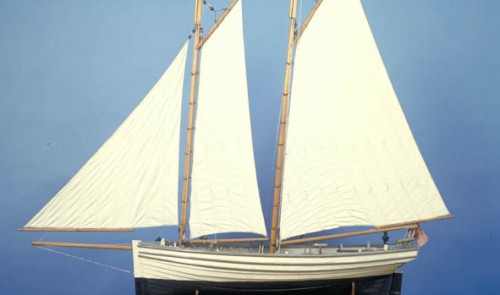
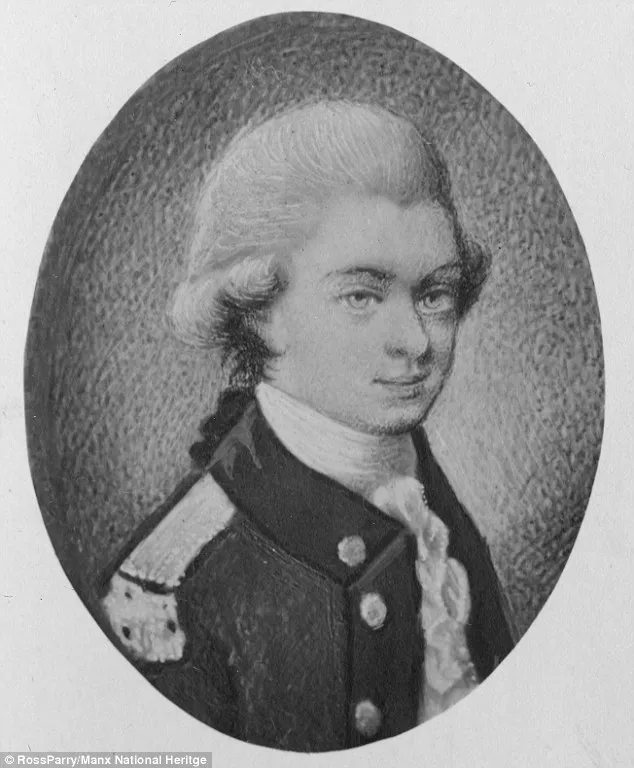
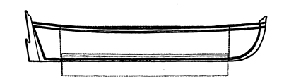
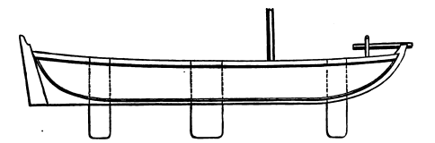
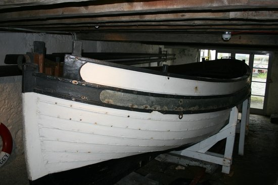
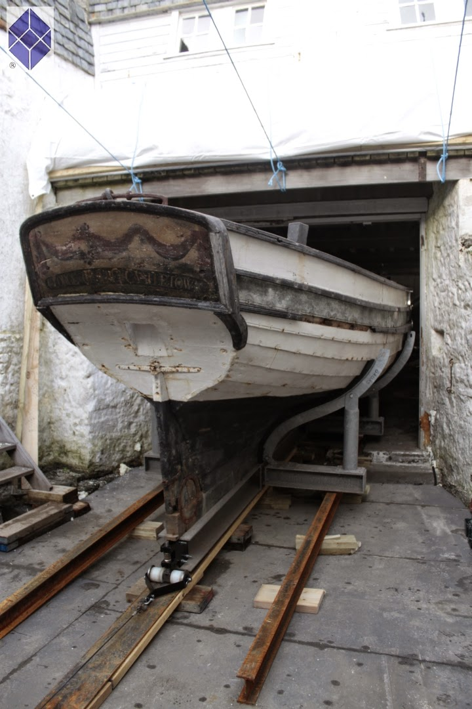

# “The sliding keels that took advantage” - the dawn of the racing centreboarder

Like all good sea stories, the history of the racing dinghy starts with smugglers, a fortune, a struggle for the hand of a maiden, cannons, islands, and a mutiny. The man who brought them all together was John Christian of the Isle of Man and England’s Lake District – the man who organised what seems to have been the first race for small centreboard boats.

John Christian was a political and social reformer, an agricultural innovator, and it was said, father to half the children in his town. As you’d expect from a powerful and passionate man in that part of the world, John Christian was also a sailor. In 1780, he had the 25’6″/7.77m long Margaret built in nearby port of Whitehaven. With her open cockpit, long, shallow keel and small lug rig, Margaret looks generally similar to other small boats of her era; heavily built, canoe sterned and rather slow.

Two years after he launched Margaret, John Christian married his cousin and ward, Isabelle Curwen. The marriage didn’t just give John Christian Curwen (as he became known) a new name and an apparently happy marriage; it also gave him Isabelle’s inheritance. John Christian Curwen spent some of that fortune in the best possible way – by buying a waterfront estate on England’s famously beautiful Lake Windermere (including the famous Belle Isle, named after his bride) and establishing the first Windermere regatta. [^chapter1-1]

[^chapter1-1]: Much of this information on Peggy is from the site of the Castletown municipal site; see http://www.castletown.org.im/heritage/nm_peggy.html

And what of Curwen’s cousin Fletcher, the man who may have been his rival for Isabelle’s affections? It’s said that he went away to sea to ease his broken heart, and on April 28 1789, the unhappy Fletcher Christian sparked one of history’s greatest small-boat voyages when he led the mutiny against his commander, Captain William Bligh of the HMS Bounty, and set him adrift in the ship’s launch – a boat that, save for her transom stern, looks to be similar in style to Margaret.

::: {#fig-curwenquayle layout-ncol="2"}
{#fig-quayle}

{#fig-curwen}

George Quayle (left) and John Christian Curwen (right); two brilliant men and rivals in the world’s first known race with open centreboarders.
:::

John Christian Curwen never achieved Fletcher’s fame, but he settled down to a distinguished life of radical politics, social and agricultural reform, field sports and sailing. In 1796, he entered into a challenge with his relative George Quayle, a merchant, inventor, ship-owner, banker, and politician from Douglas on the Isle of Man in the Irish Sea. Seven years earlier, Quayle had launched the 26’5″/7.77m long open schooner Peggy. Peggy was used for transportation and as a workboat for Quayle’s business (with perhaps some smuggling on the side) but Quayle’s letters show that she was also a pleasure boat and a joy to him.

As the noted Irish yachting journalist W M Nixon noted in an excellent article in Wooden Boat magazine, Quayle’s Peggy seems to be a much more advanced design than Curwen’s craft.[^chapter1-2] A rakish-looking boat with fine lines by the standards of the time, she carried a powerful schooner rig. She was constructed with clinker or lapstrake planking, which is normally lighter than the normal carvel hull used by boats like Margaret.

[^chapter1-2]: “Meetings with Mature Ladies”:- Wooden Boat May/June 1986, p 17.

Peggy is, of course, much bigger than a modern dinghy, but so were many of the boats that played a part in the early development of the dinghy. These days most developments trickle up from dinghies to big boats, but in the early days of dinghy sailing, when rigs and boats were heavy and stuck in the rut of displacement speeds, small dinghies were all but ignored. At the dawn of centreboarder sailing, developments trickled down from bigger boats.

Quayle kept on tinkering with Peggy long after her launch. By 1796 he had fitted her with two or three examples of the new invention that was to become the signature of the dinghy – the “sliding keel” or, as we know it, the centreboard. [^chapter1-3]

[^chapter1-3]: “The Worthies of Cumberland” Vol 1, Henry Lonsdale MD, 1867, p 66.

Like so much other technology, the “sliding keel” had been developed by the military. Captain Schank of the Royal Navy had come up with the idea in 1774, when he was in charge of building the fleet of small warships that won the Battle of Lake Champlain during the War of Independence. Schank’s “sliding keel” was merely one component of a theory of hull design that formed a striking contrast to the concepts behind the normal deep-hulled sailing vessel of the day. Schank and his patron Lord Percy realised that if vessels “were built much flatter, so as to go on the surface and not draw much water, they would sail faster, and might still be enabled to carry as much sail, and keep up to the wind, by having their keels descend a greater depth; and that the flat side of the keel, when presented to the water would make them able to spread more canvas, and hold the wind better, than in a construction whereby they present only the circular surface to the water”. The theme of “surface sailing”, instead of cutting through the water, was to become a hallmark of the centeboarder in the next century, and to be endlessly re-interpreted as boats became lighter and lighter.

Although Schank gave Percy the credit for the “surface sailing” concept, it was Schank who conceived of a keel “that was made movable, and to be screwed upwards into a trunk, or well formed within the vessel” so that the shallow-hulled deep-keeled craft he and Percy envisaged could still enter shallow waters. The experimental boat that Schank built for Percy in Boston in 1774 was the first known “centreboarder.”

::: {#fig-centreboards layout-nrow="2"}
{#fig-oneC}

{#fig-threeC}

Top: The first “centreboarder”, Schank’s “sliding keel” boat of 1775. The long single “keel” was replaced by three keels in the next experimental craft (bottom), which allowed the boat’s helm to be balanced for different points of sail. Peggy was fitted with a similar arrangement some time after her construction. Drawings from Dixon Kemp’s Manual of Yacht and Boat Sailing.
:::

The Royal Navy, although understandably distracted by wars with the USA and France, launched three experimental ships by 1796, and later followed her up with several classes of “sliding keel” brigs. The Navy’s enthusiasm for sliding keels seems to have faded when experience with vessels like the brig HMS Lady Nelson proved that 18th century technology was not up to the task of making a large centreboard that would not break, and that a ship with a broken “sliding keel” was even slower upwind than a normal square rigger. It was a classic demonstration of the fact that innovation in design is inextricably linked with material technology.

![Like most craft of her time, Peggy had a full bow and narrow stern – the so-called “cod’s head and mackeral’s tail” shape. Boatbuilders of the time placed great emphasis on having fine lines at the stern to reduce drag. The full and very buoyant bows were used to allow the heavy boats of the day to lift their bows over the steep and choppy waves around England. As warship designer and historian DK Brown notes, craft of the day also had poor longitudinal structural stiffness, so heavy weights (like anchors in the bow) had to be supported by flotation directly underneath, to stop the hull from bending. Compared to many other boats of her day, though, Peggy’s lines seem narrow by the standards of her day. Although her bows are bluff at gunwale level, they are quite fine down at water level. Note the tiny cannon that Peggy carried to ward of privateers (and perhaps other smugglers). That’s one way to ensure you get buoy room!](images/peggy08.jpg)

Quayle had no such problems with his little schooner, which had centreboards of iron plate. After receiving the challenge from Curwen, Quayle mounted the tiny swivel cannons that a gentleman’s toy needed to survive in an Irish Sea where French privateers were still active, and headed across the Irish Sea with two other Manx boats. They sailed up the River Crake and were placed on carriages for the five mile overland trip to Windermere.

With her centreboards and her big rig, Peggy swept the opposition off the lake. “The Long Bolsprit & Sliding Keels has already produced strong Symptoms of Seizure among the Devotees of Fresh Water sailing” [he wrote proudly home](https://sailcraftblog.wordpress.com/wp-content/uploads/2016/05/14733-ms02414-c-obv.jpg). One of the other Manx boats, he noted, was “the Second Best in the Lake. Modesty prevents my saying who bears the Bill.” [^chapter1-4] Peggy kept on racing and winning on Windermere until September had set in. Even on the stormy trip home, Peggy’s iron sliding keels allowed her to beat home through a gale higher and faster than other Manx boats. “It can only be imputed to the sliding keels that took advantage” wrote Quayle.

[^chapter1-4]: A letter written by Quayle from London in August 1795 (MS 02414 Cin the Manx National Archives) indicates that there was at least one other boat with three sliding keels under construction in the area. One of these may have been the centreboard yachts owned by the Commodore of the Cumberland Fleet, the first modern sailing club.

There had, of course, been other small-boat races before the clash on Windermere, and the boats of Quayle and Curwen were not what we would call a dinghy today. But the Windermere race of 1796 remains significant – not only is it the earliest small-boat event that we have significant information about, but it may have been the first race for an open centreboard craft.

Curwen kept on running regattas on Windermere after Quayle and Peggy left; the poet Robert Southey’s complaint about the food he arranged one year is probably the earliest known whinge about regatta catering. One of Curwen’s neighbours, the famous journalist and professor John Wilson, became a fanatical sailor and owner of a fleet of racing boats, run by an old sailor called Billy. Like Curwen’s biography and Quayle’s letters, Wilson’s writing under the name of Christopher North gives us another glimpse of men whose daily concerns were archaic, but whose love for the sport sounds modern; “seldom rose we ... till, about twelve o’clock, we heard the south breeze come pushing up from the sea” he wrote. “Then Billy used to tap at our door, with his tarry paw, and whisper, ‘Master, Peggs is ready. I have brailed up the foresail; her jigger sits as straight as the Knave of Clubs, and we have ballasted with sand-bags. We’se beat the Liverpoolean to-day, Master,’ Then I rose.” He also writes of the pain of being out-pointed “in our old schooner, one day when the Victory, on the same tack, shot by us to windward like a salmon.”

He won the regatta of 1813 with a boat that had the first iron keel on the lake; earlier boats commonly used stones for ballast.[^chapter1-5] Quayle, too, kept on sailing and developing Peggy. After the rough trip back to the Isle of Man (when one of the other Manx skippers was reduced to bailing with his wig box) he raised her topsides.[^chapter1-6] Like dinghy sailors of today, he seems to have fretted when work kept him from sailing; on 26 June 1803 he wrote to his brother “ ‘I have had no Time to get the Boat down yet but have been kept as busy a \[Trap Wive\] in the B \[ank\]’. Millions of dinghy sailors have echoed his complaint since that day. He kept up his interest in centreboards, meeting and corresponding with Schank and rejoicing when the inventor praised his understanding of the concept.[^chapter1-7]

[^chapter1-5]: The Worthies of Cumberland” Vol 1, Henry Lonsdale MD, 1867.

[^chapter1-6]: Details from Nixon, p 20, and the Friends of the Manx National Heritage website.

[^chapter1-7]: Manx National Archives, reference MS 02415 C. Further references to meetings with Schank are in MS 02421 C. “It can only be imputed to the sliding keels that took advantage”:- Manx National Archives, reference MS 00940/5 C. In this passage Quayle referred to the sliding keels’ assisting Peggy against a tide, which is rather confusing. “I hope left room enough for the little one to lay comfortable”:- Manx National Archives, reference MS 00940/3 C.

The ever-inventive Quayle kept Peggy in a custom-made boathouse, full of his inventions, in the tiny harbour of Douglas. He seems to have been forever tinkering with the boathouse; as his brother wrote to him in 1791, “I hope you left room enough for the little one to lay comfortable”. Towards the end of his life, Quayle entombed Peggy inside her custom-made boatshed in the tiny harbour of Douglas. Over time, the boathouse was walled up and the tiny dock outside was filled in. There the “little one” was to “lay comfortable” for decades. In 1820, Curwen got sick of losing races to his new neighbour, and he left Margaret to rot.

But that was not the end of the story for Peggy and Margaret. In 1935, the walls around Peggy’s little berth were torn down to reveal that Peggy and her gear still stood there, complete down to drinking cups made of coconuts and in astonishingly good condition. Even the bills for her construction remain in the Manx National Archives, complete down to details such as the cost of “halliards”, tar brushes and the weekly pay sheets, topped by “Thomas Kelly” and a boy.

Remarkably, Peggy was not the sole survivor of the Winderemere regatta of 1796. In 1952, G.H. Pattison of the Windermere Steamboat Museum found the boat that is believed to be Margaret being used as a chicken shed in the town of Southport. And so, amazingly, the two leading ladies of the very first recorded centreboarder regatta can still be seen today.

](images/wsm-margaret-header.jpg)

Margaret is little more than a bare shell [^chapter1-8] but Peggy is almost complete; still bearing her 18th century paint and fittings. Today, Peggy is in the middle of a painstaking long-term restoration project.  After six years of planning and preparation, in 2015 she was gently lifted out of the boatshed in which she spent two centuries and taken to a preservation facility. The slow story of Peggy’s meticulous restoration can be seen at [Peggy of Castletown](http://peggy-of-castletown.blogspot.com.au/)

[^chapter1-8]:Details of Margaret were taken from WM Nixon’s article “Meetings with Mature Ladies”, Wooden Boat, May/June 1986, p 21.

But the race on Windermere seems to have been a false dawn as far as open centreboarders went. The racing sailors of the era stayed with faithful to long fixed keels and fully decked yachts. One or two centreboarders raced with the Thames’ Cumberland fleet in this period, but they were fully-decked yachts, complete with full decks and cabins – nothing like a dinghy.[^chapter1-9]  The open centreboard racing boat seems to have been buried for half a century with Peggy. When it was revived, it was an ocean away.

[^chapter1-9]: These seem to have included the fourth boat christened Cumberland and owned by the Commodore of the Cumberland Fleet, the first sailboat racing club. So far I have been unable to track down a date for her launch, but it appears that she was launched after Peggy’s race on Windermere.

The men who kickstarted centreboarder racing around 1850 probably never heard of Peggy. But even after she had been entombed in her boathouse for four decades, the little schooner’s influence may have played a part in taking the centreboarder all the way to the other side of the world. [And that’s another story, for another post](https://sailcraftblog.wordpress.com/2016/05/19/sailcraft/).

