# "Racers in every sense of the word": the Raters {#sec-chapter11}

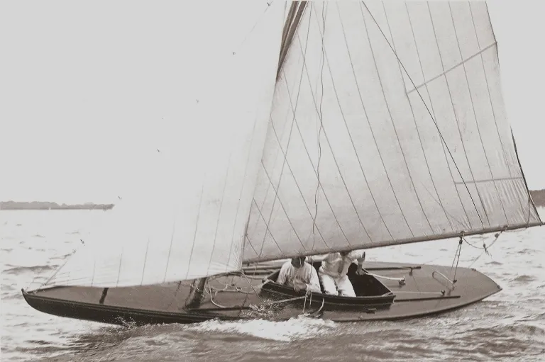

The next ancestor of the modern racing dinghy, the Rater, was created by a new style of sailor and a new style of rules. The catboat, sandbagger, sharpie and canoe were created in the same way as earlier craft; they had evolved out of workboats or the inventions of enthusiastic amateurs. But the Rater was influenced by four new factors – rating rules, professionally trained designers, a move to smaller boats, and women skippers – and it created a new style of boat, and may have proven to the world that the future of performance lay in efficiency rather than brute force.

The Rater was basically the first type where restrictions on sail area dominated design, and drove it towards light, efficient hulls. Until the Raters arrived, there had been two basic ways to classify and rate sailing boats – overall length and by hull volume. The simple length measurement was normally used in small boats, like the sandbaggers and catboats. Larger yachts were rated according to existing rules that were used to assess the size of merchant ships for harbour dues, light fees and other taxes.

Like most simple rules, the tonnage measurement had simple flaws. For a start, the use of a tonnage measurement for rating implicitly assumed that a bulkier boat was a faster one, irrespective of whether the bulk came in the form of excessive beam (which reduces speed) or extra length (which increases speed).  Secondly, since commercial craft had to be able to measured while they were afloat in port and with a hold full of cargo, the various tonnage rules often used measurements that designers could easily avoid. In Britain, for example, the problem of measuring the depth of a commercial boat full of cargo meant that the various tonnage rules assumed that a boat’s depth was linked to its beam.

The British tonnage laws were one of the biggest, and most harmful, forces that drove British yacht design for half a century. Designers realised that because volume created by beam was taxed but draft was not, if they created a narrow boat it would rate lower than a beamy one. They could then give the narrow boat enough stability by increasing the draft to lower the ballast. “Slowly at first, but steadily, yachts became longer, narrower, and deeper; the crack yacht of one year being displaced the next by something with more length, less beam, and more ballast” wrote George Watson, one of the greatest of all designers. Beam was taxed so heavily that over just 13 years, boats in the “5 ton” class increased their length by one third and their sail area by two thirds, merely by reducing beam. This was the era of the British cutters that were so long, thin and deep that they were called the “planks on edge”.

:::{#fig-raters1 layout-nrow="2"}
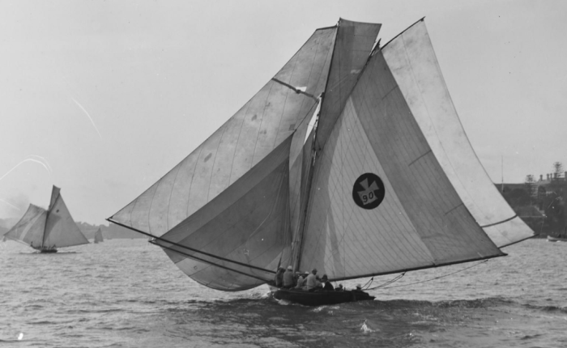

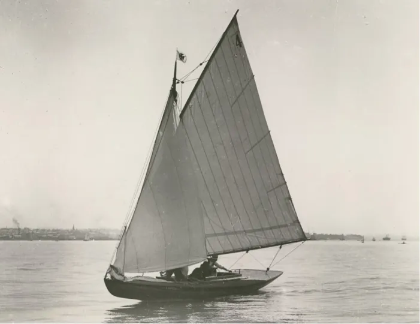

The raters took design from unrestricted clouds of sail (top) to unfettered efficiency. The Sydney 22 Footers, which had been able to beat all the other small yachts, met their match in craft like the One Rater Laurel (bottom) which had just a fraction of the 22’s sail area, cost and crew. Top pic, unknown photographer, Tyrell Collection Powerhouse Museum; bottom pic from Robin Elliott’s history section on the Royal Akarana Yacht Club site.
:::

The American clubs changed their tonnage rules to get away from the beam problem, but they shared another problem with the Brits. Perhaps because the tonnage rules were a hangover from taxation laws, and the taxman was only concerned about cargo capacity, neither American or British rules rated sail area. Sailors recognised early on that the type of rig was a vital factor in racing, and as early as the 1840s, schooners were given a huge advantage under the rating rules so that they could compete with single-masted rigs. But as far as the rating rules were concerned, sail area was irrelevant, and sailors could hang watersails, topsails, staysails and anything else they wanted onto spars that were as long as they could keep up.

Rule makers faced practical problems with measuring sail area; it was a tricky issue in those days when boats could set and drop topmasts, jackyards, square sails and a variety of jib than it is with modern rigs. And to many sailors, it wasn’t just that sail area couldn’t be measured; it was also that it *shouldn’t* be measured. To them, a boat that could carry more sail was a better boat. “If the builder of a yacht improves her form of hull while keeping the general dimensions in length, breadth, depth, and weight of ballast the same so that she is able to carry more sail, he is at once taxed for his ingenuity in having accomplished this improvement” complained one sailor when sail area was finally measured. “It is the object of a builder to develop as much boat for length as is consistent with a good model” wrote another, ignoring the fact that such boats were expensive and unseaworthy. Even the great naval architect Scott Russell felt that measuring sail area stopped the designer from being “left free to make the best ship that could be built”. The fact that the old rules that did not restrict sail area led to vast, inefficient and costly rigs on top of hull distorted to carry more sail at the expense of efficiency seems to have escaped many sailors and designers.

It was the designer and journalist Dixon Kemp who, in 1880, proposed a new type of rating rule, one which measured sail area and length alone. It seems that Kemp and other trained designers were driven partly by disgust at the direction of development under the old rules, partly by a more scientific and sophisticated understanding of the physics of sailing, and partly by the recognition that, in Kemp’s terms, “increase of sail-spread meant extra cost for the sails themselves, and extra cost for the means of carrying them”.  Kemp’s rule was as simple as could be – simply measure the waterline length, multiply it by the sail area, and add a divisor so that the final result was a simple figure that sailors could understand and relate to older rules.

In 1882, Kemp’s rule was adopted as an optional system by the RYA, although clubs held firmly to the flawed tonnage rules. In the same year the Seawanhaka Corinthian Yacht Club of New York adopted a modified version of the rule, and was later followed by other US clubs. The US versions of the Length and Sail Area concept allowed much bigger sailplans than Dixon Kemp’s original version, and measured both overall and waterline length. The adoption of the “Seawanhaka Rule” and its variations helped to kill off the dangerous rigs in small boats, and led to a breed of rather conservative big, beamy and heavily canvassed cruiser/racers that W P Stephens called “the high point of designing in America” but others like designer B.B. Crownshield called over-rigged “brutes”.

It was only when a committee lead by former Mersey centreboarder and canoe sailor Sir William Forwood abolished the British tonnage rule and adopted the Dixon Kemp rule in 1886 that the full potential of the concept was unleashed to create the fastest and most radical development in small boat design in history.[1]  The Dixon Kemp rule applied across the board, from 14 foot dinghies to the 130ft cutters of the “Big Class”, but the small yachts, large centreboarders and canoes drove the developments.

Even before the new rules arrived, the UK sailing scene was moving to small boats.  The problems with the old tonnage rule had almost killed off the big racing cutters. The building and racing of the giant cruiser/racer schooners had also almost stopped when cruisers moved to the new steam yachts. The increasing wealth and leisure time of the middle and upper-middle classes allowed many new sailing clubs to form, but few of them could afford to offer the rich cash prizes that were needed to entice the big boats to race.  Instead, owners and clubs turned to smaller yachts (although “small” in those days could mean something similar to a 30 Square Metre) which could be sailed by amateurs.

To put the small Raters in perspective and to see their development from mini yacht to big dinghy, we have to look at the boats they replaced. Once again, the first developments started in small yachts rather than in dinghies – but it was almost for the last time. By the time the story of the Rater was over, dinghies were to take over as the driving force in the development of the entire sport of sailing.

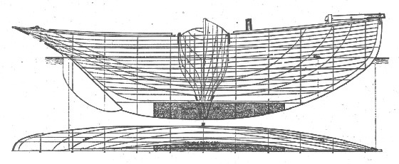

Mascotte is an example of the style of extreme “plank on edge” cutter that the British were turning away from. The famous dinghy designer Uffa Fox sailed a replica and noted that although it could reach a surprisingly high speed, it was only when it was heeling over so far that half the deck was buried and the narrow interior was unusable.

:::{#fig-itchen layout-nrow="2"}

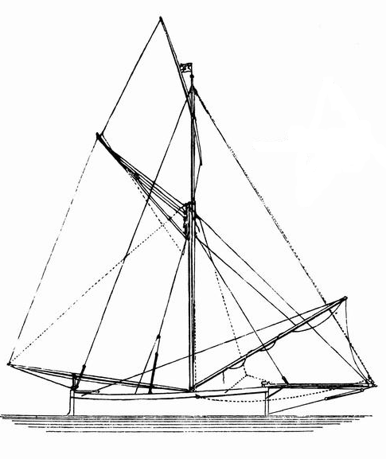

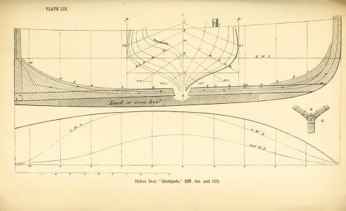

Above, a typical sail plan of one of the racing Itchen Ferries. Below, the lines of the Itchen Ferry Centipede. The external ballast keel was added to the Ferries under the pressure of racing. Both plans from Dixon Kemp’s “A Manual of Yacht and Boat Sailing”.
:::

Even the classes that were not rated under the Tonnage Rules often became victims of their own excess. Among them was the Itchen Ferry, a traditional fishing boats of the Solent. Many of the top designers rated these stubby, heavy but shapely boats highly, and many of the best professional big-boat skippers hailed from the type’s home village of Itchen. When the pros raced their own Itchen Ferries at the end of the season after the big yachts had been laid up, the competition was furious. The classes were restricted only by overall length, with the inevitable result that under the pressure of racing sail area grew and keels became deeper. The plans above show Centipede, designed by the famous Dan Hatch for the 21 foot class. She weighed in at a solid 3.5 tons with a hefty 8ft of beam, and carried a healthy 630 sq ft of sail upwind.

:::{#fig-minima layout-nrow="2"}

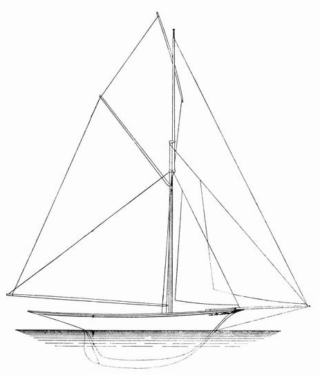

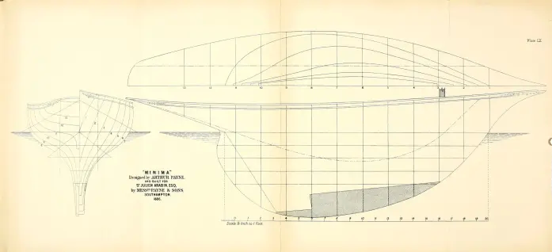

Minima, one of the distorted yachts built to race in the 21 Foot waterline length class that grew from the Itchen Ferry racing. Arthur Payne was known as the great master of the “Solent Length Classes” and this experience in classes that were limited by length rather than by the tonnage rules seems to have given him an appreciation of the advantages that could be gained by extra beam.
:::

The Itchen Ferries became one of the ancestors of the “Solent Length Class” racing yachts, which were restricted by waterline length only. Minima was designed Arthur Payne, the “master of the length classes”, to fit the same class as Centipede and shows what happens when you design a class restricted only by waterline length.  “There being no limit to sail in the length classes, it was not a difficult matter to outbuild the crack boat of the year every winter. Each succeeding boat had longer overhang, greater beam, draught, and displacement than her predecessor, and consequently won, being a larger boat and carrying more sail” noted Dixon Kemp. “The result was a rather expensive type of boat, with excessive overhang, and enormous sail spread”.  The “21 footers” ended up with deep hulls about 33′ overall and carrying over 1300 sq ft of sail.

Not surprisingly, when Payne started to design to the “length and sail area rule” he quickly reduced rig size and started to create a lighter, more efficient boat than the powerful Length Class boats – but he kept the wide beam that had worked so well in the Itchen Ferries and the Length Classes. Payne’s Lady Nan was built in 1888 and dominated the 2.5 Rater class. Although about 2ft longer on the waterline than Minima, she carried less than half the sail area. It was an early indication of a design trend that was to see sail sail area drop from 70 to 20 sq ft per foot over length during the Rater era.

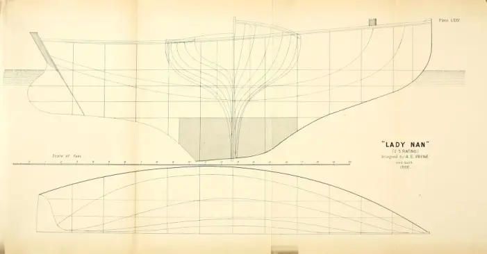

Lady Nan shows Payne moving from the long keel of the Itchen Ferry type, towards a fin keel. Her beam of 8ft3in on a 23 ft waterline was vast compared to contemporary yachts designed by the British designers who had become used to the “plank on edge” cutters. Lady Nan weighed in at 4.1 tons and had 654sq ft of sail. Development moved so fast that by her second season, she had gone from a dominant force to an also-ran.

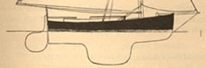

Humming Bird, a 2.5 Rater designed by Payne for the Hughes family in 1889, was a “wonderful performer to windward” and dominated the class in its Solent stronghold. When I look at Humming Bird the first thing I notice is that she represents a further stage in the development of the fin keel (perhaps influenced by the fin keel that Hughes’ father had fitted on the old family boat the previous season) but from the perspective of rival designer George Watson, who was used to designing heavy and skinny “plank on edge” cutters, the important thing about Humming Bird was that she showed “what could be done with large beam and moderate displacement.” The short ends may have been a reflection to the fact that overhangs were “considered a crafty method of cheating the rule” (as Rater skipper Barbara Hughes noted) and in its first year the class allowed no more than one foot of stern overhang – perhaps a rather logical reaction to the excessive overhangs in the Solent Length Classes.

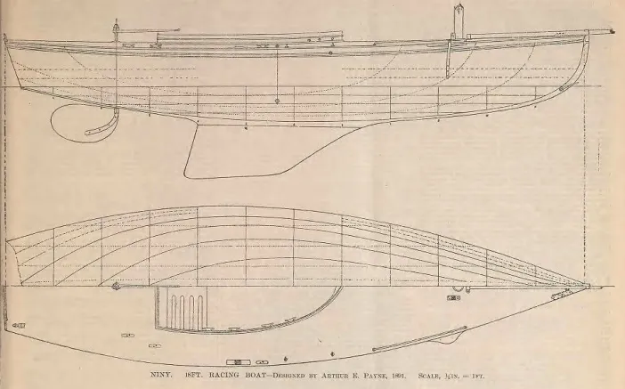

:::{#fig-niny layout-ncol="2"}

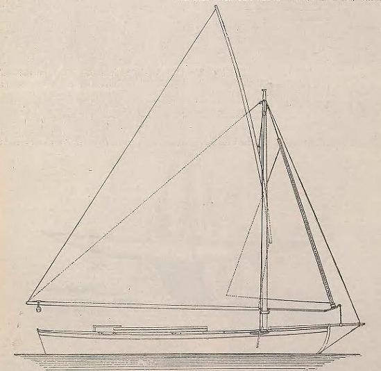

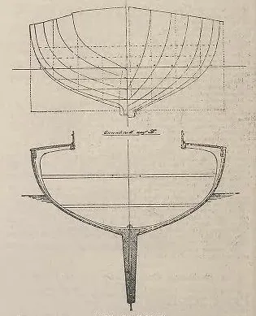

The “Solent lug” rig was all but universal on the small Raters in the Solent in Niny’s day. Many of the smaller Raters also had a roller-furling headsail, like Niny.
:::

The Half Rater class, smallest of the “Raters”, was formed in 1891 by a group from the famed Bembridge Sailing Club on the Isle of Wight. Payne’s Kittiwake, a sister to Niny, was the first champion. Their hull shape showed distinct development from boats like Lady Nan and Humming Bird; the keel has become more of a distinct fin, the skeg aft has been cut away to reduce wetted surface, and a spade rudder has been fitted. These Half Raters were described as “capital little boats—miniature yachts, in fact... wonderful sea-boats,” and weighed in at 550-600kg with about 75% of that in ballast.

There was a huge variation in design among the Half Raters. One or two big dinghies also raced, but with little success; since the Half Raters were often restricted to two crew, it was hard for the dinghies to compete since they relied on crew weight for ballast.  Some of the Smith brothers’ Oxford Canoe Yawls also competed, with considerable success; perhaps their smaller rigs and very light and slender hulls didn’t need as much righting moment as the dinghy types.

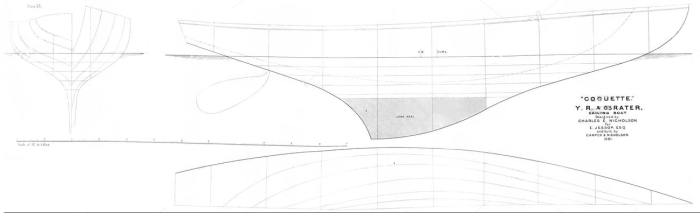

Coquette, another Half Rater from 1891, was one of the early designs from Charles Nicholson, a man who was to become one of the greats of English design. Coquette shows early steps towards one of the features that was to become a hallmark of the Rater – the overhangs bow and stern. One of the 1891 crop of Halves, Willie Fife’s Jeanie, had a stern overhang of 4.6 feet, or about a third of her waterline length – a shape, literally, of things to come.

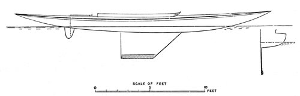

The “One Rater” Wenonah caused a sensation in the Scottish One Rater classes in 1892, and a few weeks later Wee Win did the same to the Solent Half Raters.  Nat Herreshoff had only recently returned to yacht design after many years working in steamships when he had created the famous Gloriana in 1891. She is normally credited with launching the concept of fuller waterlines forward that took a major step towards fuller ends that created extra sailing length at speed or when heeled, but boats like Coquette indicate that other designers were working in the same area.

Many people claim that Dilemma, a bigger Herreshoff similar to Wee Win and launched on October 9 1891, was the first fin-and-bulb-keel boat, but both fins and bulbs had been used earlier in England and the USA. It’s also been said that Wee Win caused a change in rules to penalise fin keelers, but the contemporary sources indicate that she was merely one of many boats that caused the change, years later. The Herreshoff boats were brilliant boats in design, construction and performance, but it seems that rather than radical breakthroughs, they were simply part of a clear, steady and rapid line of development that other designers were also taking as the world moved from boats like Lady Nan to boats like Sorcerer (below).

When the L x SA rules led to the first boats with long overhanging “spoon” or “Viking” bows first appeared, sailors who were used to vertical stems or clipper bows were appalled at its ugliness.”The first design for the 90-ton ‘Vanduara’ was drawn with a clipper or out-reaching stem; but I had not the heart to disfigure the boat (as I then considered I should be doing) by building her in this fashion”wrote George Watson, one of the great designers of the day. “The rising generation of yachtsmen, however, is entirely reconciled to the clipper bow on a cutter-rigged yacht, and may eventually (though this seems improbable) look with complacency on such cutwaters as ‘Dora’s’ or ‘Britannia’s.'” Today,the spoon bow as seen in boats like Britannia, the J Class, Dragons and Metre boats is seen as the epitome of classic beauty.

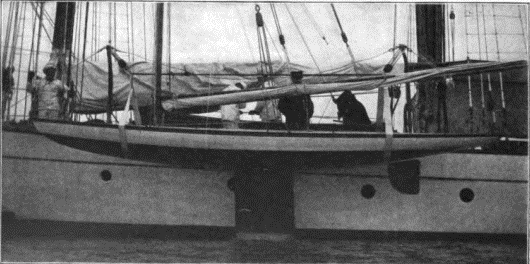

Fast and aristocratic little yachts like Wee Win and Niny gave small boats a new social status and attracted many sailors from big boats.  By 1892, Dixon Kemp noted that owning a 200 ton yacht was unfashionable in a world where the trend was towards owning a small racing machine and a steam yacht.[13]  As one paper noted, the One Raters and Half Rater were “scarcely dignified (but) many well-known yachtsmen are found sailing them.”[14]  Of course, many of those who moved into the small Raters managed to maintain their conspicuous consumption by having a palatial tender; Barbara Hughes noted that “a fifty ton steamer, or perhaps one a little smaller, is essential” as well as “a little house in Cowes” that could be rented for a season for as much as a small Rater cost to build. Buying a Rater and racing it in style and comfort for one season cost far more than the typical Briton would earn in their entire lifetime.

:::{#fig-maharanee layout-nrow="2"}

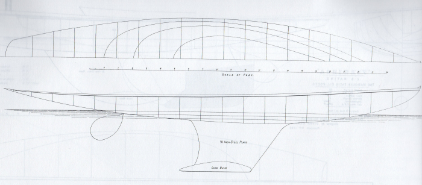

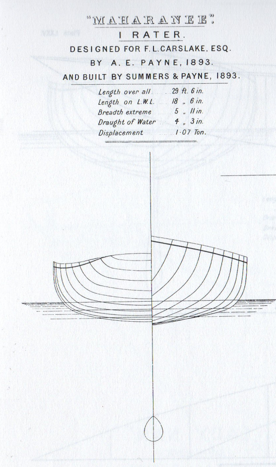

Maharanee, a One Rater designed by Payne in 1893. Comparison between Maharanee and Minima, Lady Nan and Humming Bird (above) shows the amazing speed of development in just five years. Boat design has never changed so quickly.
:::

Comparing Payne’s 1893 creation Maharanee to Humming Bird or Niny shows the extraordinary pace of development. At 8.99m/29ft6in overall, Maharanee displaced just 1.07 tons, or about two-thirds of a modern inshore racer like a Melges 32. She scored 29 wins in 34 starts. By this time, the One Raters and Half Raters were becoming the hottest classes, partly because many bigger Raters had become  were so light they had no accommodation space, and therefore owners thought that if they only had a day sailer they may as well have a small one.

The tiny and shallow rudders of these fin-keel Raters made them many of them hard to steer. “Steering has been steadily becoming more difficult hitherto,” wrote Barbara Hughes, one of the top skippers “but now I fancy there will be a return to the fixed rudders we began with, which are much easier to handle than the balanced ones of later years.” While Hughes may have been influenced by her upbringing in more conventional boats, it seems more likely that the rudder materials and the understanding of hydrodynamics in her time just weren’t good enough to create a boat that steered well with a spade rudder under the forces of the stretchy and flexible rigs of the day. Designers as brilliant as Herreshoff later returned to hanging their rudders off the back of the keel. Even the contemporary iron-clad warships, the highest technology of their day and with the advantage of extensive tank testing and design analysis by brilliant minds such as the hydrodynamicist Froude, were almost impossible to steer with their balanced spade rudders, whereas the slightly older ironclads with rudders attached to their keels handled comparatively well.

:::{#fig-unorna layout-nrow="2"}

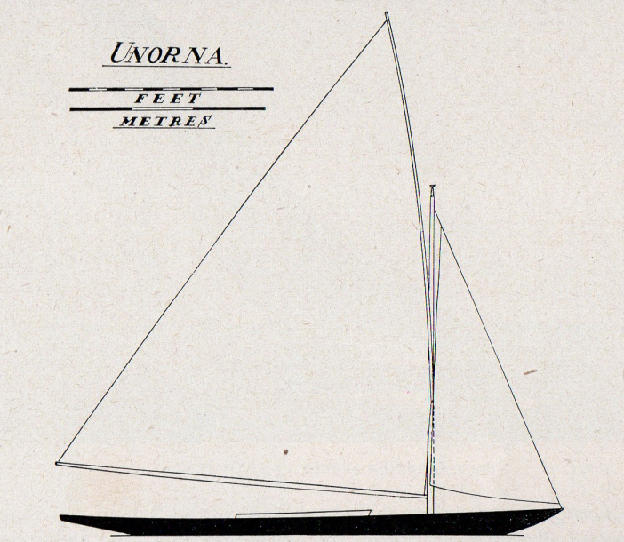

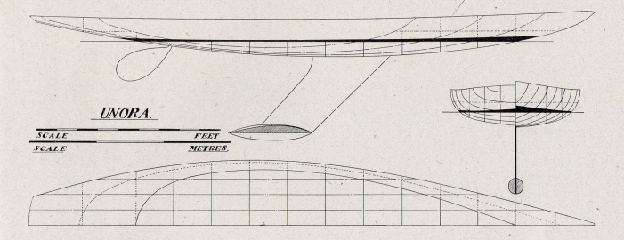

Unorna, One Rater, 1894. These plans come from Uffa Fox’s wonderful 1938 book “Thoughts on Yachts and Yachting” with permission from Uffa Fox Ltd. Uffa has spelled the name two different ways in these two drawings; all typos in this blog are put there on purpose in honour of Uffa’s mistake.
:::

Unorna was a Charles Sibbick design One Rater of 1894. With her deep high-aspect bulb keel and fine bows, Unorna marks another clear step forward in design. At 8.32m/27ft6in overall and 5.94m/19ft6in on the waterline, she displaced just 1,219kg/1.2 tons and carried 28.6m/308 sq ft of sail in her gaff rig.

Decades later, Uffa Fox used to admire the model of Unorna and other Sibbick Raters hanging in her former owner’s house. “The one-raters were racers in every sense of the world” he wrote in the 1930s, when the Raters had been replaced by Metre Boats. “They were light, lively and exciting craft to sail, as they were capable of such high speeds, and as well as this they were quite cheap to build…the small racer of the ‘nineties was far faster than her present-day counterpart.” They inspired him to design the 6m/20’ LOA Flying Fifteen, one of the world’s first planing keelboats and now one of the world’s most popular racing yachts. Just like the Raters, the early Flying 15s were known for their heavy weather helm, which is another example of the surprising amount of difficulty designers encountered with spade rudders.

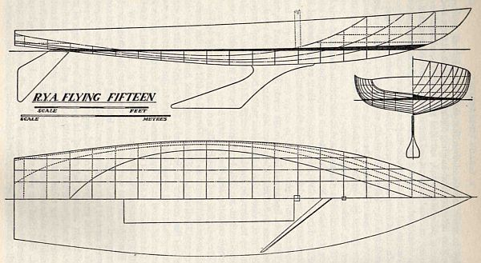

The One Rater Sorceress represents the truly dinghy-style Rater. She was designed, built and sailed in 1894 by the brilliant but temperamental Linton Hope, one of the many canoe sailors who moved into Raters, and proved all but unbeatable on the lower Thames.  She was 28 feet overall and 8 feet in beam, but her canoe hull drew just 0.55” and displaced a featherweight 667kg/1470lb.  Her only ballast was a deep, narrow centre-board, “a form which has been found marvellously effective in sailing canoes” which weighed 90lb. [5] It was designed to “twist the boat to windward”, although the exact mechanism remains unclear.[6]  What seems clearer is that the Hope foil was the first high-aspect centreboard, and a model for other designers.[7]  Known as the “Linton Hope Dagger”, it seems to have been the origin of the term “daggerboard”. It was actually a pivoting centreboard, rather than a vertically-dropping daggerboard in the sense we use the term now, and the name came from the dagger-shaped outline.

:::{#fig-sorceress layout-nrow="2"}

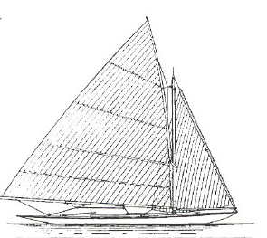
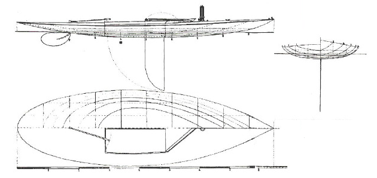

Sorceress
:::

Sorceress had only about 0.5m/17in of maximum freeboard on a waterline of almost 19 feet and set 319 ft of sail. To the surprise of many, she performed better in strong winds than in the light; her designer reported that she could carry full sail when the 130’ racing cutters Britannia and Valkyrie were reefed.[8].

With boats like Sorceress, Hope claimed to have pioneered a new form of construction. He used lighter but much more closely-space frames (just 51mm/2in apart instead of the usual 152mm/6in) and light mahogany lattice girders (mainly 6mm/1/4in by 19mm/3/4in), including one running the complete length of the boat. It allowed him to leave off the usual riband that ran behind each seam in conventional Rater construction and to reduce the planking thickness from the earlier 6mm/1/14in or more down to 4.7mm/3/16in. Hope claimed that his construction saved at least 15% of weight, as well as creating a stronger hull. His Half Rater Kismet, made in 1895 or 1896, was 25ft/7.62m long but her complete hull and bamboo-sparred rig weighed just 136kg/300lb – barely more than a 505 for a boat 50% longer. With her 68kg/150lb centreboard and crew, she displaced just 356kg/740lb to 363kg/800lb. It’s been said that Kismet had internal bracing of piano wires, but an article by Hope indicates that although he considered the idea, he was worried that one may snap suddenly where the lightweight wooden frames would just give without breaking. Kismet won 40 of her first 45 races and lasted in good condition for several years.

With their narrow cockpits, light weight and wide sidedecks, Raters like Sorceress helped to erode the old fear of capsizing. Their wide decks allowed many of them to recover and sail away. “Having a watertight bulkhead at each end of the cockpit, she is quite unsinkable, and shows about half her normal freeboard when the cockpit is full and the crew on board, so that she is not so dangerous in the event of a capsize as she is supposed to be, and so far has shown no signs of doing anything of the sort” wrote Linton Hope about Sorceress.[10]  “Half a dozen capsizes in a race used to be nothing unusual”[11] when the Raters sailed on the confines of the Thames, and even on the Solent Hope’s Raters could easily be re-righted.  In the Raters “to a youth who can swim, a capsize means nothing more than a ducking” noted WP Stephens.

Capsizes were still discouraged, for very good reasons.  In  a world with no rescue boats, when one boat capsized others often had to abandon their own race to check on their safety.[12]  Wet cotton sails and tangle-prone ropes were dangerous to sailors clad in heavy wet street clothes or oilskins. Even if the boat popped upright quickly, the cotton sails would shrink and lose shape, and cleated and knotted lines would also shrink and become hard to undue. To many sailors, capsizing remained a sin against seamanship, but the Raters seem to have continued the trend to making capsize into a racing incident rather than a calamity.

:::{#fig-britannia layout-nrow="2"}

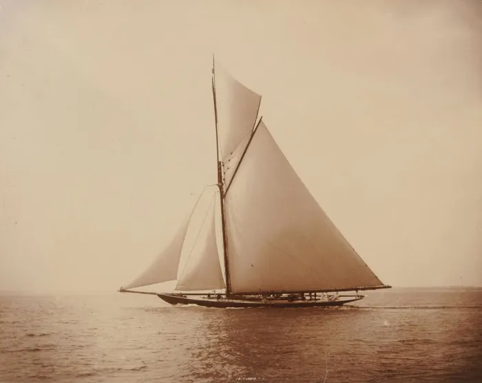

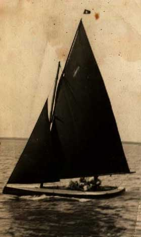

The “length by sail area” rule covered an enormous size range. At the top end there were boats like Satanita (rating 162 and 40m/131ft LOA, too long for the America’s Cup) and the Royal yacht Britannia (above, rating 151 and 122ft LOA) and at the bottom end there were sailing canoes and 14 foot dinghies that rated 0.3 or 0.5 like the Theo Smith design Menemopete below. However, the smaller yachts like the 2 1/2 and then the One and Half Raters drove the design development and led the way for their larger sisters. George Watson, designer of Britannia, thought that her spoon bow would always be thought ugly, but within a few years her shape became known as “the Britannia ideal” and it was regarded for decades as the perfect all-round hull.
:::

Boats like Sorceress achieved a level of efficiency that only the sailing canoes had reached, and demonstrated that long, light boats with moderate sail area were faster than heavy over-canvassed boats. She was simply a big dinghy, and she and her ilk took the Rater concept too far for many people. The rapid obsolescence had driven many owners out of the classes, and the fragility and instability of the extreme Raters scared other sailors and the rulemakers. In 1896 the British created the Linear Rating rule to encourage heavier and less radical boats, and then instituted a minimum displacement. The Linear Raters looked more like Wee Win than Sorceress, and many of the earlier Raters fitted into the new classes.

The Raters quickly spread across the world. They seem to have quickly moved to Germany, where they were known as “Rennflunder” (“racing flounder”, a reference to the flat fish if I’m correct), to France where a similar local rule was to give rise to the famous One Ton Cup, and Australia, New Zealand and South Africa. It was the Raters that seem to have been the ancestor of the long, low and slender boats that race on many of the world’s inland lakes today.

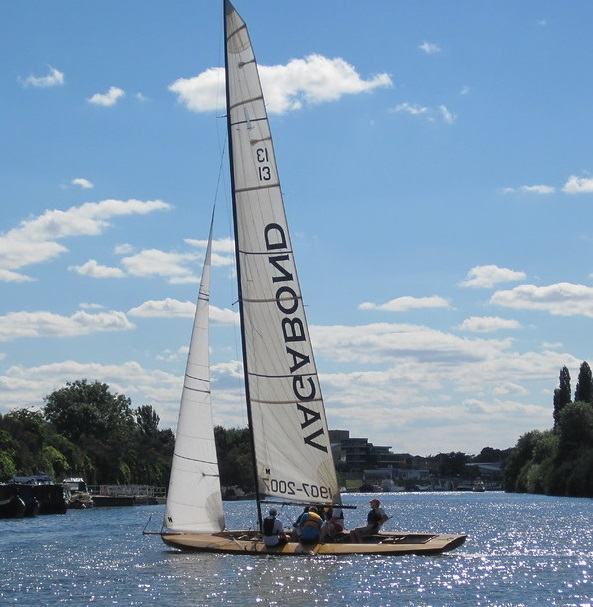

There is still one stronghold of the original Raters. The Thames, where Linton Hope had won so many races, still has a strong class of “A Raters”, originally rated between the One and Half Raters. The A Raters make even Sorceress look conservative. They are long, low and graceful, with long overhangs stretching their hull out to 8.2m/27 ft.  They are unballasted, weigh as little as 340kg (750lb) for hull, foils, and fittings, and can definitely capsize (and come back up dry, thanks to their wide decks).

The oldest surviving A Rater was built in 1898, and many of her sisters are a century old, but whether rebuilt or reproduced in modern materials, the A Raters are no museum pieces. They are sailed hard, and carry the highest and narrowest rigs in dinghy racing. At 13.7m (45ft), they have an aspect ratio around 6:1, both for aerodynamic efficiency and to reach the wind above the riverside trees. Even without their trapezes and spinnakers (which the Raters do not use on the narrow river) these are fast boats – they are rated mid-way between the 49er and the International 14. In light airs on inland waterways they are outstanding performers and their sky-scraping rigs can push them to “first and fastest” in the massive 300 boat pursuit events that are a feature of British racing; but more importantly, they provide a rare glimpse of Victorian-era performance afloat.

![The new Thames A Rater Adventurer winning the Queen’s Cup, the major prize for the class. Tamesis Club pic. Designer James Stewart notes that despite their enormously tall masts, the A Raters are one of the rare classes that doesn’t reduce rig weight to the maximum, because a little bit of momentum in the rig helps with roll tacking and slowing the reaction time to gusts. James is one of the people who provided information to the SailCraft project years ago, which I unfortunately lost in a computer crash.](images/chapter11/thames-rater-queens-cup-2014.png)

But perhaps the most significant social effect of the Raters was that they brought a new type of skipper to the forefront, and vice-versa. It wasn’t just that the Raters brought female sailors to the top of the sport in England – it was that the female sailors were among the leaders in the design of the Raters. The dawn of the female small-boat racer didn’t just change boat design, but may also have played a role in changing the image of women in sports as a whole.