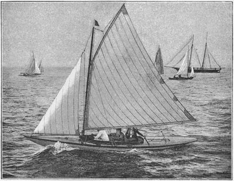
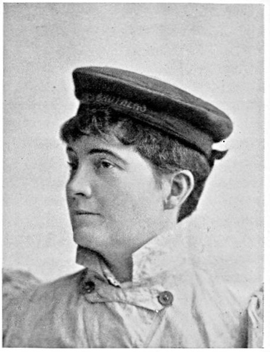
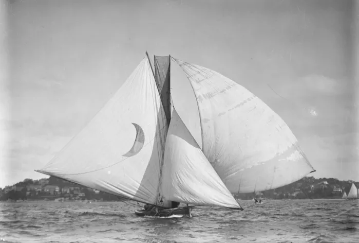
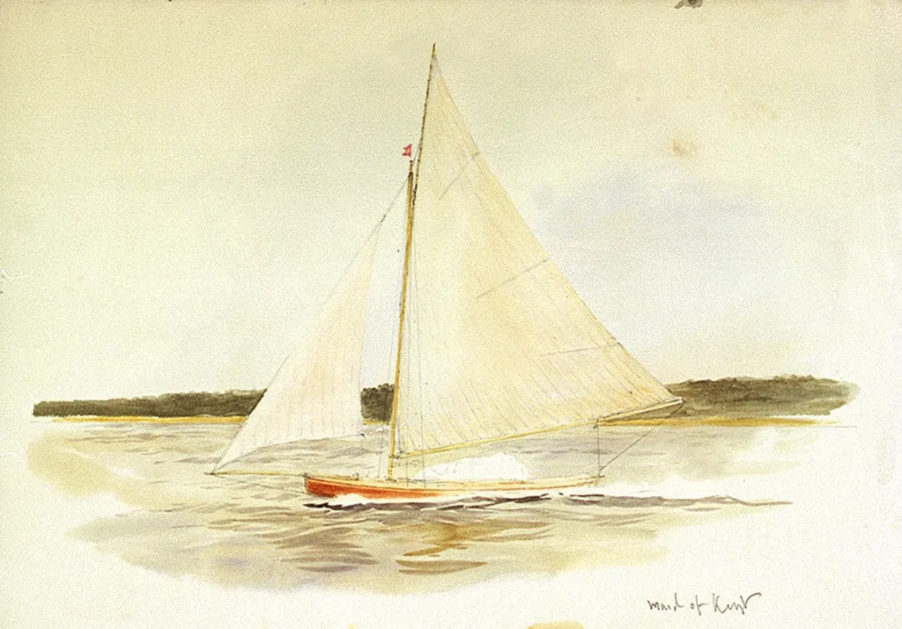

# “In every respect a sport suited to our sex”: the women who changed small-boat sailing {#sec-chapter12}

While the design of the Raters was to play a significant role in changing dinghy design, some of their owners may have been playing a role in a more important area – the changing of ideas about women’s sport. One of the major driving forces behind much the development of the Raters was a breed of women who did not just steer the boats, but also commissioned new and groundbreaking designs. The Rater women seem to have been the major prototypes of the female small-boat sailor, and they may have helped to change the way the world thought about women’s sport.

It’s probably no coincidence that female owner/skippers suddenly emerged in the 1890s. It was the era of the “New Woman”, of suffragettes and their valiant fight for the vote. Ibsen’s play “A Doll’s House”, with its inadvertently feminist message, was a hit on London’s West End and Broadway. Sport for women, especially middle-class women, was being encouraged as physical exercise was becoming recognised as useful for a woman’s “primary role” as a wife and mother.

The women who raced in the UK all seem to have been among the more affluent of the upper middle class, or the upper class.  Their secure social status may have helped them blaze new areas in society. Modern academic accounts of women’s sport in the late 1800s stress that society expected women to be more interested in competing than in winning, and to lose to men. It seems that no one told the women who sailed the Raters. They sailed hard, the sailed to win, and they very often did.

Barbara Hughes, a member of a family that owned and sailed many top Raters, encapsulated sailing’s  attractions as a sport in which women could simultaneously follow society’s mores and also be independent and highly competitive. “Yacht-racing is in every respect a sport suited to our sex. No unseemly gymnastics, no over-straining or over-tiring, no cruelty can be laid to its charge, in fact nothing to offend the most exacting upholder of the feminine….” she wrote. “Where it stands alone, is that in it a woman can compete on equal terms with man... To enjoy racing to the full you should have it all in your own hands with no one to say you “nay,” otherwise that spirit of independence - so rarely enjoyed by our sex - is lost.”

Barbara Hughes was one of the most successful and keenest of the women skippers in the Solent in the Rater era. She and her sister Grace Schenley (in the usual sexist way of the time, her own name was never used after her marriage and it remained a mystery to me until I stumbled over it at the fascinating Peggy Bawn Press site [here](https://peggybawn.wordpress.com/2013/02/14/valentine-a-well-named-yacht/) sailed in what may have been the first race specifically for women, in 1889. Around the same time Solent clubs like the Castle YC and Bembridge SC (called “a hotbed of fast women skippers” decades later) welcomed women.  By 1891 when the Half Rater class started it was noted that there were “several ladies taking an active interest in the sport, and some of them steering their own boats in the roughest weather.”  The arrived of the female skippers “has done much to make the sport popular and fashionable” wrote one correspondent.

But the Rater women were not just skippers – they were also patrons of design. They commissioned many new and radical boats and became a major driving force in the incredibly rapid development of Rater design. It’s a measure of the influence and success of women that four of the boats pictured in @sec-chapter11 were owned by women, as were several other leading-edge boats like Grace Schenley’s Soper-designed Flatfish.   Two of the most prominent of the Rater women were the Sutton sisters, the daughters of Sir Richard Sutton, who had earned himself fame for his sportsmanship during the close 1885 America’s Cup challenge. Winnie Sutton dominated the Solent Half Raters in 1892 with Wee Win, only rivalled by Barbara Hughes (sailing as a “hired assassin”, as champion amateurs steering other people’s boats were later known) in Coquette. The next season, Maud’s Sutton’s Morwena dominated the One Raters on the Clyde. There were some years in this era when boats owned and skippered by women won more classes than those sailed by men.

The fame of the Rater women spread around the world. Newspaper readers from San Francisco to New Zealand read syndicated reports of the new breed of English sportswoman who was “meeting the men on equal terms and neither asking nor receiving any odds on account of her sex” and “not infrequently winning more races than any man who was opposed to them.”  There were doubtless men (and women) who opposed women in sailing (perhaps some of them just got sick of the increased competition) but the overall flavour of the media of the time was overwhelmingly positive towards the new breed of sailing women.

![Rater women. This group of sketches comes from an article about female skippers that was printed in papers in places as far away from the sailing heartlands as Montana. The sailors include (clockwise, from upper right) Maud Sutton of the Herreshoff Half Rater Wee Win; Grace Schenley, who got into Raters with the family boat Humming Bird and ended up owning several of her own, like the Watson-designed Thief and the Soper-designer Flat Fish; Constance E Bennett, who sailed the Half Rater Spruce III and owned her own boat Solan; and Mrs Hardee Jackson, who persuaded her husband to buy the Herreshoff 2 1/2 Rater Meneen, which she sometimes steered. In 1893 the two Sutton sisters and  Jackson each topped their class.](images/chapter12/rater-women-portraits.png)

The women of the 1890s did not just sail small keelboats or big centreboard raters. Over on the Medway, the little offshoot of the Thames, Maud Wyllie was proving to be one of the top helms on boats like the “Gillingham Punts”. These long-lost boats, one of the types that proves that not all skinny, flat boats were developed from the American sharpie, were originally created from small flat-bottomed double-ended punts that were used to glide over estuary mud. As Maud Wyllie later explained, after people started rigging the Punts for sailing, “a small club was then thought of, for the purpose of opening up the healthy enjoyment of punt racing to the working class... A small subscription of half-a-crown, and a shilling entrance fee, made it possible for the working man to enter, and most races were arranged to suit his convenience.”

The Gillingham Mosquito Club’s first punts only cost four or five pounds, but they soon developed into much bigger and more sophisticated boats that were rated as Half Raters. By the 1890s Maud and her husband W L “Bill” Wyllie, one of the greatest marine artists of the Victorian and Edwardian eras, were building light, flat-bottomed punts like Sea Maiden – perhaps the most modern-looking recorded dinghy of the 19th century.

Although Bill was much the older half of the couple, the Wyllies were obviously a true partnership – Maud’s book on their lives has the simple and touching title “We Were One” – and in the style that would become popular in the 20th century, they built Sea Maiden themselves in their loft at home. Her details speak of people who were thinking decades ahead of their time; she was built with a flush deck (although much to Maud’s relief, a small footwell was put in later to make her more comfortable) so that she was unsinkable and self-draining in an era when most dinghies didn’t even have buoyancy tanks. When it came to making the sails, the Wyllies anticipated experiments that men like Manfred Curry did 50 years later; “We have very strong ideas of our own on the sit of a sail, and had proved by many experiments that a sail that sits dead flat is a mistake, but to make sure, we made one more trial with a lot of little paper vanes stuck on pins, and setting our sail, pinned these right across, shifting them time after time as we sailed about” wrote Maud. Almost the only hint of the Victorian era in Sea Maiden’s tale was that she was launched not with a car and trailer, but with a horse-drawn farm cart full of straw.

![Sea Maiden, designed by WL Wyllie, built by WL and Maud Wyllie, and helmed by Maud Wyllie. The punt rules were intended to create a cheap boat that a working-class person could afford, and required a hard-chine hull.  With her tiny self-bailing cockpit, seam-tapered sails, experimental sail tufts, lightweight 1/2in kauri construction, flat hard-chine shape, flat run aft, efficient high aspect foils and general conception, this seems to be the most modern 19th century dinghy I have ever seen.  Plans from the Badminton Library’s “The Sportswomen’s Library, Vol 2”.](images/chapter12/sea-serpent.jpg)

Sea Maiden was a long way from the original punt concept, and she cost about 12 pounds instead of 4 or 5, but she was also a superb performer. In Bill’s words, “the flat floor enables you to sit out to windward, and carry a press of sail out of all proportion to the size of the boat” and “off the wind, the boat has a curious way of rushing through the water with her head up, and just as if in tow of some invisible steamer”, which sounds like the sort of planing action one would expect of a boat shaped like Sea Maiden. She could beat Linton Hope’s highly successful Half Rater Lotus and the famous Wee Win, and she spurred a whole fleet of imitations. As Maud wrote, “owing to the drawing of our punt, which appeared in the Field, there have been many imitations of our flat-bottomed class started in different parts of the world. The Puffins at Plymouth, a little fleet at Weymouth, the new class at Southampton, and individual boats in Scotland, Northumberland, Anglesea, Florida, and even distant Hong Kong.”  Even down in New Zealand the plans of Sea Maiden and the Gillingham Mosquito club’s Punt concept caused a stir. “Yachting is usually considered as the sport of the well-to-do, but Mr. W.L. Wyllie, A.R.A., gives some particulars of a craft…which indicates there is no reason why the working classes do not engage in it” noted the Otago Daily Times in the far south of New Zealand, which is only about 400km from being directly as far from the Medway as you can possibly get.

![Sea Maiden, probably on one of the rare days when she didn’t win. Light winds and bumpy waves were the boat’s worst conditions and in these conditions it could apparently be beaten by the conventional Half Raters. That would be WL Wyllie, with the leonine beard that was typical for a late Victorian artist, up the front. Maud is managing to steer a high-performance dinghy in full formal regalia. Imagine the impact of a woman winning race after race in a radical boat in the Victorian era. It would be interesting to find out why these punts, which look so modern, died out. Pic from “The Sportswoman’s Library Vol 2”.](images/chapter12/sea-maiden-pic.jpg)

Rater-sailing women in boats like Sea Maiden, Morwenna and Wee Win may have been part of the reason why writers of the 1890s noted that “women in England have exercised an influence over yacht racing that has been decidedly stimulating, especially in the smaller classes.”  [18]  The new American sailing magazine Rudder, whose erratic editor Tom Day could sometimes be blatantly sexist, advocated both for female skippers and for Raters.  “There is no reason why we should not have our yacht racing skippers of the feminine gender on this side of the Atlantic as well as they have them on the other, and the one half raters are distinctively a ladies’ boat. Easy to handle, small, light and quick, they are just as easy to handle as the latest ladies’ pet, the safety bicycle, and much more amusing.”  In turn, the Brooklyn Daily Eagle took Day and Rudder to task for assuming there were no female sailors in the USA. “America has women sailors – many of them, and good ones” it stated, listing female skippers who could beat the men and noting “there are plenty of good women sailors in this country; all they need is a fitting opportunity to prove it.”.

America’s female skippers almost had that “fitting opportunity” that same year.  At the British Canoe Club’s annual regatta in 1894 “Mrs Howard”, who was in England while her husband William Willard Howard raced the canoe Yankee, finished second in the lady’s race to Constance E Bennett, who had been lent the Half Rater Spruce III for the event. The fact that Spruce III, a counter-sterned small yacht created by canoe yawl master Theo Smith, was allowed to race as a “canoe” shows the confused nature of British canoe sailing at the time.

Both the Howards were impressed with Spruce III and the Rater concept. The best British One and Half raters, WW Howard told America, were better than comparable US boats. A boat like the latest One Rater Sorceress “leaves no room to deny that she is an actual improvement over all other types of small yachts.”  WW Howard invited Spruce III’s owner J Arthur Brand to demonstrate the Rater type to American sailors, and Mrs Howard challenged Constance Bennett to a challenge in Half Raters in the Solent in the summer of 1895. The challenge stirred international interest, and for a while it looked as if the influence of women on Rater design was to put the class on the world stage.

Then sickness, war and famine intervened. The man who was building the Howard’s boat fell ill, and the challenge was delayed until he recovered. Reports started filtering in of a massacre in Armenia. WW Howard went off to report for the American newspapers on the conflict, and after dodging bullets and bandits with a price on his head he became the head of the American effort to relieve the famine among the refugees. The idea of the women’s challenge in Half Raters faded away while the Howards got on with more important work, and an outstanding chance to make womens’ sailing prominent faded with it. But the abortive women’s challenge had sparked an idea, and (as we’ll see in a later chapter) that spark was to have significant effects on centreboarder design.

It was perhaps symbolic of the prominence of Victorian-era English sailing women that although the Bennett/Howard challenge was cancelled, another Englishwoman took the helm in another international centreboarder challenge just three years later. In 1898 Mark Foy, famous as the man who established Sydney’s 18 Foot Skiff class,  challenged the British to a match race against his 22 Footer Irex. The 22 Footers were essentially a descendant of the sandbagger and an ancestor of the 18 Footers, and the only real class restriction was a maximum length. Like the sandbaggers and the skiffs, the theme of the 22 Footers was power – power from great beam, huge rigs and a crowd of 15 to 20 men hiking on the windward gunwale. Irex was 2.9m/9ft6in in beam, and measured 18.3m/60ft from the tip of her bowsprit to the end of her boom. Downwind, she was said to set from 316 to 371.6m2 (3,400 to 4,000 sq ft) of sail – as much as a modern 50 footer.

Although it was later sometimes said that Irex was a tired old boat sailed by an inexpert crew and steered by the less-than-brilliant Foy himself, contemporary records tell a different story. Irex was certainly an old boat, but she had been class champion shortly before she was sent to England, and was still rated by the Australian sailing magazine of the time as one of the three fastest 22 Footers in Australia. Other reports indicate that the crew included some experienced hands who had specially trained for the event for a fortnight (a rarity in those days) and included the pro sailor/boatbuilder George Holmes Jnr – the man who was said to know Irex better than anyone – who (according to some accounts) steered the second and third races.

Foy’s challenge was taken up by Medway Yacht Club with Maid of Kent, specially designed by W L Wyllie and Linton Hope. Under the challenge rules, the only restriction was that the sum of her overall length and beam could be no more than that of Irex. Maid of Kent seems to have been basically a supercharged ultralight centreboard Rater with a longer waterline and bigger rig, as neither sail area or waterline were measured. She measured 24ft overall, 22ft on the waterline, and 7ft6in in beam. She carried a high-aspect rig with 500 sq ft of upwind sail and the accent was on light weight and efficiency; her freeboard was a mere 17 in, with an almost flush deck and a small cockpit that drained into the centreboard case. All the six crewmembers and the skipper hiked, holding onto toggles at the end of ropes that led to the coaming. Her rigging included a roller-furling boom and she was so lightly built that she cracked and started filling during the contest.

![The lines of Maid of Kent. She looks like a Rater with the overhangs cut off, which is logical considering that the Anglo-Australian Shield was effectively raced under limits of overall dimensions, rather than waterline and sail area measurements like the Raters.  This sketch plan looks like the work of WL Wyllie, who was head of the syndicate, a talented and successful designer, and co-designer of Maid of Kent with Linton Hope. These plans are from The Australasian for 14 Jan 1899, digitised by Trove.](images/chapter12/lines-of-maid-of-kent.png)

Maid of Kent formed a complete contrast to Irex, but as Maud Wyllie wrote later, the real shock for the Australians was the identify of the person on the tiller. “Mr. Mark Foy remarked to Bill, ‘I suppose Mr. Wyllie, you will be helmsman?'”  Bill answered, holding his hand out to me, ‘No; my wife always steers.’ Mr. Foy turned quickly towards me, saying, ‘WHAT !!’  And the boat-builder said, with a jeer, ‘Why, if you win, they will say in Sydney, “He only beat a woman!” and if she wins, they will say, “Beaten by a woman!” and you won’t be able to hold your head up.’ We finished dinner rather silently.”

It was an apt premonition, as well as an example of the contemporary Sydney sailors’ attitude to women. The light and high-pointing Maid of Kent won all three races (plus a fourth “consolation” race) with ease. It was a demonstration of the pace of the lightweight Rater type compared to the powerhouse Sydney style. Sadly, as with so many other international challenges of the time, the contest for the Anglo-Australian Shield faded away in a display of bad sportsmanship. Mark Foy later claimed that “his boat and crew were not given a fair go” although it seems that this was simply because Irex was not suited to the shallows and chop of the Thames.  Foy went home and had two Rater-style boats (copies of Maid of Kent, wrote Maud Wyllie) built for a return challenge. The return challenge foundered when the Medway YC refused to allow Foy’s demands to use a professional skipper (which would have broken English rules but was perhaps not unreasonable since the long trip from Australia would meant so much time away from work to have been a financial problem for many amateurs) and a course free of sandbanks and tide.

Maud Wyllie’s victory in the Anglo-Australian Shield was almost the last high-profile win for the Rater-sailing women. The era of the dinghy-like unballasted centreboard Raters was almost over, and the role of women as high-profile skippers and as patrons of leading-edge designs seems to have faded with them. It may have been that the Metre Boats that replaced the Raters were too big and heavy for women, and the early development-class dinghies too unstable to be sailed in the restrictive clothes of the day.

But there was one more landmark for sailing women before the Rater-style boats faded away. The sailors of Europe had adopted the Godinet Rule, a sort of precursor to the Linear Rating rule, as early as 1892. In the confused and confusing Olympic Games of 1900, Countess Helen de Pourtales sailed as one of three or four crew aboard the Swiss Godinet Rule boat Lerina to become not only the first ever female Olympian, but also the first female gold medallist. Lerina appears to have been a light Rater-style keeler rather than a centreboarder and she played no part in the development of the sailing dinghy, but the tale of de Pourtales shows that small-boat sailors played a significant role in early womens’ sport.  Sadly, de Pourtales is still sometimes assumed to have just been an owner, which not only goes against the evidence but shows a prejudice against both sailors and women of the time. The Rater women, too, have largely been forgotten by sporting historians, both mainstream and feminist, who often appear to fall into same trap of assuming that women who sailed were merely owners or ornaments.

The end of the Rater era didn’t mark the end of women in early centreboarder sailing. Surprising numbers of women in England and a few Americans skippered their own centreboarders with success in the early 20th century, but most of them moved to the cheaper and normally more conservative local one design classes. They still sailed and won, but they no longer led design trends or took out the high-profile events. It may be a symbol of the change that the redesign of the oldest one design of all, the Water Wag, is often thought to have the work of Mamie Doyle, daughter of the boatbuilder James Doyle. Mamie certainly designed a 20 foot yacht, entered a design competition and may also have been the creator of another Dublin Bay one design, the Colleen, that spread to South America. If the number of women involved in dinghy design is sadly small, at least there’s some compensation in knowing that one of them was probably the designer of the one of most enduring dinghies of all.

See @sec-chapter13 for the next step in the SailCraft story – the Seawanhaka Cup, which grew out of the aborted UK/US women’s challenge.

[1] “Yacht-racing in old England", *8The Salt Lake Herald*, June 30 1895

[2] The Rudder 1895, quoted in Brooklyn Daily Eagle 17 April 1895;

[3] “may now be called lady’s weather”:- Quoted in Forest and Stream, Dec 3 1896.

[4] Note: Female sailing Olympians remained all but unknown until Ella Maillart sailed the singlehanders for Switzerland in 1924.  “I began to sail on planks and logs at a veryu tender age” she wrote years later. “Later on and during many years, I devoted every spare hour of the summer months to sailing. I handled dinghies and open boats before I was trusted with a ‘one-ton’ boat, the Poodle, and a ‘six metres fifty’, the Poodle. This training took place on the Lake of Geneva….To me nothing mattered more than to become a perfect sailor. Therefore, although grown-up in size, I never devoted my thoughts to planning a ‘serious life'”. Maillart finished mid fleet and went on to have an amazing life as a travel writer and top-level skier and hockey player.

[5] The BDE took Rudder to task for assuming there were no women skippers in the USA;

