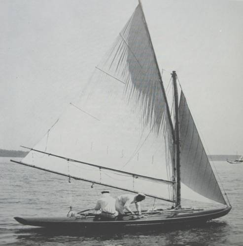
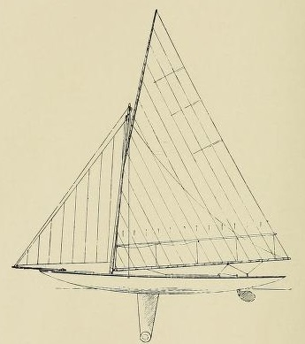
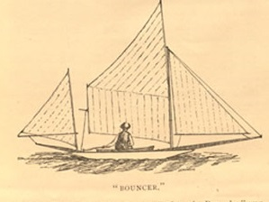
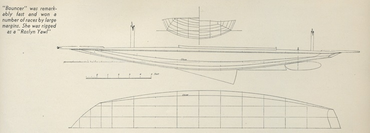
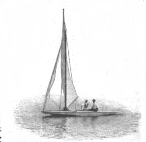
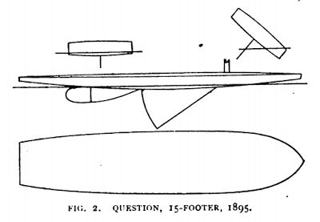
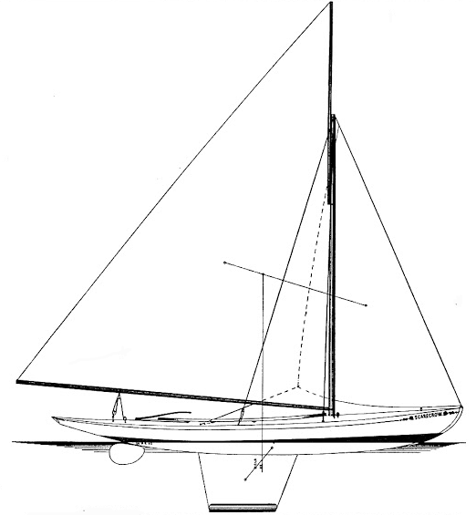
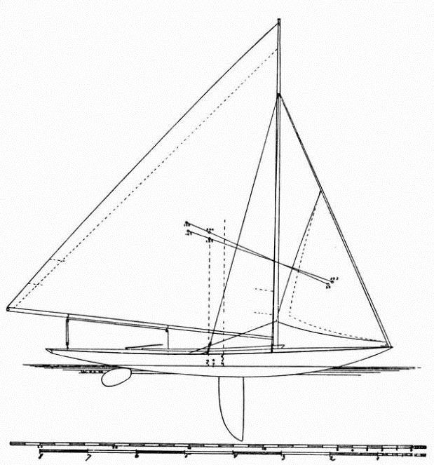
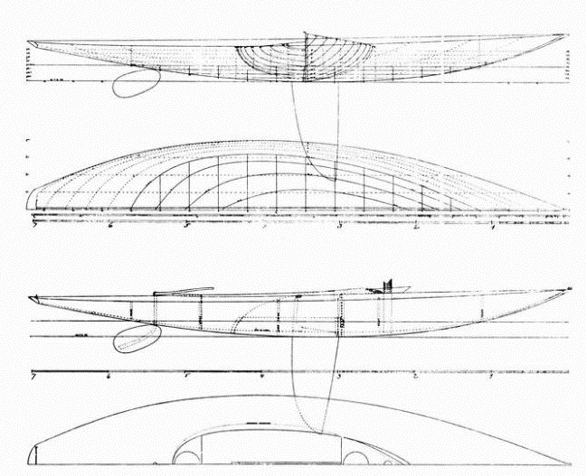

# The Seawanhaka Cup {#sec-chapter13}

Although the international women’s Half Rater challenge was abandoned, William Willard Howard’s incitement to take a Half Rater to the USA “to show the boys” lived on, and it kickstarted what became one of the most significant events for centreboarders.  [20]

Brand issued a challenge to the New York Canoe Club, who felt that the Half Raters were too big for a canoe club and passed it on to the Seawanhaka Corinthian YC [24], although many of the press still referred to the event as a “canoe race”[29]  It was decided that the series should be sailed in boats rating at 15 feet under the Seawanhaka’s Length and Sail Area rule, which resulted in basically the same size and type of boat. The Cup rules also allowed spinnakers (normally banned by British clubs in these skittish little boats) but banned the canoe-style sliding seats that Brand had used on his earlier Spruce II; instead the boats would be restricted to two crew “hiking out to full length”.[23]

Brand’s new boat, Spruce IV, was created by Harry Smith of Oxford canoe yawl fame. She seems to have been a more conservative design than Spruce II (which had twin sliding seats and a canard centreboard) or Sorceress, but like most of the boats she faced she was essentially a dinghy with long overhangs. [21]  [22]

Apart from the America’s Cup, the Seawanhaka challenge was the biggest event in American sailing for 1895. The defence trials attracted a small but diverse fleet, including a sharpie (which soon gave up) and a sistership to Wee Win, which was uncompetitive. Herreshoff’s best boat was the unconventional (but expensive) Olita, a short boat, wide-sterned boat that was so lightly built she visibly flexed over the waves. Skippered by C B Vaux of canoe fame, she finished second in the trials.

The boat that finished third in the trials was Question, a descendant of a boat that had been designed to mock the entire concept of the length and sail area rules.  As early as 1884, when most people believed that it was impractical to measure anything but waterline or overall length, sharpie pioneer Thomas Clapham had proposed that “the only proper measurement for racing purposes is to include all the elements of design made use of for the attainment of speed. These would be length over all, beam, greatest depth of hull, from water line plumb to the garboard rebate, and sail area.”  In 1890 Clapham launched the little yawl Bouncer, designed to prove his point about the ills of the L x SA rule. In Clapham’s words, she was intended “to demonstrate how foolish and unfair was the simple water-line measurement for time allowance, and to show how under the rule a large boat could be sailed in a race against a much smaller one without having to pay for her greater size and power.”

“The Bouncer system of designing may be defined as follows: The use only of curves approximating as nearly as possible to segments of circles for all longitudinal lines below the water’s surface” Clapham wrote. “If this rule is strictly adhered to it is impossible to produce a slow boat, provided the proper proportions of beam and immersed body are selected. That is to say, the deeper the immersed body the narrower it should be and vice versa.”  Although Clapham didn’t spell it out, the other key to Bouncer’s speed was that her overhangs were so low and beamy that they would have become immersed almost as soon as she heeled or started moving, so that her effective waterline was much longer than her measured waterline.

Bouncer doesn’t appear to have been the first racing scow.  As early as the 1850s, George A Shaw, a well-reputed rowing shell manufacturer from an affluent family in Newburgh on the Hudson, made a scow-type boat that allegedly went well in flat water. Years later there was a reference to a long-lost breed of “East River scows” that allegedly raced around the same time. But although she seems to have been inconsistent, Clapham’s boat sometimes sailed faster and rated lower than just about everything her size, and she caused a sensation. When she first turned up to race with the motley fleet of the new small-boat club called the Corinthian Navy it “snowed exclamation points” as sailors tried to work out what she should be called. The answer, the Corinthian Navy members decided, was either “hamsandwich” or “pancake’. To Clapham’s disgust, they quickly settled on a label that has now become famous in American dinghy sailing –  “scow”. It was probably for the best, because a “Class A hamsandwich” or the “Fireball pancake” aren’t the coolest-sounding names.

Today, we tend to assume that a “scow” must have a bow that is squared off when seen in plan form. When the type came out, and for decades afterwards, the characteristic that defined a scow was its shallow-draft flat-bottom sections rather than the bow planshape, and so it was common as late as the 1920s to refer to “pointed bow scows”. As scow sailors of the 1920s put it (in a slightly ambiguous sentence that matches the ambiguous use of the terms) “the typical scow has a very flat floor, a firm bilge, and sections that are generally parallel throughout….the matter of bow shape has nothing to do with the generic type, either the pointed-bow or scow-shaped type of hull…being true scows.”

:::{#fig-bouncer layout-nrow="2"}

Above, an early sketch of Bouncer from Rudder magazine. Below, the lines of Bouncer show a bottom that was much more rounded than a modern scow’s.
:::

The Bouncer concept arrived at the Seawanhaka Cup in the shape of Question, designed and sailed by sharpie designer Larry Huntington.  Question was not just a clone of Clapham’s concept.  In plan shape she had a rounded bow, instead of the square shape of Bouncer.  Her topsides were vertical and her hull bottom sections almost flat, although observers noted that “there are clever curves in the bottom of the Question which competitors would do well to study if they get a chance”[1]

Question was uncomfortable (she had very little freeboard, and no cockpit all all) but she was also cheap (just $250 complete, compared to $500 for the eventual defender or up to $1200 for a Herreshoff) but even in the light winds of the selection trials her potential was apparent. In one windy race of the Seawanhaka itself she sailed around the course with the official racers and beat them both.  “From the published descriptions of the initial boat, Question, and the discussion of her principles, yachtsmen all over the country became familiar with the type; and the idea was soon developed to an extent never dreamed of by its originator” noted W P Stephens. [2]  

:::{#fig-question layout-nrow="2"}

Question was a crude-looking boat, but in heavy winds she was faster than the conventional types. Pic above from Outing magazine; plans below from [Earwigoagin blogspot](https://earwigoagin.blogspot.com/). She had a steel centreboard weighing 155lb and no other ballast. From the time that Bouncer was launched, it was realised that the scows sailed better when heeled, as shown in the right-hand section below.
:::

Many commentators were horrified by Question and her cousins. “No sailor-man who sees these unsightly scows can fail to be touched with a feeling of prejudiced revulsion against them” wrote R B Burchard, who was a top Rater sailor himself.

The boat that won every race in the the defence trials was Ethelwynn, created by canoe specialist W.P Stephens. In typical Rater style, she had been created extraordinarily quickly, just 20 days after the order and design had been received.  She was in many ways a typical Rater of her day, with her hull coming in at a featherweight 355lb hull despite being 23ft4in overall, and a deep Linton Hope style centreboard weighing just 55lb, “as light as possible, the weight of the crew being depended on for ballast.”  [25]  She could and did capsize, but like the canoes and some of her British cousins she could be righted without taking on much water.

Above the state of the art hull, Ethelwynn had something that had never been seen in an international contest – a bermudan rig.  The rig had been designed by W.P. Stephens’ old canoe collaborator, Charles J Stevens. An obstinate Quaker who had come into sailing late in life, C J Stevens was never a champion, but he was passionate and meticulous in development.  Ethelwynn’s rig was a development of the one that Stephens and Steven had used for the little Rater-style cruising yacht Scarecrow they had created together.  It had a modern-style luff track and slugs replacing the cumbersome and heavy mast loops or lashings that were normally used to connect a mainsail’s luff to the mast, custom fittings and lightweight Italian hemp lines. Despite the innovative spars, CJ Stevens decided to “use the longest possible boom so as to get the lowest centre of effort.”  It was, said WP, an example of the fact that canoes still lead the way in rig design. [26]

The Seawanhaka Cup itself was a hard-fought affair on the water and off it, and even among the American crew. Ethelwynn’s inexperienced owner, scared by a fresh breeze, forced his skipper to retire from one race and Brand, in typical Victorian style, entered some silly protests. Ethelwynn took the Seawanhaka Cup by three races to two.[27]  Stephens blamed Spruce’s upwind weakness on her heavy rig and a bow that he claimed was too full, but she won the lightest heat and was well ahead when the local boat withdrew in the windiest race.  [28]

:::{#fig-bermudan-rigs layout-nrow="3"}

The bermudan rig enters top-class racing. Ethelwynn’s hull was finer under the waterline and more flared on top than Scarecrow, and her Linton-Hope style dagger looks much more efficient. Compared to contemporary  Raters like the Linton Hope designs, Ethelwynn seems to be narrow in the stern and with a lot of vee in the bow, perhaps a mark of her canoe heritage.  Her sailplan was basically identical to the later version of the one used on Scarecrow, and Stephens regarded her light, efficient rig as the main reason for her victory in the US trials.
:::

The result of the first international victory of a bermudian rig was…..nothing.  Gaff and gunter rigs continued to dominate. “Many of my clients insisted on the boom-and-gaff rig” wrote Stephens, who was a fan of the bermudian.  People like Thomas Day criticised Ethelwynn’s rig, saying that “no form of sail will send a boat to windward like a gaff-sail.” Reading between the lines of old writings about rigs, it seems that in the 1800s sails twisted off so much that the upper sections at the top of a “pinhead” bermudian sail was often of little use. Gaff and gunter rigs also had the benefit of a tough lower mast that was easy to support, and a topmast or yard that could be lowered when the sail was reefed.

The British didn’t give up after Spruce’s defeat. Linton Hope sent in a challenge. His unballasted Half Rater Kismet looks like a step on from Ethelwynn and Spruce IV and could have been an interesting competitor. But the Canadians got in first, and their Seawanhaka Cup racers were to help to change the shape of sailboat design.

Boats like Ethelwynn and Kismet can perhaps be seen to mark the end point in the development of the small Rater as an international type. Boats of this general type were to spread to many corners of the sailing world.  But the Seawanhaka Cup itself was to take another course – one which followed the example of Question and Bouncer, rather than Ethelwynn.

