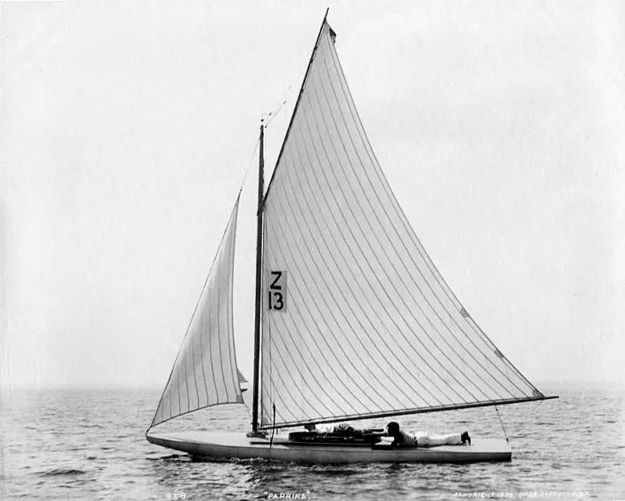
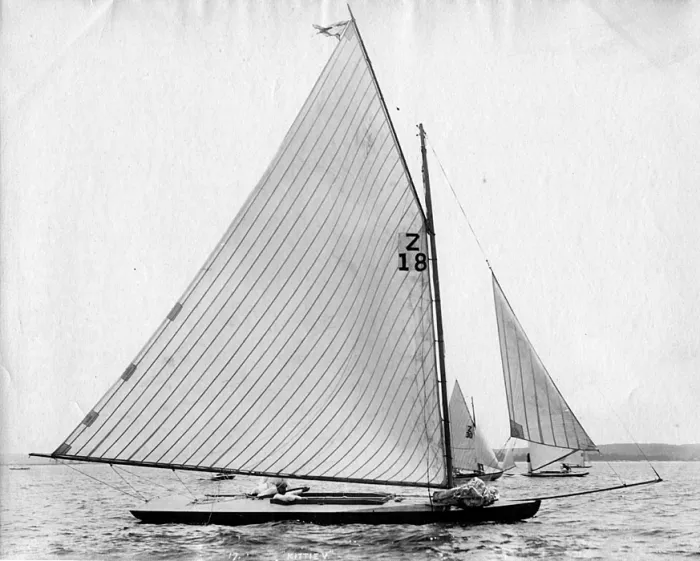
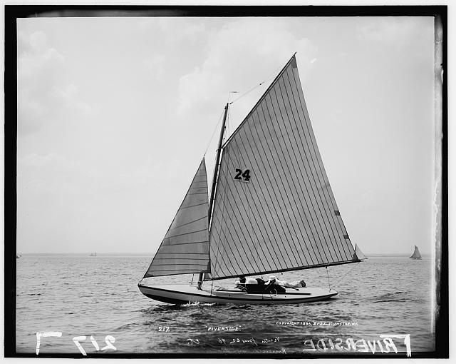
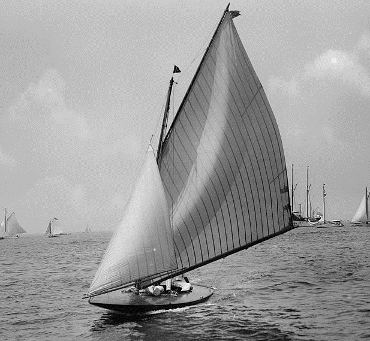
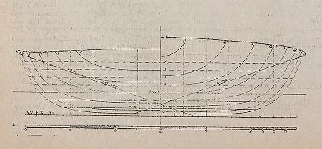
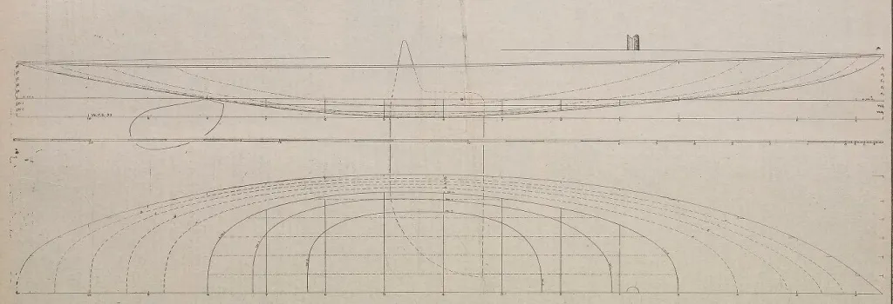
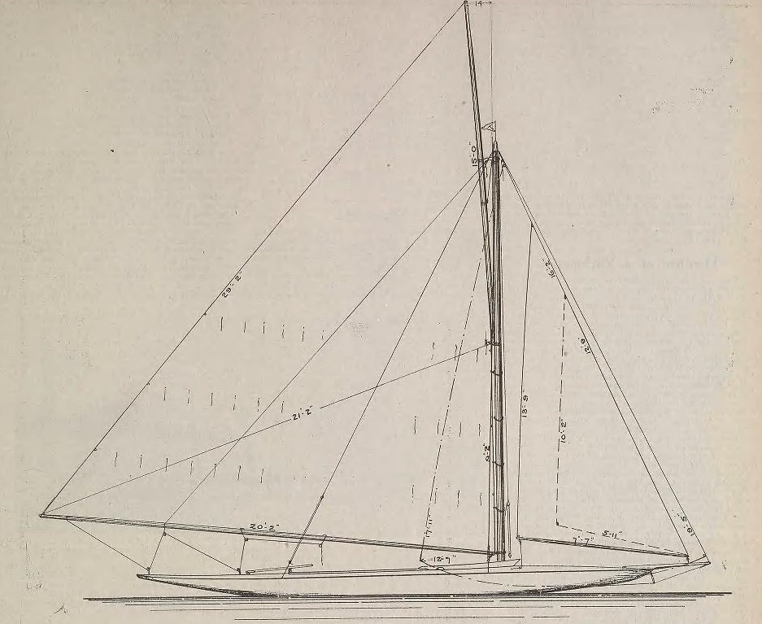
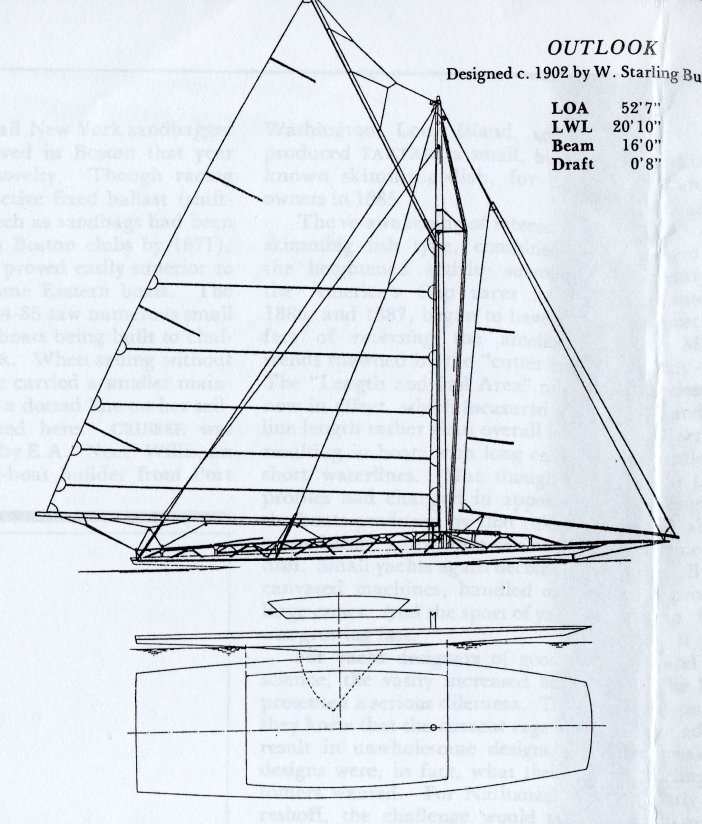
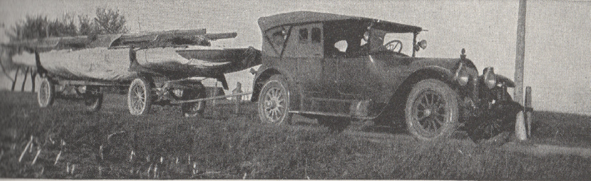
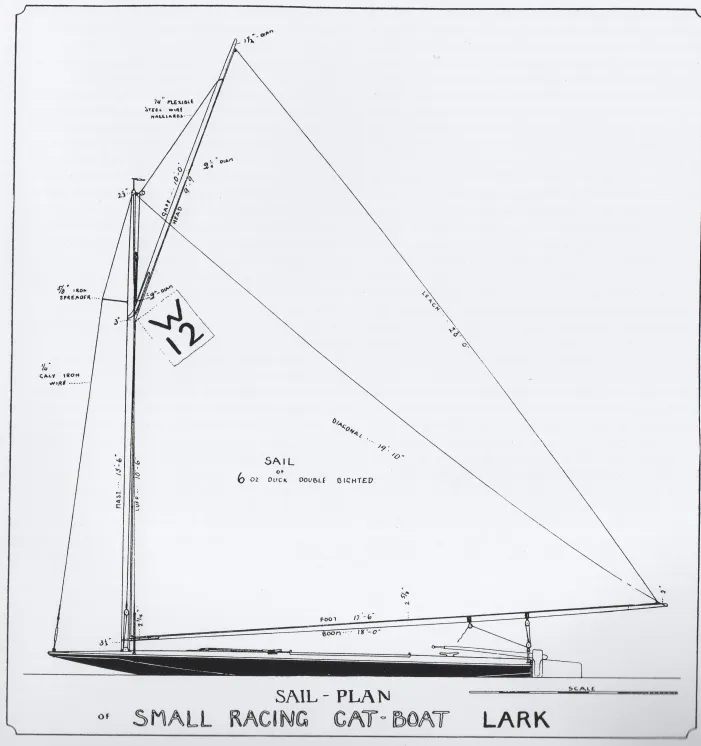

# "A radical departure": the scow {#sec-chapter14}

![“Racing Half-Raters”, from Outing magazine, August 1896. Most of the Seawanhaka Cup boats, like the Question type in the painting, were essentially unballasted and relied on crew weight for stability. Many of their sailors came from canoes and all of them would have been aware of sliding seats, so they knew all about the advantage of getting body weight out to windward. If some of them preferred to lie along the gunwale as in this painting rather than hiking like the crew of Spruce did, it may have been because sailors of the time were very concerned about the windage created by the crew.](images/chapter14/harry-b-snell-august-1896-outing-half-rater-painting.jpg)

By the time the second Seawanhaka Cup was raced in 1896, over 100 “15 Footers” were sailing in North America, with no less than 27 boats entering the selection trials and 17 aiming to become challenger. “So great a variety of features in design, construction, rig and fittings has never been brought together in the history of yachting” noted WP Stephens in Forest and Stream. The fleet was also said to be a “crude and experimental one”, because so few boats were properly tuned and prepared.

Three of the entries in the US trials were Question-type designs; Question herself, Willada and Hope. R B Burchard, who was to crew the the runner-up in the US trials, called the Huntington designs “especially ugly and crude-looking” but admitted that “they have shown great speed in heavy weather.”  They got little heavy weather in the trials, and were well out of the running.

The newest Huntington design was Paprika, described as an attempt to combine the Herreshoff Olita design with a round-bilge version of Question. She was the fastest of the fleet in strong winds, but not as fast as others in the light. She was owned and sailed by the young Sherman Hoyt, who was to become one of the world’s great yachtsmen over the next few decades.

One of the most bizarre boats was “In It”, designed by the Crosby Company. She was said to have "the appearance of the under body of a small boat, fastened to the upper body of the larger model. There is no only a separate hull, but also a separate V-shaped transom or knuckle forward of the rudder and under the water-line." This strange design reduced the measured waterline to 10ft and therefore allowed In It to carry 375 sq ft of sail under the Seawanhaka Rule, but she was a failure on the racecourse. Many years later the 12 Metre Mariner tried a similar underwater transom and was a famous flop as an America’s Cup defence candidate, proving that small boats led the way even when it comes to bad designs.

Kittie V was another boat that had “a sort of double hull, the lower to be measured and the upper to do the sailing on”. Her “lower hull” turned out to  be too small to lift the “upper hull” out of the water while the boat was measured, so she must have been measured on her “real” waterline length. That may explain the small jib in the photograph above. She was fast in light winds, but didn’t bother to start when it looked as if it would blow.

Vesper had circular sections, so that she presented the same shape to the water at all angles of heel, and was described by Stephens as being similar to Sorceress. Sailed by Paul Butler of canoe fame she was beautifully built, with hollow spiral-veneer masts and silk sails, but poorly prepared. She was another of the finalists.

![Vesper. Her mainsail had a long batten that looks like a gaff. Although her sails were silk, it was noted that they set poorly, as can be seen from the crease running vertically down from the peak of the head batten. One of the striking points about sailing in the 1800s was how many boats were rushed into trial races and championships without much preparation time, and then discarded as failure after just a few races. Perhaps the very fast pace of design development and the comparatively primitive knowledge of tuning in those days meant that people normally assumed that a lack of boatspeed was a design problem, when it was probably often a tuning issue. There must have been many good boats that failed to show their true potential because of the lack of development time.](images/chapter14/vesper.png)

The boat that was chosen as American defender, El Hierie, was one of those that had been inspired by Question. She was the creation of Clinton Crane, who managed to beat boats from most of the established American designers with the first design he ever created.  At the time, most of Crane’s sailing had been done on primitive canoes. His only design experience consisted of building a crude canvas-covered half-size version of the deep, narrow Hyslop 30 cutter Petrel, an experience that taught him that “small boats that are ballasted by their crews are bound to be faster than any keel boat of the same size.”

Crane, who had worked a summer job as a shipyard machinist while studying naval architecture at Harvard, saved up his wages to pay for El Hierie, which cost only $500 with sails. He called her “a round bilged scow with a vertical transom and the lines carried forward to sharp bow, the overall length being 26 feet and the waterline length 15 feet.” Her hull shape was intended “to provide a boat which could be fair in shape when heeled over to about 15 degrees, and at 15 degrees heel would have enough stability to carry 225 feet of sail.”

The Canadian challenger Glencairn, designed and skippered by civil engineer C.H. Duggan, was another boat that was inspired by the scows in the first Seawanhaka Cup trials. It was, wrote Duggan, “a radical depature” from earlier designs.  “Studying the designs in the inclined position in which the boats must generally sail, it became apparent that by making flat floors carried to the end of the waterlines, or a modified scow, many advantages were to be gained” he wrote years later. “When inclined the flat section became the canoe-like form with greatly reduced waterline beam, the waterline became elongated both forward and aft giving a sailing length considerably greater than the measured waterline, a symmetrical waterline plane and altogether very easy lines.  It had another advantage in shifting the inclined centre of buoyancy further to leeward, thus giving a greater righting moment to the weight of the hull and crew and permitting a larger sail plan to be carried than in the Ethelwynn type, without increasing the beam.”[3]

Duggan built his own blocks, spars and sails. He was described by Crane as “not only a great sailor but a fine engineer and had proved himself a wonderful designer….. a past master of light construction, which means putting material in the places where it is needed and omitting all material from the places where it is not needed.” (15)

Despite her overall length of 24ft, it was said that “above water she appears to be as large as a one-rater” but Glencairn’s hull weighed just 320 lb and because of her extremely short waterline length of just 12ft 3in, under the simple length  and sail area rule she could carry 260ft sq of sail. Duggan noted that Glencairn and El Heerie were “practically the same form” but the American boat was less stable and, because of its longer waterline, had only 240ft 2 of sail. “Glencairn won easily, due no doubt to her additional power and sail-area” noted Duggan. “For the first time an American yacht has met defeat when defending an international trophy….” noted Day in The Rudder magazine. “A more decisive victory than that achieved by Glencairn has seldom been registered…on every point of sailing the Canadian craft…easily sailed away from El Hierie.”

:::{#fig-glencairn-lines layout-nrow="3"}

Glencairn's hull lines and sail plan.
:::

The long effective waterline length and big rigs of boats like Glencairn moved performance to a new level in medium and fresh winds.  Crane said that the older style of Rater like Ethelwynn was “a sweetly formed little boat, but except in light weather hopelessly outclassed by the scows”.  The scow types, he claimed, had a maximum speed of about 14 knots, six knots faster than a more conventional boat.

The Half Rater or 15 Footer class was dumped in favour of larger boats (rating 20 feet and about 32ft overall) after the 1896 Seawanhaka Cup. It was a change that both Crane and Duggan (who both kept designing and sailing Seawanhaka Cup racers) regretted. “I am fairly sure that it would have been better for the sport of racing had it continued in the smaller boat, but many people felt that these 15 footers were too much like canoes, and that much more could be learned about design and sailing in a boat which required a larger crew” wrote the US designer. (12)

In their short life time, the American 15 Footer/Half Rater types had changed the face of sailing. They had demonstrated to American sailors “the practicability of sport in so diminutive a boat” and lead to a huge growth in small yachts. But they chose a variety of local one-designs around the same size, ignoring the radical products of designers who had “speedily murdered the (15 Foot/Half Rater) class by demonstrating that under its rules, a perishable, shingle-shaped article and not a staunch boat, was the prize winner”.

The Seawanhaka Cup 15 Footers had also taken the scow from a curiosity and turned it into a gold standard for performance. The bigger boats soon took on the same concept. Within a few years there were bizarre boats like Outlook, less than 21ft on the waterline but 52ft7in overall, with a hull just 8in deep, 1/4in spruce planking that split under her crew’s feet, and a giant steel structural truss running on top of her deck to hold her together until the end of the two regattas she sailed.

Even the very largest of boats were inspired by scows. In 1901, BB Crowninshield launched the biggest scow of all, the America’s Cup triallist Independence. She was unsuccessful, but that didn’t stop the old sandbagger racer C. Oliver Iselin from pressuring Nat Herreshoff to make Reliance, the largest America’s Cup boat ever built, a scow.  The fact that America’s Cup syndicates were requesting boats of a type pioneered by dinghy-size centreboarders like Bouncer and El Hierie may have been symbolic of a major change in raceboat design.   For perhaps the first time, the design of the largest boats was being inspired and led by small dinghy-size centreboarders. The centreboarder had taken over as the leading force in sailboat design.

Such excesses would never last. The short waterline of the Rater types demanded lightweight construction that was unable to withstand the strain of waves banging under the flat scow bow. On the coast, the radical scows quickly pounded themselves to pieces and proved themselves too hard to sail.  As Clinton Crane noted, many yachtsmen soon decided that the scows were unseaworthy, uncomfortable and fit only for young experts. His own Seawanhaka Cup designs proved the point – one of them only lasted six races.

In the words of historian Russell Clark, “the American small sailing yacht evolved from an extreme and dangerous racing machine – to an extreme and dangerous racing machine. From sandbagger to scow.”  W P Stephens was one of those who was horrified by the scows, saying that they were “a type of racing machine which no one with the best interests of yachting at heart can contemplate with any sentiments but disgust and disappointment…the majority are calculated to work nothing but harm to yachting….as long as such freaks are recognised and actively encouraged by the clubs, no general good to yachting can be look for from racing in the small classes.” Francis Herreshoff agreed, describing them as “the worst freaks of all”.

The descendants of the boat that Thomas Clapham had designed to make a point about the length and sail area rule proved that he was right after all.  The concept was too easy to get around, and its end marked the end of the long search for a single simple rule that could fairly rate all types of boats, from dinghies and small Raters up to America’s Cup boats.  The future lay with more sophisticated rules, targeted at specific types of craft.  Nat Herreshoff himself created the Universal Rule, which restricted the width and shape of the bow and stern, to knock the flat-bowed scow type out of competition among bigger boats. Other coastal sailors moved to slower but more practical one designs and  restricted classes.

Of course, the basic geometry of the scow concept was too good to allow the type to die. It just moved to flatter water and into smaller boats. The sailors of midwestern USA, who had already been moving towards the scow shape even before the Seawanhaka Cup arrived, brought in construction and design restrictions that ensured that their characteristic bilgeboard scow would become a fixture on the USA’s small inland lakes.

The big bilgeboard scow was to be the fastest of all centreboarders for decades, but they were almost entirely restricted to the midwestern lakes. The two boats that made the scow popular around the world were launched by The Rudder magazine as the century came to an end, and they helped to set a pattern for the small-boat sailing of the future. As   recounted in the [Earwegoagin](http://earwigoagin.blogspot.com.au/2014/07/the-lark-scow-laser-of-early-1900s.html) blog, the first of them was the 16 foot Lark, the creation of Rudder’s design editor C.D. Mower, which raced with success in the 15 Foot class of Seawanhaka Cup fame in 1898. The plans for Lark were issued in the magazine that year, followed by a big sister, [the 24 foot sloop Swallow](https://earwigoagin.blogspot.com/2015/02/the-swallow-scow-plans-rudder-magazines.html), in 1899.

The Rudder designs were cheap, easy to build and fast, and they were a huge hit. As Francis Herreshoff was to recall many years later, “most of us who were boys during the happy nineties were much carried away with the skimming dishes…when The Rudder of 1898 brought out its “How to Build a Racer for $50.00″ we boys were very excited about the racing catboat Lark”.  Larks and Swallows were soon sailing and winning around the world, from Japan to Christchurch in New Zealand’s South Island and Perth in Western Australia.

One of the most striking points about the letters from builders that flowed into The Rudder was that they couldn’t help themselves from altering the boats. It was a habit that (as earwegoagin’s excellent posts on the Lark and Swallow show) created mini-Larks, keelboat Larks, cruising Larks and even Olympic Larks. In the 1900 Olympics in Paris, Larks were apparently entered in the “0 to .5 ton” rating class. Although the details of that regatta are notoriously unclear, it’s possible that Larks that won both races and therefore became the first champion Olympic dinghies (rather than the first dinghy class).

In a way, the Lark and Swallow can be seen as symbols of three eras. They showed the way to a future when thousands of dinghies would be made by amateur boatbuilders at home. The fact that they don’t seem to have achieved widespread organised racing, despite their popularity, typified the confusion and stagnation of dinghy racing in the early 1900s. And they marked the end of the era when dinghy development worldwide was dominated by design concepts created in the British Isles and eastern North America - see @sec-chapter15. 