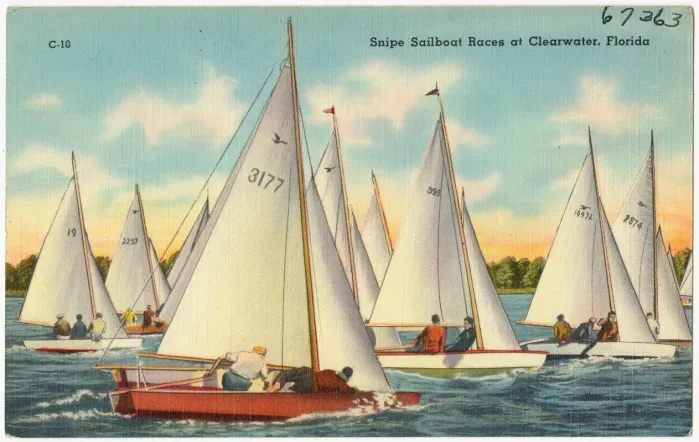
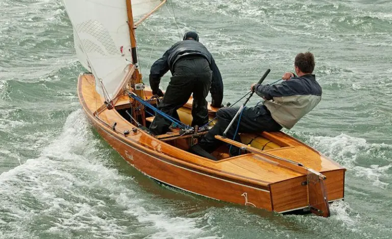

# Introducing the era of nationalism: dinghy sailing in the early 20th century {#sec-chapter15}

Something odd and unexplained happened to centreboarder sailing as the 19th century came to a close. Within a period of about three years, international racing and the influence of centreboarders on sailboat design reached a new peak, and then quickly faded. The nature of dinghy design itself started to change in rather puzzling ways, and in some ways the development of boats and of the sport itself seem to have stagnated over the next few decades.

No one in the 1890s seems to have foreseen the doldrums that dinghy design was about to reach. The end of the Victorian era had seen international racing in big centreborders in areas as far flung as the Thames and Auckland. Centreboarder design had reached new heights of influence in the world of sailing. No longer did the design of small craft lag behind the big yachts, as it had often done in the early days of centreboarder sailing. From the 1890s onwards, the concepts developed in small centreboarders like the canoe yawls, the Raters and the scows took over as the driving force in sailboat design. An observer in the late 1890s would have only seen grounds for optimism. There seems to have been no hint that small boat racing was about to enter a quarter of a century of generally slow and insular development. Perhaps the pace of change itself exhausted dinghy sailors. Maybe the poor sportsmanship that was such a feature of international challenges in the 1800s turned people’s minds back to local racing; certainly some British big-boat sailors felt that the international events only harmed the more important cause of local racing.

The tale can be told in stark numbers. There were five challenges for the oldest international trophy in centreboarders, the New York Canoe Club Cup, in its first decade. After 1895, there were only two in 38 years. New Zealand and Australian were involved in two international events for centreboarders (the Intercolonial One Rater Challenge and the Anglo-Australian Shield) in just one year in the 1890s, but then stayed out of international racing for almost 40 years. Canada faded out of the scow matches against the USA. Even when the dinghy sailors of the world met in the Olympics, it was normally in a design only sailed in the host nation. Even national-level events seem to have been rare in first 20 or 30 years of the 1900s.

Whatever the reason, the lull in international and national events may have been a symbol (and perhaps a cause) of a major shift in the evolution of dinghy design. From the time that Britons in Boston had created the centreboard itself, the British Isles and north-eastern North America had produced almost all of the innovations that created the sport of dinghy sailing. Those areas had produced the catboat, the sandbagger, the sailing canoe, the Raters, the one design concept, and scows. The flow of designs outwards from Britain and America had tended to unify design across the globe. The amazingly fast communications, the small number of other sports to write about, the surprisingly common export and import trade in boats, and the passion and technical skill of writers like Thomas Day, Dixon Kemp and WP Stephens meant that sailors in South Africa or Hamburg could keep up to date with the latest designs bred by men like Linton Hope and Paul Butler. It led to international uniformity in concepts and in the general outline of design. There were direct links between Bob Fish in New York and the sandbaggers of Hamburg; between designs of the Thames and the Raters of Auckland; between the offices of Rudder magazine and the Swallows of the Adriatic.

 site.](images/chapter15/n-class.png)

As the new century arrived, this era of internationalism faded. Centreboarder design across much of the world became isolated and parochial.  For the first half of the 20th century, each of the major sailing regions developed its own style of boat; a distinctive indigenous breed suited to their own conditions, culture, geography and economy. The British adopted local one designs and development classes with short, round-bilge planing hulls: the Germans bred long, slender designs; the US adopted big hard-chine one designs and scows; New Zealand and Australia each developed two distinct breeds, one of them the over-canvassed development type we now call “skiffs” and the other a lighter breed of turbocharged dinghy; the French seem to have had their own eclectic mix.

:::{#fig-snipes layout-nrow="2"}

The Snipe (top) led the way in creating a distinctive American style of dinghy, but along with the 12 Square Metre Sharpie (below) it was also one of two hard chine one designs that emerged in 1931 and had worldwide influence. Top: Boston Public Library image.
:::

As each region developed its own style of design, sailors and designers seem to have become less interested in designs from other areas. There were, of course, exceptions. The major one is the international spread of two hard-chine one designs, Germany’s 12 Sq Mtre Sharpie and Rudder magazine’s Snipe, which appeared within a few months of each other and spread around the globe. But it does seem that after the late 1890s, many of the major dinghy sailing regions developed a distinct local style that would dominate the sport in that area until a new internationalism arrived in the second half of the 20th century.

The next section in SailCraft is about the development of those national styles. Once again it is a tale of technical development, but also of the social, geographical, economic and factors that drove and crafted the craft we sail. Some regions get more attention than others, but that’s not an indication of their relative importance. In some cases other people (like New Zealand’s Robin Elliott and Harold Kidd) have already written such great work that there is little new ground to cover; anyone interested in dinghy history in their area should just go and buy their books!  In other regions (primarily Europe) the problem is the lack of information in English.  If there is a disproportionate amount on the history of Australian dinghy sailing, it’s not because I think that Australian design was the most advanced or best (it clearly wasn’t) but because very little has been written about the subject by sailors or by historians, and that has allowed a few myths to evolve. Australian libraries and museums have also made a lot of excellent historical information available, and that reveals a sailing scene too diverse to cover with the usual inaccurate cliches about “Sydney Skiffs”. But to start the second phase of the history of dinghy sailing, we will return to the country where it may have all begun – to England, and to two of the most famous names in the sport. See @sec-chapter16