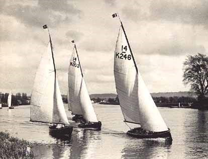
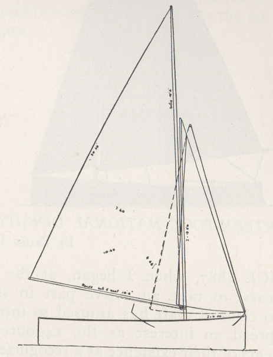
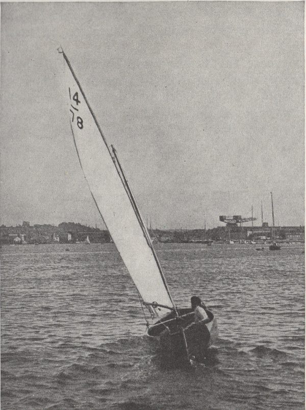
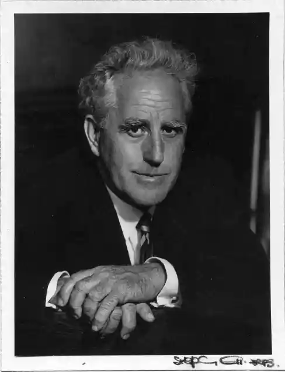
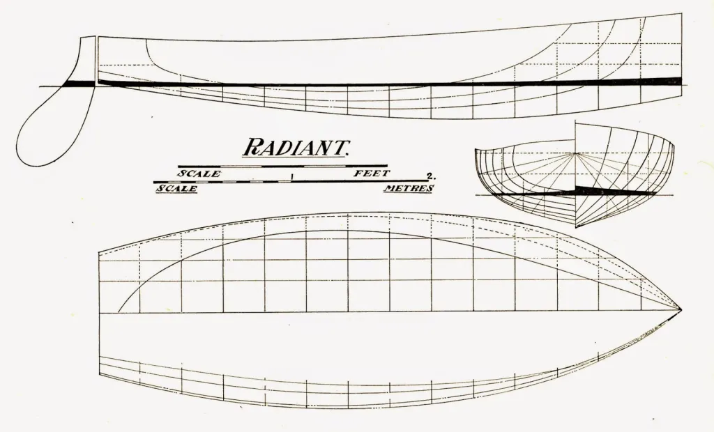
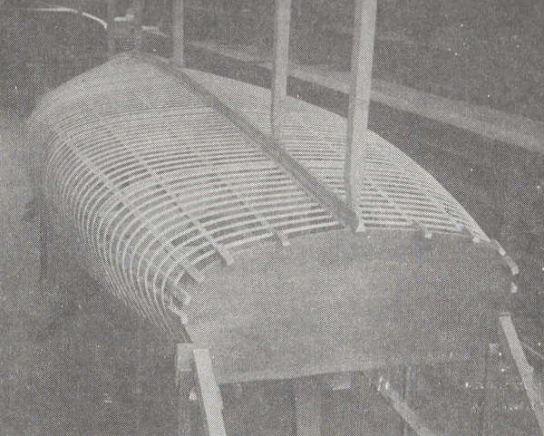
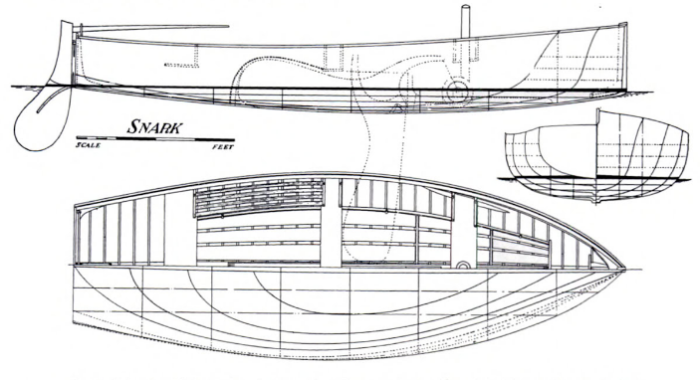

# "Fox hunting": Uffa, Avenger and the planing dinghy {#sec-chapter16}

Looking through the dim lens of a century or so, it seems that dinghy racing in Britain stalled in the early years of the 20th century.  The influence and popularity of the canoes and small centreboard Raters had faded.  The fleets that developed out of the sail-and-oar boats were isolated and disorganised. There were pockets of activity, but fleets generally seem to have been small and confined to small areas.

The long era of quiet seems to have ended in 1923, when the National 14 class was formed to allow the classes of 14 footers that had quietly grown in different parts of the country (mainly the Norfolk Dinghy and the West of England Conference Dinghy) to race together under a complicated set of rules that allowed for different weights, construction types and sail areas.

Although the class’ excellent history by T J Vaughan notes that the early Nationals “still showed their link with the yacht tenders from which they originated”, there had been significant development since the days of the earlier oar-and-sail boats. They had evolved away from the narrow and tucked-up “wineglass” transoms towards flatter sterns. They had flat centrelines and semi-circular sections, which reduced the wetted surface area and therefore cut down on skin friction. The circular sections also meant that the underwater shape stayed the same when they heeled to a puff, making them easy to handle. Ian Proctor, who went on to become one of England’s top designers, noted that this hull shape developed in areas of fluky winds and commented that “the U-section of boats of about this time gave advantages in gusty weather, in which it is difficult for even highly skilled helmsmen to keep a dinghy sailing level.”

As the designer of the class’ first champion, Bruce Atkey, wrote that they were “used for cruising as well as for racing, and so are made as comfortable as a fast open boat can be”. But even before Atkey’s words had been printed, the whole shape of dinghy sailing was changed by one man and one boat. The man was Uffa Fox, the boat was Avenger.

Uffa may not have invented the planing dinghy with Avenger as is so often claimed, but he did make a giant leap forward in design. It was Uffa who created a dinghy that would plane regularly and on reaches as well as runs, not just when driven downwind in a gale. And Uffa not only created a design that made planing routine, but honed a new sailing technique to match.

Finally, but perhaps most importantly of all, Uffa told the world about this “new” concept in performance and design, and in the process he seems to have changed the way much of the world thought about dinghies. As International 14 sailor and IYRU (later World Sailing) head Sir Peter Scott was to write, in Avenger’s day “dinghies were the kind of boat you used to take you to a larger and more respectable yacht and were not in their own right regarded as yachts at all.”  Uffa and his 14s showed the whole sport that small dinghies were not just inferior versions of “real” yachts, but were more advanced and capable of higher performance than the mighty cutters and schooners. As Frank Bethwaite has pointed out, “in his books and in the media of the time he wrote about this new way of sailing….the credit (for inventing the planing dinghy) has always gone to Uffa Fox…because he wrote about and explained what he was doing”.

So who was Uffa Fox? The bare facts – that he was a boatbuilder, designer and sailor from the Isle of Wight, a traditional centre of British sailing – do nothing to show his character or his influence. New Zealander Geoff Smale spent an enchanted afternoon with Uffa at his boatyard after Smale won the 1958 Prince of Wales Cup, “wandering around with a straight edge”, comparing hull shapes and talking design. Although the admirable Smale sailed many boats, became an Olympian, a highly successful businessman and remained so active that he died after crashing his microlight plane at the age of 86, when I spoke to him in the 2000s he still recalled his day with Uffa as “one of the greatest days that I ever spent.”  American sailor/designer Sandy Douglass, no man to mince words when it came to criticizing people, was just as frank in his admiration for Fox. “I hesitate to write of Uffa” he wrote “for fear I could not do him justice, for Uffa was the most remarkable man I ever met…..Boat designer, racing skipper, writer, wit, raconteur, singer and friend – he was all of these and more”.

Uffa followed the great tradition of British eccentrics. He had, said Scott, “an irresistable urge to shock the straight-laced.”  This was a man who rode his horse to the dinner table, a man who turned up to the first of his several weddings with his toenails (which he would only ever cut on Tuesdays) poking through holes in his only pair of shoes. It was Uffa who decided to cure his boatyard staff from their “repressive” habits of going to the toilet in private, by building a communal toilet and conducting office meetings while sitting on the “throne”. That didn’t work. It was Uffa who lived and worked on an old floating bridge (cable ferry), and tried to escape property taxes by towing it across government boundaries with a rowing boat. That did work.

It was Uffa, a tradesman in a class-conscious era, who became a celebrity by becoming the firm friend and sailing tutor of the British royal family. His name could be found in the tabloids, and in a play by Joe Orton, one of the “angry young men” of British literature. It didn’t stop him from “christening” an America’s Cup challenger by pissing on the keel while the Queen was on deck, or managing to comment loudly about “bedworthy” women while at Buckingham Palace to receive the CBE.

Like so many of the early dinghy sailors, Uffa was a renaissance man. He recorded a successful album of sea shanties with Beatles’ producer George Martin. He created the airborne lifeboats that saved the lives of many shot-down Allied aircrew in World War 2. His books on sailing and design (edited by the man who inspired Peter Pan), covered boats from dinghies to the J Class and sold well.

As a sailor, Uffa had both talent and daring. He sailed across the Atlantic and raced successfully in big boats and Six Metres (then the “grand prix” class of yachting) but his main fame as a sailor lay in his small boats. He became a national champion in 14s, an international champ in Canoes, and he stunned sailors with feats such as sailing the open, undecked 14 Footer Avenger across 100 miles of open ocean to race the French, sailing home overnight and then racing the same afternoon.

Uffa’s unconventional mind had unconventional training. At a time when most boatbuilders learned their trade building heavy displacement boats, Uffa started his apprenticeship working on the hydroplane Maple Leaf IV, the first boat to go over 50 knots. Later, he helped to built floats for the early flying boats. It was the ideal training ground for a man who would become famous for his diktat that “weight is only useful in a steam roller”. It was an era, Uffa wrote, of rapid change – from horses to petrol engines, cars, airplanes, and a world war. “It was natural that my apprenticeship, served through all this change, taught me to take nothing for granted, nor to accept past designing and construction as unalterable. So when I started off as a young designer and builder, it was with a mind as free as air; with a restless zest to strive for “newness” in design”.

Uffa wrote that his experience with planing powerboats and his “zest for newness” inspired him to create something different – “a light hull could be driven, so that she would rise and plane along the surface of the water like a speed boat”. He also seems to have been well aware of the Oxford canoe yawls and the lightweight Raters. The new National 14 class gave Uffa an ideal arena to apply these influences to a dinghy, but like many up-and-coming professional boatbuilder/designers, he could not afford to risk the reputation on which his job depended on by creating a failure. Instead of leaping straight to his ideal conception, he had to slide slowly towards it. His first 14 design, Ariel, was a cautious step towards a planing hull. Next, to explore whether the other extreme would work better, he experimented by creating the deep Vee design Radiant which was designed to “knife” through the water as a displacement boat. On both boats, he experimented with different rig proportions and mast positions. Both were successful, but Laurent Giles and his U-shaped boats typified by Snark (designed as a WEC Dinghy in 1911 but still competitive as National 14 as late as 1928) remained on top. “The problem was difficult” wrote Uffa, “for Giles as a designer was king of the castle and in a very strong position having, in twenty years or more, developed and perfected the Snark type of lines. If I followed, it was obvious that I would always do so, and so I decided to go off on another tack.”

After success with Ariel and Radiant, Uffa finally felt ready to take his “other tack” – the long-awaited step towards a planing dinghy. Her name was Avenger, and she was a complete break with the past. When she was designed, the 14s were allowed to trade off weight for sail, and Uffa planned for Avenger to weigh 27kg (60lb) lighter than usual and carry 0.9sq m (10sq ft) less sail. The rule was altered while Avenger was being built and Uffa added an 18kg (40lb) bronze rudder as the easiest way to bring her up to weight, but her true breakthrough – her hull shape – remained the same.

It was the Avenger’s Veed hull sections, wrote Uffa, that was her “secret”. “Broadly speaking, the only difference between the Avenger and the Snark is in the sections, Snark being U sectioned and Avenger V” he wrote. “Her V sections run down to give her deep chest forward of midships and run right throughout her length…The V-d sections for the first third give her an angle of attack to the water….so as Avenger’s shaped bow was driven through the water, its shape and angle of attack caused it to lift. The two thirds of length in her long run aft ran fast and easily in the groove cut by the sharp V bow perhaps 3″ less in depth than her waterline at rest. She changed trim and went along at double the speed of any other dinghy at this time. It was this planing ability that made her invincible in winds of over 12 miles an hour, and so the first sea-going, planing sailing boat was born.”

Avenger’s race record tells its own tale – 52 wins, two 2nds and three 3rd starts out of 57 races. She planed away to win the 1928 Prince of Wales Trophy by five minutes. “Other Fourteens planed on occasions” wrote Tom Vaughan, the class historian. “Avenger would pick up her skirts and go at the slightest provocation — it became the rule rather than the exception. On the wind Avenger was just as efficient”. The sport, Uffa’s competitors joked, was no longer dinghy sailing but “Fox hunting”.

Uffa’s proviso – the first “sea-going planing dinghy” – is often forgotten, even by him. As we’ve seen, Avenger was not the first boat to plane under sail. Uffa was not (as has been claimed) the first to apply the term to dinghy sailing – Giles himself had written of “planing” in a dinghy before Avenger was launched. But Avenger may have been the first “normal” dinghy (as distinct from a canoe, Rater or scow type) to plane regularly, on moderate-wind reaches as well as screaming runs, and she did it not in a distant backwater or a small class, but in the home of English sailing and the class that was the playground for the UK’s dinghy designers. Geoff Smale recalls that older boats like the Kiwi X Class 14 footers would plane only square running in a big breeze “through brute force, because the power was too much for them to do anything else, but the (International) 14 would plane on a close reach.” The Fox 14s showed the world what dinghies could do, and Avenger remains arguably the most important dinghy ever.

Uffa always said that Vee sections were the secret of his success. But were they? As early as the 1950s, boats like the Flying Dutchman and 505 were moving away from the Vee, to a flatter shape. In fact, most modern high-performance boats (with notable exceptions like Julian Bethwaite’s designs) have “U” shaped sections – almost like the 14s before Avenger. In some ways, the U-shaped sections of the Giles designs, and the accent on reducing wetted surface area, are much closer to the modern ideal than the Fox boats.

So if we have returned to U shape sections in most modern performance boats, why was the Vee-shaped hull such a breakthrough in Avenger’s time? It seems that the answer lies in the way boats were sailed in earlier days. The sailors of the ‘20s (and decades after) were handicapped by technology. Their sails were difficult to depower, their rigs were heavy, they lacked high-tech lines and modern cleats and controls. Etiquette often demanded that they sailed in street clothes, even ties and street shoes. They hiked off narrow gunwales, their feet slung under the centerboard case or thin, uncomfortable hiking straps or wooden battens. They had no trapezes and beam was narrow, reducing leverage. Even in boats like canoes, which had more leverage, the early sliding seats were so low to the waves that they were sailed heeled, to stop the skipper from being washed off. Self bailers were unknown, so heel also helped to keep the windward gunwale high and reduced the amount of water splashing aboard. The heavy centreboards provided righting moment, but only when the boat was heeled.

These factors combined, it seems, to mean that the early dinghies were sailed in a breeze with much more heel than we use today. Dixon Kemp reckoned that a dinghy was normally sailed at 15 degrees, and heeled to 30 in the puffs. Francis Herreshoff’s contemporary diagram of righting lever arm shows a range of boats, including a canoe and a sandbagger, at 17 degrees of heel. Look at the photographs in earlier chapters, and you’ll see most boats beating or reaching in a breeze- even the champions – are sailing with much more heel than we’d accept from a top crew today.

This style of sailing was in harmony with the shape of the boats before Avenger.  The early 14s, Ian Proctor noted, came from gusty areas, and the round-bottomed shape still performed well when heeled to puffs. But, as Uffa realized, the Avenger type needed a new style of sailing. “It was essential to have a great deal of power off the wind to make Avenger plane at double her normal speed”, he wrote, so instead of reefing like earlier 14s, the helmsman had to work the mainsheet like a fisherman played a fish; “play his sheet in and out and spill the wind out of the top of the sail, so though all the while the boat was kept travelling at her maximum speed, she never, for a moment, had more pressure in her sails than she could endure.”

Another clue to the Vee shape comes in the same paragraph from Uffa. “We kept the jib in tight, as this tended to ease the weather helm when the boat heeled in a squall and put her lee bilge down deep.” This passage may confirm that what sailors of Uffa’s day called sailing “upright” was not actually sailing with zero heel – it just meant sailing at a much smaller angle of heel than had been common  before. Look at Uffa’s own logo and letterhead above; they show him sailing canoes and an I-14 with more heel than a modern champion would advertise. Even allowing for the fact that photographers may have thought heel artistically pleasing, it seems that what sailors of Uffa’s day called “upright”, was in fact sailing at a heel – “putting the lee bilge down deep”.

Why didn’t Uffa and his contemporaries sail truly upright? A dinghy’s ability to carry sail is governed largely by the distance between the centre of gravity (C.G.) and the centre of buoyancy (C.B.). When the hull is upright, the C.G. is directly above the C.B. When a typical hull is heeled, the volume in the leeward bilge moves the C.B. out to leeward. That increases the distance between the two centres, increasing stability because the weight of the boat is acting as a lever against the buoyancy.

We all know that heel generally increases drag; the increased drag on the hull alone is said to be around 5%, and heel also increases rig and foil drag. In many modern dinghies, the crew can develop so much power from trapezes, wings and racks that it’s better to reduce drag by keeping the hull upright and relying on crew weight alone for stability. But in other craft, the extra righting moment generated by heel creates more than enough sail power to offset the extra drag. That seems to have been the case in Uffa’s day, when rigs were heavy and righting moment was generated by heavy centerboards and primitive hiking straps. To generate the greatest possible stability they needed to be sailed at an angle of heel, but to plane they needed to present a flat surface to the water. Uffa’s Vee-shaped boats presented a flat surface to the water when the boat was heeled; the older U shape presented a rounded one.

Geoff Smale, whose runaway Prince of Wales Cup win shocked 14 sailors of the ‘50s, confirmed the reasoning above, and that the Vee was effective only when boats were sailed at an angle. “If you kept the lee side of the Vee just flat to the water’s surface, that gave you maximum hiking power and they really went. If they had allowed the trapeze, the Vee wouldn’t have lasted as long. Once you put the trapeze on, you didn’t need the Vee because you could hold the boat flat. It’s what power the boat has that determines the hull shape”.

So Uffa’s Vee shape, the shape which is sometimes held out to be the key to planing, was only part of the answer. It was a highly intelligent reaction to the limits of the technology of the time, not an ideal design in itself. But for the next two decades, Uffa was to perfect his basic concept in a series of boats that would come to represent the classic British racing dinghy.

# REFERENCES (draft)

“The long era of quiet seems to have ended in 1923”:- The National rules had actually been drafted by Morgan Giles around WW1 (1911 or 12 according to Maud Wyllie, about 1918 according to Vaughan) but the class had failed to take off until various sailors and the RYA got involved in 1922-23. The initial rules included many trade-offs, apparently to allow types that had evolved in very different ways to race together. Each boat could carry “two distinct Sail plans”, one for the sea and one for inland use. Sail area could also be traded off for weight under a rating formula, and clinker-built boats had a rating adjustment to allow for their extra wetted surface area. These provisions were all dropped as the class evolved from one which catered for existing boats into one which catered for ones designed specifically for racing in the class. See “The International Fourteen 1929-1989” by T J Vaughan.

“Ian Proctor, who went on to become one of England’s top designers”:- “The International Fourteen-Foot Dinghies”, Ian Proctor, “British and International Racing Yacht Classes”, E H Whitaker (ed) 1954

“As the designer of the class’ first champion, Bruce Atkey, wrote”:- ‘The Fourteen-Foot National Dinghy Class” in “Sailing Craft”, Schoettle (ed) 1928

“As International 14 sailor and IYRU (later World Sailing) head Sir Peter Scott was to write”:- “-

“As Frank Bethwaite has pointed out”:-

“Geoff Smale, one of the great International 14 champions”:- Personal telephone interview with the author

“American sailor/designer Sandy Douglass, no man to mince words”:- “Sixty Years Behind the Mast – The Fox on the Water”, Gordon ‘Sandy’ Douglass

