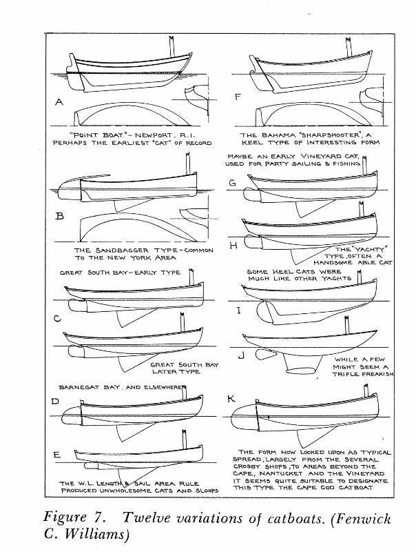
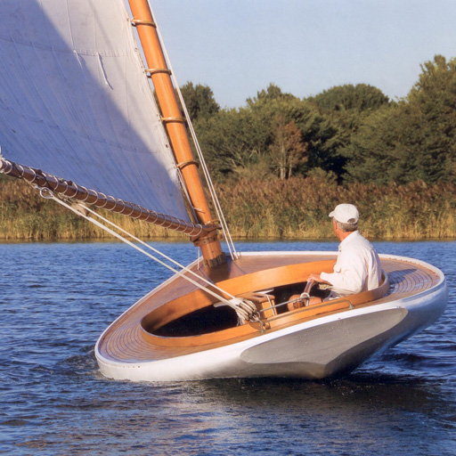
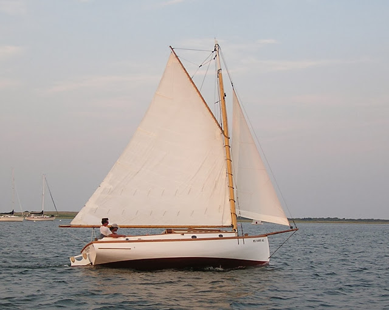
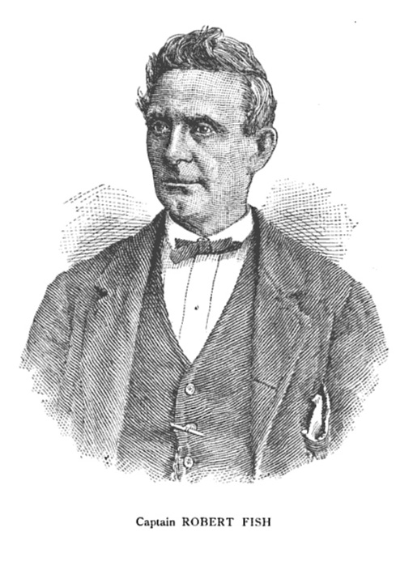
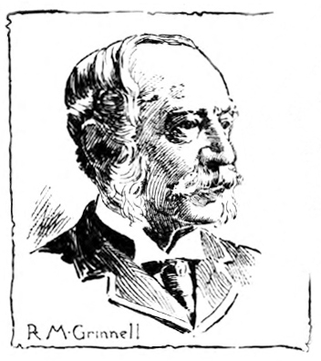
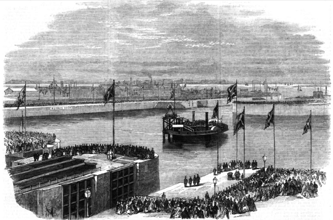
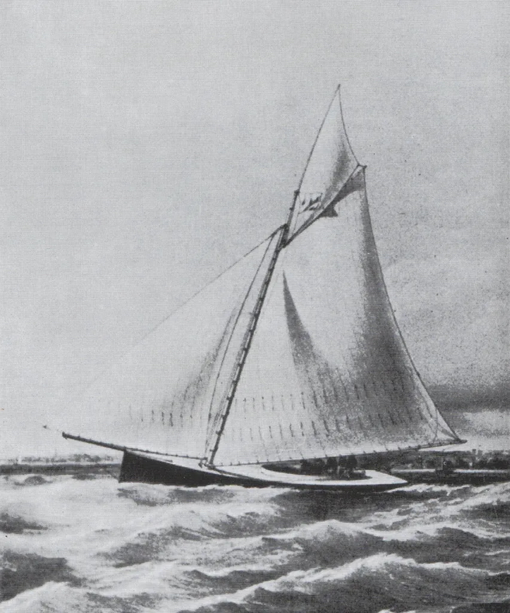
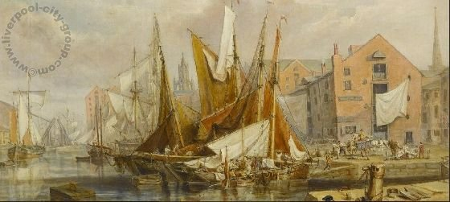

# "Truly as fast as the wind": Catboats and skimming dishes {#sec-chapter2}

While Peggy slept in her boatshed and Margaret rotted by the lake, the next ancestor of the modern racing dinghy started to evolve across the Atlantic.  Some time before 1850, when the waters of north-eastern USA developed the beamy, shallow type that was to become the catboat and the sandbagger.

The ancestry of the catboat is a mystery.  The Dutch, the developers of the fore-and-aft rig and the first European settlers around the New York area, had used similar short and beamy boats with a mast stepped well forward for many years, and some of that tradition may have remained in the small boats using for fishing, oystering and other work around the north-eastern USA.  But even to authorities like Howard Chappelle and William Picard Stephens, the greatest of all racing sailboat historians, exactly when and where the breed developed remained unknown.[^chapter2-1]

One of the earliest descriptions of the type that for some unknown reason became labelled the catboat can be found in the recollections of the legendary yacht designer Nat Herreshoff, who sailed the “Point Boats” that had evolved around the point of Newport Rhode Island by the mid 1800s.  “Most boats in those days were roughly the type of the old Julia” he wrote to his son Francis, referring to a long-keeled boat approximately 23’ long that was built by Nat’s father Charles around 1833.[^chapter2-2]   “They were nearly all cat rigged with high narrow sails.  In their regattas there were no restrictions as to req. ballast, so it was the custom to take out part of the standing ballast and replace it with sand bags and men.”[^chapter2-3]

A correspondent in the New York Clipper paper New York Clipper of November 11, 1854 claimed that “as far back as 1810,” he had “a beautiful little schooner-rigged centreboard sail boat, with which….he used to go forth and outsail everything of her size that floated: and about the same time, Fountain and Hatfield, of Whitehall, rigged centreboards to their piraguss, which so improved their working and sailing qualities that nothing could sail with them.” [^chapter2-4]

Craft like the “Point Boats” remained popular in the deep waters around Boston and Newport, but in the mid 1800s a different style started to develop around Cape Cod and in the shallower waters around Long Island, New York, New Jersey and Barnegat Bay.  As Nat Herreshoff recalled, about 1853 or 1854, “the cat boats were changing to centreboard and greater beam, and their rig not so high & narrow.” [^chapter2-5]

The style that is now the archetypal catboat didn’t evolve until about 1850, when the Crosby family of Cape Cod launched the first of the 3500 “Cape Cod cats” they have built.  The Crosby cats were heavy centreboarders, with the mast stepped right in the eyes of the boat, a hull almost half as wide as it was long, and a huge transom. [^chapter2-6]  Although the Cape Cod Cat is seen as the classic catboat today, in the 1800s many localities developed local breeds. They all used the catboat trademarks of wide, shoal-draft hull and low aspect rig, but tailored the style for their own conditions and use.

No matter what local breed they were, the 19th century catboats often carried a bowsprit and jib, especially for racing or the light winds of summer. A sloop-rigged catboat seems a contradiction in terms today, but they used words differently in the 1800s.  Words like “catboat” or “cutter”, which we used to describe a type of rig, were then used as the label for a general type of hull. As Nat Herreshoff’s brother Lewis wrote, “the cat-boat in the usual acceptation means something more than its simple rig; it stands for a shallow, wide boat, with one mast crowded into the extreme bow, and a boom reaching far over the stern.” In typical sailing fashion, just to confuse the uninitiated the sailors of the time also used the term “cat rigged” to refer to boats that only hoisted a mainsail.

This evolution towards a broad, shallow centreboarder was common around many parts of the USA. At the start of the 19th century, the waters around New York had been populated with wide and beamy centreboarders like the big North River sloops, 75 to 100 feet long, that worked freight and passengers up and down the Hudson.   Fastest of them all was the giant racing sloop Maria, which had a full 26’6” beam on a waterline length of 92’ and a draft of just over 5 feet with her seven ton centreboard up. She was built in 1846 for John C Stevens, founder of the New York Yacht Club, and easily defeated the yacht America in trials before the famous schooner went to England and won what would become the America’s Cup.  About half the  big yachts of New York followed the same beamy centreboard theme as Magic.

To British yachtsmen, the shallow, beamy American centreboarders were to become known as “skimming dishes” or “surface sailing” boats, because they were thought to skim over the surface of the water, rather than knife through it like the deep British craft or the pilot schooner types like America herself.  By the time of the first America’s Cup challenge in 1870, the beamy centreboard “skimming dish” hull was established as the American national type, from the smallest catboat to the largest schooner.

Like many of the big yachts, the small catboats were normally designed and built by self-taught men, not by trained shipwrights or designers. “Phil” Elsworth was an oysterman, Jake Schmidt a hatter and saloonkeeper.  They designed by carving models in pine, and then cutting them apart to use as the pattern for the full-size boat. Their experience and innate ability allowed them to create boats that for many years equalled those of the trained designers.[^chapter2-7] [^chapter2-8]

One of the greatest of these “modellers” was Bob Fish. Born into a distinguished family, he had been forced to support his family and siblings when his father died early.  “He was a man of no technical education, but a born boat sailor, an original thinker, and a very clever mechanic” wrote WP Stephens.  Lewis Herreshoff, brother of the famous Nat, rated Fish as second only to Steers (designer of the schooner America) in his time. Another who ranked Fish highly was A Cary Smith, who served an apprenticeship in his Pamrope boatshed before becoming famous for designing America’s Cup winners. [^chapter2-9]

It was two of Bob Fish’s creations that made the catboat and the sandbagger famous around the sailing world, even before they were fully developed in their own home waters. Although the tale of these two little boats seems to be a diversion from the development of the catboat type in its American home, it is a tale worth telling because the sensation they made in England makes them the first well-documented examples of their type, and also provides an illustration of their strengths and weaknesses.

In 1852, Robert Minturn Grinnell ordered a jib-and-main boat from Fish.  The two men were linked by their families, which had been partners in the prosperous shipping firm that had just launched Flying Cloud, one of the greatest of the clipper ships.  Although he was a member of the New York Yacht Club, Grinnell was about to leave his home town to take up business in Liverpool. In 1852, little Truant, about 20’/6m overall and 7’/2.1m in beam was delivered to Liverpool, then the world’s busiest port.

While the Americans had been developing the beamy centreboarder, British yachting had developed the narrow deep keel cutter.  Just as the word “catboat” then referred more to a hull shape than a rig, in 1850 the term “cutter” did not simply mean a single-masted boat with more than one headsail, as it does today.  To sailors of the 19th century, it meant a boat with a deep slender hull (a product of harbour taxation laws, rating rules and the belief that a narrow boat performed better in choppy English seas) and a complex rig with a large topsail and several headsails set from a reefing (retractable) bowsprit.  Even small fishing craft, skiffs and dinghies under 20 feet tended to have complicated rigs with lugsails or spritsails, jibs and even mizzens. Such rigs may seem clumsy to our eyes, but they were comparatively easy to reef or douse in the changeable and often blustery British winds.

The men who sailed the English cutters were far from the modern cliché of the conservative Victorian-era British yachtsman. Sailboat racing as an organised sport was young – little older than the 505 class is today – and it was proud to call itself the most progressive and scientific pastime of the era. Even an “establishment” club like the Royal Yacht Squadron was led by a man (C.R.M. Talbot) who earned his fortune in the new industries of steel and steam and counted among its members like Robert Stephenson, creator of the famous ‘Rocket’ steam engine and one of the new breed of engineers who was transforming the entire world with railways. Other members included the great Radical journalist Albany Fonblanque and Joseph Weld, who had created an entire lake on his estate as a giant test tank. [^chapter2-10]   Even those who had the most conservative political and social views were fascinated by new yacht designs; the Marquis of Coyningham, pilloried by The Times as one of the worst of the landlords who lorded over the oppressed Irish in the leadup to the Famine, was one of those who tried to buy the schooner America. Men like this and their professional skippers and crews sailed hard, gambled hard on their races, and were not above fighting with marlinspikes or using cutlasses and axes to cut a rival’s rigging after collisions.[^chapter2-11]   At least that was a fair contest; [^chapter2-1]  other “sportsmen” of the era got their kicks by watching their greyhounds tear live hares apart, or shooting hundreds of captive pigeons in a single match.

The big boat sailors of the time believed that they had a duty to use some of their wealth improve the breed of sailing craft.  Sailing was not just a sport; it was the usual method of transportation for amateur and professional fishermen, daytripping tourists, and merchant and naval seaman.[^chapter2-12] Until the more economical compound steam engine was developed in the 1870s, even the most modern ironclad warships relied on sail power for long passages. As one newspaper noted “the celebrated tea clippers, which used to make such wonderful passages to England from the China ports, were the fruits of theory and practice combined and developed in yacht building.”[^chapter2-13]  Oyster fishermen of the Chesapeake later improved their boats after reading magazine updates on yacht design, and at least one yachtsman used to sell his old boats to the local fishermen each year to improve their fleet. [^chapter2-14]

Truant crossed the Atlantic while British yachting was still in shock from the victory of the schooner America the year before.  [^chapter2-15] “The first effect of the visit of the America was visible in 1851 in the remodelling of the entire British yacht fleet” wrote WP Stephens. [^chapter2-16] The big cutters and giant schooners were being cut down and re-shaped; their bows extended and made finer.  Their full sails were being replaced by flat ones, laced to the boom. “The ‘America’ was truly the harbinger of a mania for clipper-yachts” said one writer.  “Every yacht and boat-builder immediately had their hands full….Such was the complete revolution in yacht-building created by the performance of that vessel, that more than half the whole fleet of yachts were altered at the bows….so great was the rage to excel and to possess a clipper yacht, that experiment upon experiment was made.”[^chapter2-17]

Grinnell couldn’t have arrived at a better place and time. The sailors of the River Mersey cities of Liverpool and Birkenhead were just as keen on development as those who sailed the giant schooners and cutters of the Thames estuary and the Solent. They included men like members of the famous Laird shipbuilding family, who had recently launched the world’s first iron warship, complete with “sliding keels”. Shortly before America and Truant crossed the Atlantic, yachtsmen of the Mersey established the Birkenhead Model Yacht Club as “a school of marine architecture” with the aim of “scientific experiment and practical deduction” to improve boat design.  To the BMYC members, the word “model” had three meanings. As well as the obvious meaning of scale model, it was also a common term for the physical shape of a yacht’s hull at the time. Finally, and perhaps most importantly, there was the connotation of “an example to follow or imitate”, as in the term “model of perfection.”

The men who formed the BMYC, once called “the mother of small yacht clubs”, ranged from titled big-boat owners to immigrant students, but they were united by a desire for a “progressive and scientific yacht club” that would improve boat design by testing models.[^chapter2-18]  “5000 persons assembled to witness the match. I will never forget the sight as long as I live” remembered one witness to one of their model yacht races in the docks near Liverpool “up to nearly their waists in the water stood some 15 gentlemen, including…a well known medico….and one of the young Lairds, who then owned a yacht of some 35 tons.”[^chapter2-19a]

Some BMYC members quickly found out that the choppy water of the dock and the effects of scale meant that their tests were misleading, and decided to continue their experiments with full size boats. “Owing to the dissatisfaction of several of the more progressive spirits at the results of our model experiments, craft of from 4,5,6,7 and 8 tons were at once built” foundation member H.R. Murray recalled years later. “And no sooner did they spread their white wings over the Mersey than (a ship) brought over a queer-looking centreboard craft” wrote Murray. [^chapter2-19b]

The “queer craft” was Truant. The little American boat caused a sensation. She was “another America; dissimilar in some respects, but greater as developing a great novelty” raved one paper. “Her peculiarity consists not only in her rig, but in her hull” which was “about as flat as a butchers tray, sharp in front but full behind. She has a shifting keel by which she can either draw about eight inches of water only when running, or about 4’6” when beating, at which time only her keel is put down like an ordinary boat’s. Of her rig next.  She has her mainsail flat as a board and laced; and carried forward what is known to yachtsmen by the appellation of a “bumpkin” foresail, also laced to the boom.  These, with a small topsail, constitute her suit: and a smarter suit it would be difficult to find...[^chapter2-1b]

The “strange-looking little foreigner…has her mast stepped in her very eyes- has a long easy entrance – full withal, and not a hollow line about her – carries her body all aft – does not draw much more water than about a foot in ballast trim – sails with a small centre board” noted another fascinated reporter. “She is about twenty feet over all, and seven feet beam.”

Unlike the British cutters, Truant could sail well under mainsail alone, although she did sometimes set a topsail.  When racing she appears to have normally carried a jib set on a boom which (like the rig of a modern model yacht) pivoted on a point aft of the tack.

Even before her first race, Truant’s performance on the narrow Mersey River amazed the locals. “Truly she is as fast as the wind – staying, wearing, running and reaching under the single sail with amazing velocity” one journalist reported.  [^chapter2-19]  In her first race the little boat, rated at 3 1/2 tons, “shot away”[^chapter2-20] to finish 16 minutes ahead of the fleet. “Although the Yankee has, on this occasion, again ‘whipped all creation’ the best feeling was manifested; and Grinnell was highly complimented by the commodore in awarding to him the cup.” [^chapter2-21]

By July, Grinnell had shipped Truant across the Irish Sea, and “the Yankee cockleshell” was amazing the Irish regatta circuit. [^chapter2-22] She could “go about in the most extraordinary manner, in fact exactly like a top” exclaimed the Cork Examiner, and “gaining ground on every tack”, she “shot off rapidly” to win.[^chapter2-23]  The “extraordinary little yacht” was “now as famous in Dublin Bay as she had previously become at Liverpool.”[^chapter2-24] 

Truant gained her most noted success after she was shipped down to the Thames, site of the world’s first organised yacht racing club.  The unbeatable American was already so famous that before the race, Bells Sporting Life was warning spectators to book early for the spectator ferry.[^chapter2-26]  In the race she showed herself to be “infinitely superior” upwind, winning by a quarter of an hour from larger boats before being “greeted with loud cheers, which were taken up by several of the yachtsmen afloat in their own craft.” [^chapter2-27] Truant’s triumphs were not just local news; they were reported as far afield as New York and Australia.

“The performances of this little vessel in beating to windward and scudding before the wind were astonishing” wrote contemporary sailor Henry Folkard in his enormously popular book Sailing Boats. “No English boat her size could sail so close to the wind, nor run so swiftly before the wind; and the result was, that the Truant completely vanquished on the river (as her larger sister the America had done on the sea) every boat that competed with her. [^chapter2-28]

The New Sporting Magazine compared Truant’s impact to the that of the schooner America. “No English boat of her size could compete with her; and thus a second revolution was brought about; and boat-builders puzzled their brains over this new discovery which now dawned upon them, as the astonishing performance of this little clipper were from time to time witnessed in every match she sailed.”[^chapter2-25]

One of the boatbuilders who puzzled over Truant was  H.R. Murray of the BMYC. Years later, he was to use the term “surface sailing” to contrast the American centreboarders with the deep British boats. “The hull should skim over the surface of the water, while the immersed blade increases the lateral resistance, and enables them then in ordinary weather to hold a wind with their deep-keeled rivals.” It was a description that echoed Schank’s words of the 1700s, and that Murray would take across the world. [^chapter2-11]

Although there were some who jeered and even some who cursed, the available evidence indicates that the overall reaction of the Victorian yachtsmen to Truant was positive.  As early as November 1852, Grinnell noted that builders from all parts of the UK were copying her model, and as soon after Truant returned from the Thames to her home waters at Liverpool, she started facing competition from other boats built along the lines of the American centreboard sloop. [^chapter2-29]   The Mersey fleet soon included the centreboarder Breeze built along American lines, the 10 ton Stranger, a keelboat built to the centreboard sloop concept by Bob Fish himself and carrying up to 12 crew as live ballast, and another Fish export, the little 2 ½ ton Buffalo Gal that was later sailed by Grinnell. [^chapter2-30],[^chapter2-31]

Probably the keenest of all the Mersey centreboarder fans was the cotton  merchant Alfred Bower.[^chapter2-32]  In his obituary is was noted that Bower “to his last was a firm believer that, for speed, the centre-board would beat the deep keel craft hands down.”[^chapter2-33]  For several years he had a new 8 ton centreboard sloop type built every year; first Presto, then Challenge, Charm, Spray, each with 670lb/300kg) of movable ballast mounted on “tramlines” that ran across the cockpit – an idea that the legendary Herreshoffs only adopted about a decade later.[^chapter2-34]

Presto, Challenge and Spray were each built by local boatbuilder Philip Kelly.  And here we come to an intriguing note – for the only boatbuilder of that name I can identify in the area at the time was in his late 60s, but still healthy enough to woo and marry his third wife a few years later.  The marriage records show that the ageing Philip Kelly had been born in Douglas to a shipwright named Thomas Kelly in Douglas on the isle of Man in 1786.  Was this the same Thomas Kelly who was listed in George Quayle’s accounts for the construction of Peggy?  Was the young Philip Kelly the first ever boy to be fascinated by a champion centreboarder, and to decide to devote his life to building boats?  Did he chuckle when the ‘new fangled’ centreboard, similar to the ones he may have worked on 50 years before, arrived at his Liverpool home when he was an old man?  It’s hard not to think that the Philip Kelly who built Bower’s boats must have grown up on the Isle of Man, watching his father build Peggy under George Quayle’s direction, and perhaps lending a hand on her modifications in those days when children started their apprenticeships early.

But despite the enthusiasm for the American centreboard sloop, within a few years the type seems to have died out.  Race reports become once again a contest of deep, narrow cutter against deep, narrow cutter. So why did the American centreboard sloop fade out in Britain?  In part, it was due to the fact that the rating systems of the day favoured the traditional deep and narrow cutter.  Truant, 20’ long overall, only had a handicap of a minute per race over Julia, the runner-up in the race on the Thames, which was more than 30’ overall.[^chapter2-35]  But the rating system itself could not have killed the centreboard sloop; they could still win races, and other types that rated poorly (like the Itchen Ferry Punts) did not die out.

The centreboard itself attracted some criticism.  Some said that it was “a dodge” that allowed her to sail into shallow waters and escape unfavourable tides. [^chapter2-36]  Years later one “establishment” owner was to comment that “for many years there was a curious dislike and distrust of (centreboards) among British boat-sailers and builders. They were excluded altogether from most regattas; and not one in twenty of the boats that would have been vastly improved by them were ever fitted with them. They were regarded, for some mysterious reason, as unseaworthy, unsportsmanlike, and unfair.”[^chapter2-37];  Others said that the movable centreboards should be banned because they were a return to the curse of shifting ballast that had blighted British yachting for years. [^chapter2-38] Still others spoke of leaking centreboard cases, while Francis Herreshoff noted years later that stones from the British shingle beaches often jammed ‘boards.

Although it is often said that centreboards were banned from British yachting, in Truant’s day there was no national body to enforce such a ban, and the two major small-yacht clubs, Birkenhead and the Prince of Wales, either permitted them or, following the standard practice of grouping boats of similar type into specific classes, ran separate classes for centreboarders.  Some years later, other regatta organisers and clubs did ban centreboards, and they were specifically banned from the bigger yachts, but at this distance it is hard to find any evidence that prejudice or blind conservatism was the reason.

There were those who criticised Truant and similar centreboarders as nothing more than “sailing machines”. “We may just as well call her a yacht as term a match-cart (i.e. a horse-racing sulky) a comfortable family carriage” said one writer after Truant’s victory in the Thames. [^chapter2-39]  “A shallow skimming dish should hardly be allowed to sail in matches, in which vessels possessing the usual accommodation were competitors, and almost certain to be distanced.”[^chapter2-40]

It was, in truth, a fair point. The boat that ran second to Truant on the Thames was Julia, described as “a very peculiar model” of boat, built in iron to a design by her owner. [^chapter2-42]  Rated at 7 tons, she had a waterline of 26’6” LWL, a beam of 7’11” beam, and was about 30 feet long.  She was a much larger boat than Truant, but she also had a 10’ long  saloon with standing headroom that would seat half a dozen in comfort. [^chapter2-41] The Ida, which placed third that day, was only 22’6” long but had completed a 20 day cruise to France.[^chapter2-43]  Truant, in contrast, was an open day-sailing racer that was carried from race to race aboard ships.[^chapter2-44] Even in larger sizes, the centreboarders had their accommodation cut up by the centreboard case and the deck obstructed by the large deckhouse required for headroom.[^chapter2-45]  Putting a boat like Truant up against these seaworthy cruiser/racers was like putting a skiff in a sportsboat race.

But in the end, the Mersey centreboarders may be an early example of the fact that weather, society and geography dictate design.  The beamy centreboard sloop often performed brilliantly on the Mersey, Thames and Dublin Bay, but it may not have suited other British conditions.  As the celebrated yachting writer William Cooper (writing as Vanderdecken) noted, in flat water, downwind or in steady conditions the American sloop type was “admirably adapted, and of wonderful speed” but they were inferior in typical English conditions of blustery  winds and choppy seas, cut up by tides and overfalls. “They are not calculated for our seas” was his conclusion[^chapter2-46].

Cooper‘s criticism could perhaps be dismissed as bias or conservatism, if it was not borne out by so many race results and reports that spoke of the centreboard sloops retiring or lagging behind deep-keel cutters in strong and gusty winds and choppy seas.  [^chapter2-47] [^chapter2-48] Sir William Forwood’s story demonstrates that “establishment” figures like him were not scared of the new style of centreboarder, or ignorant of its problems.  He had sailed on several of the centreboarders owned by his uncle Alfred Bower. In 1866 he bought Truant “which had greatly distinguished herself for speed, and taking her up to Windermere” he wrote. “She was not, however, of much use on that expansive but treacherous sheet of water. The heavy squalls were too much for her huge sail plan.” [^chapter2-49]

![The cutter Coralie (left) takes the winner’s gun in a Royal Mersey Yacht Club race in 1847, five years before Truant arrived in Liverpool. The big cutter’s owner was one of the BMYC members who used model yachts to test new designs. Coralie was to become one of the rivals of the bigger Bob Fish and Philip Kelly designs such as Challenge and Stranger in a series of interesting battles between the deep British cutter and the shallow American centreboard sloop. This copy of the Henry Melling painting comes from the RMYC site.](images/chapter2/coralie.jpg)

Many years another writer who had learned to sail on the Liverpool sloops wrote of their “alluring excitement” but claimed that sailors were turned off by their dangerous and uncomfortable performance in the choppy, windy and cold British conditions.  An Australian yachting writer claimed years later that the Liverpool sailors laughed “when they recall to memory their folly, and the risk they used to run in the useless and unseaworthy boats, which they looked upon at the time as not to be beaten by anything afloat” [^chapter2-50]  Even Truant herself, sailed by the experienced Grinnell, capsized twice on the Mersey.[^chapter2-51]  Anyone who looks at the Mersey could wonder how they would right and empty a big 19th century centreboarder among those chilly tide-ripped waters and steep riverbanks.

Truant’s career shows a trend that extends to the present day.  The fact that some people disliked the type is seen by some modern commentators as unfair bias by a blind establishment.  In fact, judging from the press accounts, those who cursed Truant were greatly outnumbered by those who cheered her.[^chapter2-52]  Some reports of her performance exaggerated her record, rather than diminished it. [^chapter2-53]   In the end, it seems that the American centreboard sloop died out in Britain not because of establishment bias (although the rating rule was harsh on them) but because they were unsuitable for cruising and inconsistent and uncomfortable for racing in English conditions.[^chapter2-54]  It might be significant that when the Mersey developed another local centreboard class in the 1880s, the class rules created a slender (5’8” to 6’ beam) 18 footer with a moderate sized 280ft2 rig rather than a beamy American sloop type.[^chapter2-55]  But true to his beliefs, Arthur Bower kept his last centreboarder, Enigma, laid up for 20 years, and to the end of his life he occasionally brought her out to “show them how a race should be sailed”.

And what of Grinnell? After selling Truant, he also occasionally raced his big schooner on the Mersey.  When the American Civil War began, this member of the New York establishment took up arms against his own side by joining the southern Confederate forces.  Remarkably, after the south lost the war he appears to have returned to New York, but unlike the rest of his family he dropped out of sailing.

But even as the craze for the American centreboard sloop started to fade, the model started to spread further afield.  Men and boats inspired by Truant ended up taking the “surface sailing” model across to the far side of the world. Bob Fish himself started to export centreboard sloops to Germany, especially to the tiny ornamental lake Alster in Hamburg. Was Fish’s export drive spurred by the fact that one skippers entered against Truant in the famous race on the Thames was a Herr Westphal from Hamburg?  But that is another story, and first we must look at the next Bob Fish boat to cause a sensation overseas... see @sec-chapter3.

[^chapter2-1]: See “Fore & Aft Craft and their story”, E Keble Chatterton, p 261 and 305.

[^chapter2-2]: Capt. Nat Herreshoff, the Wizard of Bristol by L Francis Herreshoff, p39

[^chapter2-3]: This information comes from Nat Herreshoff’s recollections of his grandfather’s tales of early sailing, as described to his son L Francis Herreshoff in a letter of 10 Feb 1926.  Reference: Mystic Seaport Museum.

[^chapter2-4]: The pivoting centreboard, as distinct from the daggerboard-type “sliding keel” of Peggy and Schank, was designed by another Royal Navy officer, Captain Molyneux Shuldam,  when he was a prisoner during the Napoleonic Wars.  A parallel but slightly later development was awarded a patent in the US.  Shuldham, described by an Admiral as “a very clever officer”, designed a “revolving rig” similar to that of the current superyacht Maltese Falcon, as well as a “harpoon rudder” that seems to have been the first spade rudder; Transactions of the Royal Institution of Naval Architects, Vol 9 1868 p 273.  

[^chapter2-5]: Letter of Nat Herreshoff, Mystic Seaport Museum, Feb 10 1926

[^chapter2-6]: Francis Herreshoff believes that the Crosby Cape Cod type was merely one example of the catboat’s spread up and down the coast, but that “they came into vogue around on Cape Cod where the centreboard cats were so popular that many people speak of them as Cape Code cats.” The Compleat Cruiser, p 299

[^chapter2-7]: See for instance “Traditions and Memories of American yachting” MotorBoating August 1944 p 49.

[^chapter2-8]: “The history of small yacht design Part II” by Russell Clark p 29, Wooden Boat July/August 1981 has information on some of the odd thoughts of the “Rule of thumb” school.

[^chapter2-9]: Fish also built boats for the Duke of Wellington and worked for Stevens, founder of the NYYC and the syndicate that built the schooner America, and as the modeller for the NYYC (Brooklyn Daily Eagle 27 June 1889 p 6). As expert skipper as well as a builder, like other catboat sailors he seems to have turned to a career as a professional racing skipper in big boats later in life.

[^chapter2-10]: Talbot was vice commodore; the commodore was the Prince of Wales?

[^chapter2-11]: The *Times* of 23 July 1795 reported a collision between Mercury and Vixen, in which the captain of Vixen dismantled his rival’s rigging with a cutlass.  See also The New Sporting Magazine, Volume 11 p 181.  In the Town Cup at Cowes in 1826 a Sir James Jordan allegedly floored a crewmember of Weld’s Arrow who had tried to bash him over the head with a marlinspike after a collision. Rudder v 21 1909 p 11

[^chapter2-12]: There was some justification for this belief; in both England and the UK , and the brig-rigged yacht Waterwitch beat naval ships so often that the Royal navy bought her for a trial horse.

[^chapter2-13]: *The Australasian*, 9 July 1881 p3

[^chapter2-14]: Chappelle

[^chapter2-15]: America’s victory was not won against the best yachts in England.  As WP Stephens, the leading authority in yachting history of the time wrote in his journal.  One of the best British yachts lost her    and another of the top boats went to her aid.  The      cutter                  , was only     behind the     ton American schooner at the finish and would have won under any reasonable rating or handicap system.  America’s only other win was against Robert Stephenson’s Titania, a schooner of half America’s rated size.

[^chapter2-16]: American yachting p 71

[^chapter2-17]: “Yachting and yacht racing”, New Sporting Magazine, July 1866 p 21. “”a school of marine architecture”; Hunts Universal Yacht List, 1852, p 63.

[^chapter2-18]: The Australian Town and Country Journal, 5 May 1888 p 39; Ballarat Courier 7 Sep 1877

[^chapter2-19a]: Ballarat Courier, 30 Aug 1877

[^chapter2-19b]: Ballarat Courier, 7 Sep 1877

[^chapter2-1b]: The Era, May 22 1853

[^chapter2-19]: *Bell’s Life in London and Sporting Chronicle*, June 20, 1852.  The report says that she was normally cat rigged, but it appears that when racing she normally carried a jib.

[^chapter2-20]: *Manchester Times*, June 30 1852.  Truant often raced with Birkenhead Model Yacht Club on the Mersey River at Liverpool.  Birkenhead, like its London counterpart, used the term “model” to mean an ideal full-sized boat, not just a “toy” or miniature one.  As noted in Bell’s Life of December 19 1852, the club “was formed expressly and entirely with a view to the improvement of model”, and so raced full-sized craft of up to 8 tons.  The early fleet was made up of “old boats” converted into yachts, such as Alfred Bowyer’s Mosquito, but custom-built yachts soon arrived.

[^chapter2-21]: The Brooklyn Daily Eagle, 14 Aug 1852, p 1

[^chapter2-22]: Freeman’s Journal and Daily Commercial Advertiser, July 21 1852

[^chapter2-23]: The Cork Examiner, July 28 1852 p 3

[^chapter2-24]: Hunts Yachting Magazine, September 1852, p 105

[^chapter2-25]: Yachts and yacht-racing”, New Sporting Magazine, July 1866,  p 22

[^chapter2-26]: Bell’s Life in London and Sporting Chronmicle, 1 May 1853, p 6

[^chapter2-27]: The Era, May 22, 1853

[^chapter2-28]: Folkard p 94

[^chapter2-29]: Irish Examiner, 22 November p 2.  It is interesting to see that this comment came in an advertisement for the boat, although Grinnell himself continued to race his larger schooner around Liverpool.

[^chapter2-30]: Hunts Yachting Magazine, December 1852, p 291.  Grinnell raced one of the imported Fish products, the little Buffalo Gal, to second in a race at Windemere in spite of being by far the smallest boat and facing a “hurricane” of a headwind; Hunts 1859 v 8 p 516.

[^chapter2-31]: Bells June 12 1853 p 5

[^chapter2-32]: Bowyer’s earlier boat, possibly one of the converted open boats that the BMYC started with, had capsized and instantly sunk in the Mersey in 1852; Manchester Courier and Lancashire General Advertiser (Manchester, England), Saturday, September 11, 1852; pg. 7

[^chapter2-33]: Australian Town and Country Journal 5 May 1888 p 39

[^chapter2-34]: The information about the movable ballast in the Bower boats comes from classified ads when the boats were put up for sale in the early to mid 1850s.  L Francis Herreshoff says that the second Julia was fitted with a similar device in 1864.  She had 550 lb of iron ballast mounted on a slide that ran on railway tracks across the cockpit Traditions etc, MBing Sept 1942 p 52 clled the movable ballast “unwieldy and dangerous” but Francis quotes Nat (p 41) as saying that there were no problems with it and it made Julia (2), not a new boat, the fastest of her type in the district.

[^chapter2-35]: Even traditional British types suffered the same way; the Little Mosquito, apparently built to the Itchen Ferry’s length restriction, was “beating everything in turning to windward” but was noted to be “built to sail by length, not by tonnage’ so rated one ton higher (a minute per race) than a boat like Julia which was several foot longer, and carrying, at least, a fifth more sail.”  – Bell’s Life in London and Sporting Chronicle (London, England), Sunday, July 29, 1855; pg. 8.

[^chapter2-36]: One writer, referring to larger boats, referred to the centreboarder’s ability to ‘cheat’ tides and said that if all courses were in deep water, like Kingstown in Ireland, centreboards would be allowed – but as most racing was done in tidal rivers, they had too much of an advantage; Hunts Vol 19, 1870 p 554  . A BMYC owner who had refused to race his keelboat against the centreboarders on the Mersey because he felt they had an unfair advantage in tidal waters later bought Truant and raced her with success in Kingstown.

[^chapter2-37]: Yacht’s Sailing Boats, Earl of Pembroke and Montgomery, Yachting vol 1, Badminton library p

[^chapter2-38]: Until a few years before, even the larger British boats had carried tons of lead shot in bags, which was dragged or tossed to windward each tack.  It was a dirty, exhausting and unpleasant operation that cost owners dear, both to have their yacht’s accommodation modified and cleared out before each race, and for extra paid crew to replace the amateurs who rebelled against spending their leisure hours throwing metal around a tossing hole.  At least one sailor died when the ballast they were moving fell to leeward and the boat sank with him trapped in the cabin; The Sporting Review, Review of the yachting Season of 1857 p 248. Around the time of Truant, individual clubs and regatta organisers restricted shifting ballast, which was eventually banned by the RYA (then the yacht Racing Association) in 1875. There were apparently rumours that Truant carried movable ballast, and Bower’s boats certainly did.

[^chapter2-39]: Hunts Yachting Magazine, Vol 2, 1853, p 151

[^chapter2-40]: Hunts Yachting Magazine (?) p 105

[^chapter2-41]: Hunts Yachting Magazine, Vol 3, 1854, Vol p 506

[^chapter2-42]: Hunts Yachting Magazine, 1857, p 422

[^chapter2-43]: Hunts Yachting Magazine and WP Stevens provide information on the cruise, while Stevens provided information on Ida’s dimensions.

[^chapter2-44]: See for example, Irish Examiner August 2 1852

[^chapter2-45]: After an early win in Ireland in July 1852 some objected to the fact that Truant had boomed out her headsail (as America had been allowed to do) and “a sailor, who had been in the second boat, came up and formally cursed her for the loss of the victory – a duty which he performed with entire simplicity and sincerity of feeling.”[45]

[^chapter2-46]: In the Gaff Rig Handbook, John Leather refers to Truant as “a poor seaboat” that probably won because of her rig, but he gives no source or evidence for these remarks.  Cooper believed that Grinnell was the only man who could really sail the sloop properly, but in fact she won her race on the Thames under a guest skipper, and after some bad luck early on she also won in Ireland with another hand at the helm.  She also returned to Grinnell’s control by 1856 for at least one race.

[^chapter2-47]: Among them, Hunts 1858 p 260-1; 1858 v 7 p 224; note in this race 3 of the 4 entries were centreboarders; the event was won by a 33’ cutter.

[^chapter2-48]: For example, Hunts 1870 p 552

[^chapter2-49]: “Recollections of a busy life”, Sir William B Forwood, 1910, Chapter xix.  Forwood went on to commercial and political success and was one of the founders of the Royal Yachting Association, which appears to demonstrate that the centreboarders had support from the “establishment”, who were not always against innovative types. Grinnell was also a powerful man; he was not just rich but also had strong support from the press, who reminded readers that his father had paid for Polar expeditions in search of the lost Royal Navy ships Erebus and Terror.

[^chapter2-50]: Australian Town and Country Journal, 1 April 1882 p 32.  It should be noted that the un-named writer did not provide any evidence for his claims.

[^chapter2-51]: Bell’s Life in London and Sporting Chronicle , November 25, 1855, p.5.

[^chapter2-52]: See for instance Bell’s Life in London and Sporting Chronicle, July 25, 1852, p.5, which spoke of the “wonderful little craft...beautifully handled by her open hearted and spirited owner.”

[^chapter2-53]: “But true to his beliefs, Arthur Bower kept his last centreboarder”: – Australian Town and Country Journal, 5 May 1888 p 39.

[^chapter2-54]: The fact that Truant’s owner Forwood was one of the founders of the RYA indicates that “the establishment” had much more experience of the American centreboard sloop than later critics. 

[^chapter2-55]: A century later, the gaff rig expert John Leather noted that one of these 18 Footers, Zinnia, was similar to a sandbagger or catboat and mused whether her designer had seen such plans in Dixon Kemp’s earlier editions.  It is more likely that he was aware of the Mersey centreboarders that were inspired by Truant.  Kemp edition p 354

