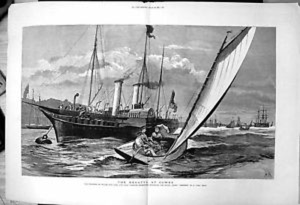

# "A little too marvelous to be real" – the story of the Una Boat {#sec-chapter3}

Even before the initial flush of British enthusiasm for the “Yankee centreboarder” died away, it was renewed by a smaller Bob Fish design.  In 1852 the expatriate Scotsman William Butler Duncan, a leading member of the New York YC, bought a little catboat from Fish and sent it to England as a present for his friend Lord Mountcharles. [^chapter3-1]   Una, as she was known, became a toy of the rich and famous, and gave her name to the entire catboat breed and the cat rig in England.

![Una’s sailplan, as it appears in Dixon Kemp’s famous “Manual of Yacht and Boat Sailing”. In typical cat-rig fashion, the mast was stepped right forward to avoid creating too much weather helm.  Because the foredeck is too narrow to allow an adequate staying base, the archetypal cat rig has no shrouds, which in turn dictates a strong and heavy mast and mast step. The traditional catboat was therefore heavy in the bows and had a reputation for pitching badly in a seaway.  The arrangement of the blocks above the gaff allowed the sail to be hoisted on a single halyard, instead of the conventional system that used a throat halyard fore end of the gaff and a separate peak halyard for the outboard end. Una’s  rig, said Kemp, was “simple in the extreme, and even the famed balance lug cannot beat it in this respect.”](images/chapter3/una-boat-from-dixon-kemp.png)

Una was measured for a lines plan and offsets some time after she arrived in England. It was a symbol of the times, for ‘scientific’ designers using lines plans were starting to take over from the old-timers who designed their boats with carved models. It also means that Una is the earliest small catboat for which we have accurate information.

At a bit over 680kg/1500lb (assuming that her design waterline allowed for two crew) Una is no lightweight by today’s standards.  With her 6’6″/1.98m  foot beam, the little Fish boat was narrow compared to the typical modern Cape Cod style cat, but to eyes used to the narrow English boats her “chief peculiarity” was her “great beam in proportion to length.”  She had the typical slack bilges of a catboat of the era; "all deadrise and no bilge" was how some put it. She had hollow waterlines forward and an extremely deeply veed bow that broadened and flared out quickly into semi-circular sections.

To men who had grown up with the deep and narrow English cutter and were still reeling from the shock of the schooner America, this little “skimming dish” was a sensation. The little catboat attracted widespread interest during a summer of sailing on the Serpentine, the small ornamental lake in London’s Hyde Park, where Mountcharles was serving in the Queen’s Life Guards regiment.[^chapter3-2]  When another officer in the Life Guards challenged Mountcharles to a match race against his sloop, Butler Duncan took Una’s helm and won by over two laps in front of a crowd including the Prince of Wales, heir to the throne.

The next summer Mountcharles’ little boat was taken to Cowes, which was taking over from the increasingly crowded and polluted Thames as the centre of English yachting. There she caused such a sensation that her name became a British term for the catboat and for the mainsail-only rig. “The Una, like the Truant, outsailed all the British boats that competed with her, and thus a sort of second revolution in racing boats was brought about” raved contemporary sailing writer Henry Folkard.[^chapter3-3] “The Cowes people regarded the Una as a little too marvellous to be real” wrote the journalist, author and designer Dixon Kemp.  “To see the Una dodging about on a wind and off a wind, round the stern of this craft, across the bows of that one, and generally weaving about between boats where there did not look to be room enough for an eel to wriggle, astonished the Cowes people, who had never seen anything more handy under canvas than a waterman’s skiff with three sails, or an Itchen boat with two, or more unhandy than a boat with one sail – the dipping lug; but the Una with her one sail showed such speed, and was so handy, that in less than a year there was a whole fleet of Unas at Cowes, and about the Solent.”[^chapter3-4]

It’s been said that Cowes was a conservative place where social status was ruled by the size of one’s yacht. If it was ever true (and Una’s tale indicates it probably was not) the little American boat broke the rules.   “Una boats” became the plaything of both the rich and powerful, such as the Prince of Wales, and the middle class. [^chapter3-5]  By 1853, the Royal Yacht Squadron, undisputed social leader of the English yachting scene, scheduled a special race in its annual regatta for boats under 17 feet “in order to afford the spectators the opportunity of witnessing a display between the little Una’s, American clippers, or sliding keel boats with the English sail boats of Southampton and neighbouring ports.” [^chapter3-6] In 1855, Una won first prize in a race for “American boats” in the Royal Yacht Squadron Regatta.[^chapter3-7] She won a similar event, in different hands, in the Cowes Town Regatta the following year ahead of a boat owned by yachting royalty, Barry Ratsey of the famous boat building and sailmaking family.  The race “created great excitement, as the American style of boat seems to be a favourite among young Cowsers”. [^chapter3-8]

True royalty gave the catboat the ultimate stamp of approval in 1881 when the Prince of Wales ordered his own “Una” from Cowes boatbuilder Caleb Corks, “well known for his skill in building these boats, which are great favourites with many yachtsmen”. [^chapter3-9]

The fashion for Una boats may have been fading by then, as even the Prince apparently found it organise a class race. [^chapter3-11] But by August that year, the Prince was racing in a special catboat class in front of Queen Victoria herself, against boats owned by the Earl of Gosport, his occasional friend Lord Beresford (second in charge of the Royal Navy), and the tiny 12’ Pixie. [^chapter3-12]  Even the fashion pages gushed about the Princess of Wales appearance in a Una boat at Cowes, describing her outfit down to the last button. The original Una herself was last heard of on the estate of Lord de Ros; from start to finish she had been a darling of the rich and famous.  Meanwhile, men with smaller wallets raced catboats across much of Britain.

The Una fever in England faded in the late 1800s.  The diagnosis was similar to that of centreboard sloop; catboats were not well suited to British conditions.  To quote a later catboat fan from the USA, “the one-sail plan is the best for weatherly qualities, and for handiness – if there be no sea, and if it is all turning to windward.  In a sea, however, the heavy mast, stepped so far forward, makes the boats plunge dangerously, and the boats themselves are so shallow that they are not very well adapted for smashing through a head sea.  Then, off a wind they are extremely wild, and show a very great tendency to broach to.”[^chapter3-15] The catboat was probably eclipsed by the classic British dinghy, which was already starting to evolve in places like the Thames.  As Folkard noted, the “Una style of boat, with its one sail, once so popular among the boating fraternity at Cowes and elsewhere, is now a type of the past. It is, in fact, almost entirely supplanted by a less shallow form of boat and a handier kind of rig”.[^chapter3-16] 

But the Una Boat story may shed an interesting light on the culture of sailing in England, one of the core areas for dinghy design and development.  Some commentators have claimed that the Una was an upstart and a social outcast.  They could not be more wrong.  The fact that aristocrats like Mountcharles (soon to become the Marquis of Coyningham), Sea Lords, the Royal Yacht Squadron and the man who would be king were happy to be seen involved in small, unusual boats proved that social status in England was not strictly linked to the size of your boat.  Perhaps Britain’s class structure was so secure that a person’s social status could not be damaged even by something as apparently eccentric as sailing a tiny boat.  The tale of Una may have been a forerunner of the fact that British sailors of later eras were happy to sail boats that were significantly smaller than those of the other major sailing nations, and which pointed the way to the modern sailing dinghy.

While the Una craze was waxing and waning in England, the catboat style was being pushed to new extremes in its homeland.  For the story of the sandbaggers, the next part of the SailCraft story, see @sec-chapter4.

[^chapter3-1]: The information about Una’s provenance comes from an interview with Duncan; “Men who have made yachting, William Butler Duncan”  *The Rudder*, Jan 1906,  p 6.  Some other sources say that Mountcharles saw Una at Fish’s yard while visiting New York; the two accounts are not mutually inconconsistent. Like so many others associated with the story of the Unas, W Butler Duncan was a pillar of the establishment. He was later a Rear Commodore of the New York YC and played a leading role in America’s Cup defence syndicates.

[^chapter3-2]: *Hunts Yachting Magazine* Vol 2 1853 p 152 notes that it was regretted that Una was not seen sailing during a London Model Yacht Club race on the Serpentine. Bell’s Life in London and Sporting Chronicle, March 6 1853 noted that Mountcharles presented the Prince of Wales YC with a model of Una that “elicited universal admiration”. Una’s dimensions, as given by Kemp in his Manual, were 16’ LOA, 6’6” beam, weight (with crew) 13 cwt, sail area    .

[^chapter3-3]: *Sailing Boats* p 94.

[^chapter3-4]: Dixon Kemp, p 322.  Kemp states that the normal Cowes Una Boats were similar to the original, but had slightly flatter sections and more freeboard.

[^chapter3-5]: *The Standard*, June 15 1875 p 3

[^chapter3-6]: *Bell’s Life in London and Sporting Chronicle*, August 20, 1854.  The event did not occur as “they were all afraid to show against the Teazer, of Southampton, which had been expressly entered for the purpose of contending with them.”

[^chapter3-7]: *Hampshire Telegraph and Sussex Chronicle*, August 18, 1855

[^chapter3-8]: *Hampshire Telegraph and Salisbury Guardian*, August 16, 1856.  A few months before, however, it was said that the very deep 20 foot Itchen Ferries beat the Cowes centreboarders; *Bell’s Life in London and Sporting Chronicle*, November 25, 1855, p.5

[^chapter3-9]: *Isle of Wight Observer*, July 23 1881, p 6.  The Prince’s boat, like most of those she raced against, was about 25’ long.

[^chapter3-11]: *The County Gentleman: Sporting Gazette and Agricultural Journal*, August 6 1881

[^chapter3-12]: *Morning Post*, August 15, 1881 p 6.  The *Evening News* of the same day noted that the exported Herreshoff catboat Gleam, which had movable ballast and a large crew for live ballast, was “sailing in company, and beating the racers easily.”

<!--[^chapter3-14]: *The Times* (London, England), Monday, Aug 14, 1882; pg. 8-->

[^chapter3-15]: Edwin B. Schoettle, American Catboats p 94, in Sailing Craft.

[^chapter3-16]: *Sailing Boats* p 19
