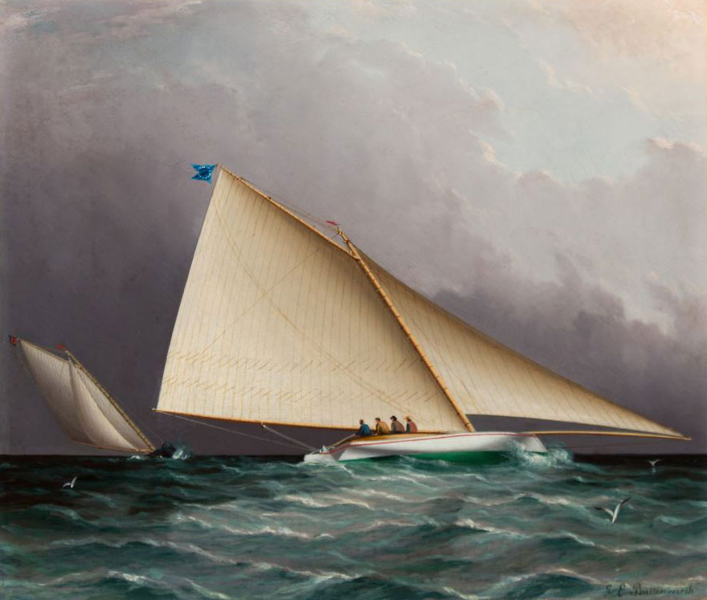
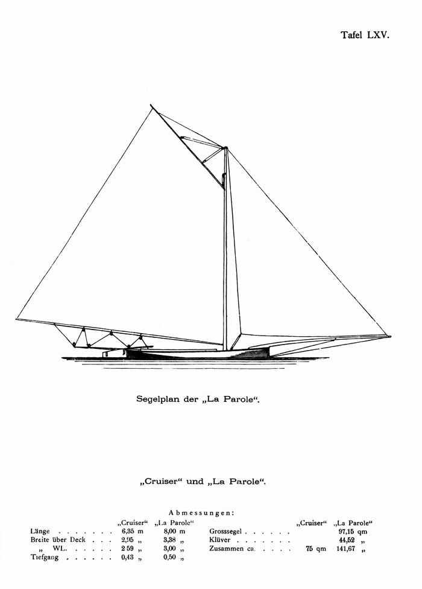
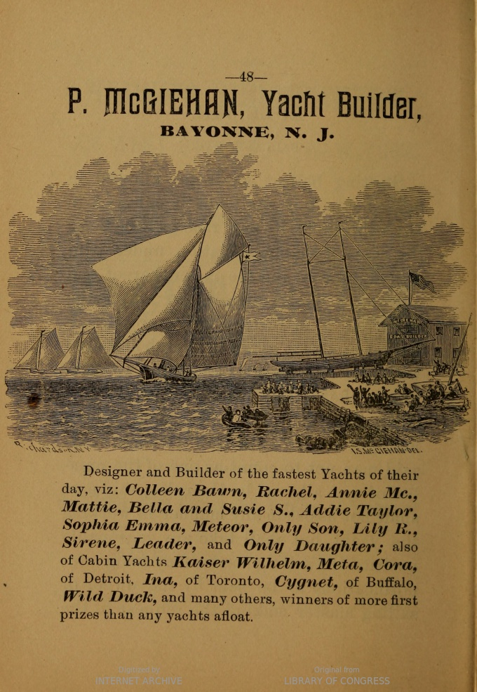
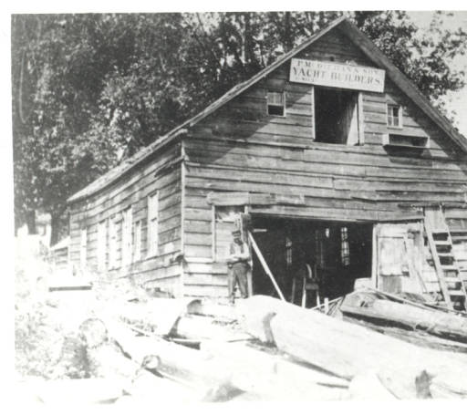
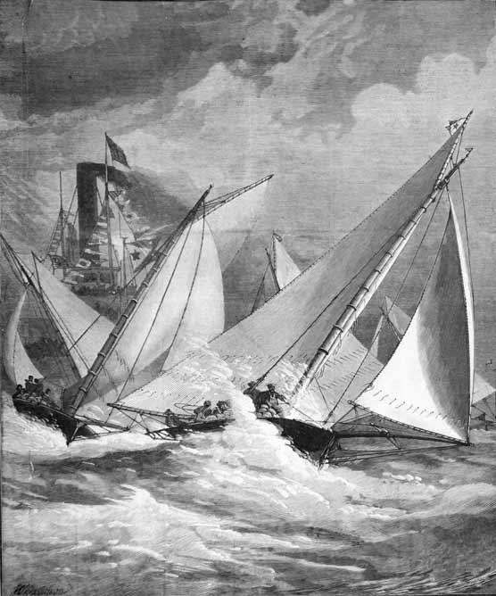
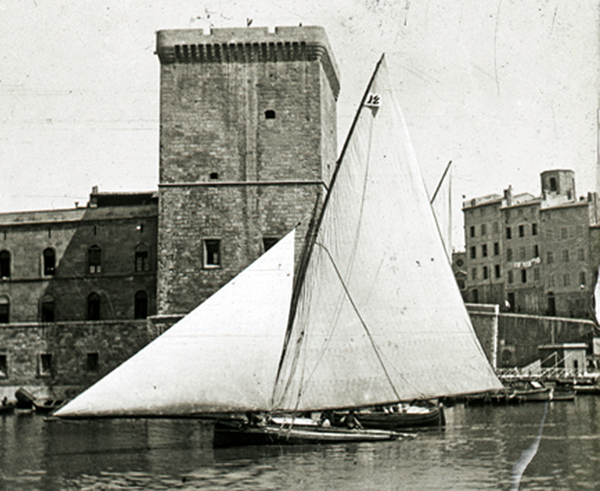

# The Sandbaggers {#sec-chapter4}

While Truant and Una were awakening the British to the potential of the beamy “skimming dish” centreboarder, the Americans were taking the concept to the extremes. [^chapter4-1]  By 1885 there were 1000 catboats and jib and mainsail boats in the USA. [^chapter4-2]  Although some followed the deeper and narrower style of pilot boats and the schooner America, most were beamy centreboarders, especially around the New York area.  “The whole tendency of the time, in small and large classes alike, was toward the extreme development of the smooth-water skimming-dish, of great breadth and limited draft” wrote Stephens. [^chapter4-3]    “Local conditions, as exemplified in the shoal waters of the anchorage ground and of parts of New York Harbor where short cuts were possible to yachts of light draft, with the reaching course down the river and back, all tended toward the one dominant type that prevailed from 1860 to 1880.” [^chapter4-4]

Although designs were becoming more sophisticated, there was still often little distinction between workboats and pleasure craft. Even yachts as fast and famous as Maria ended their careers as working craft, while the New York Yacht Club allowed Hudson River working sloops into its early races, and at least two big oyster sloops, Cap’n Joe Ellsworth’s 60’ Admiral and 45’ Commodore, raced as part of the Brooklyn YC fleet when they were not earning a living. [^chapter4-5] [^chapter4-6]

Of all the many breeds of working boat turned racer, the breed that became the fastest and most famous was the “sandbagger”, which seems to have evolved from the oyster fishing catboats that harvested seven million oysters a year from the shoals of New York harbour.  In time-honoured fashion, the inevitable informal races between working craft probably developed into match races and regattas.  Boatbuilders found that a working boat worth \$250 (about 15 weeks’ wages for a carpenter or blacksmith) could be sold for \$400 to \$600 if it was was a winner, and inevitably, the boats became faster and more extreme.

![Susie S, one of the fastest and most famous sandbaggers. She was built quite early in the sandbagger era (1869) but raced successfully into the 1880s. W.P. Stephens noted that Susie S “lacked the power of later boats, but she was very fast in light winds.” Although Susie S was slightly narrower than some later boats (3.35m/11ft wide on an overall length of 8.23m/27ft) her lack of power may have been due to the hollows in her waterlines forward and in the floors, each side of her keel. The top illustration is a painting by Frederick S Cozzens, who did many depictions of canoes, yachts and boats of the era. This plan and illustration are from Stephens’ ‘Traditions and Memories of American Yachting.’](images/chapter4/susie-s-cropped.png)

Like so many boat types, the sandbagger was the creation of local winds (in this case, the light airs of the New York summer), geography and economy.  “The superior speed of the light displacement, lightly built centre-board yacht over the keel boats of the pilot-boat type in the races which were each year becoming more popular, and the convenience of very light draft in mooring off the flats of Hoboken, Communipaw, and Gowanus, appealed strongly to both owners and builders” wrote W.P. Stephens [^chapter4-7] ;[^chapter4-8]  “The farmers who dwelt along these shores in the fifties were amphibious by nature, many of them fishermen and oystermen.  This entire community was devoted in one way or another to yachting.”.[^chapter4-9]

“Racing was the regular amusement of the community” noted Stephens in his encylopaedic book *Traditions and Memories of American Yachting*... “here, as well as along the Staten Island shore and in sheltered nooks on the East and North rivers, were boat shops, waterside saloons frequented by boat sailors, and fleets of cat-boats, jib-and-mainsail boats, and small cabin yachts, all of the centre-board type. It was not until well along in the sixties that yacht clubs became general, but from the first a strong community of interest and friendly rivalry united all these localities”.

“All that was now needed was a foothold on shore for a dinghy and a landing float, and these were provided by a waterside pub.  This popular institution provided, in default of a yacht club, shore shelter, landing facilities and social discourse, while mine host was at least an enthusiastic sailor if not a builder as well.”[^chapter4-10]

The races organisation was simple.  Boats were normally divided into four classes based on their length,[^chapter4-11] although boats that were outclassed could be moved to a different class.  Many regattas had four classes; First Class, 26 to 30 feet in length; Second Class, 23 to 26 feet; Third class, 20 to 23 feet; Fourth class, under 20 feet.  Within each class there was normally an allowance for length, typically two minutes per foot over a 20 mile course.[^chapter4-12]

Sail area was not measured.  This was standard at the time, from the biggest boats to the smallest.  Apart from the fact that no one had worked out a good measurement system for sails, it was often felt that “a tax on sail is a tax on skill”.  The simple rules almost inevitably meant that, as sandbagger and America’s Cup designer A Cary Smith noted, “the intention was to get as large a boat for the length as possible.”  Designers and crews created boats of vast beam, kept them upright with movable ballast, and crammed on sail area until, as one sandbagger sailor recalled, they became “a thing of small body and great wings.” [^chapter4-13]

The claims that the sandbaggers broke convention by using movable ballast seem to be one of those myths born of a desire to paint “mainstream” sailors as archaic throwbacks trying to hold back the tide of development. [^chapter4-14]  Shifting ballast had been common in racing yachts when sandbaggers were still evolving. Ironically, the practise had become common in English yachting because of rules intended to make boats less extreme. When clubs and regatta organisers banned boats from setting larger sails in light winds, racing sailors started to keep their their largest sails up all the time, and stacked ballast to windward to make the boats stable enough to handle the extra power.

The British soon found that shifting ballast with 19th century technology was an expensive, unpleasant hassle. Before each race, interiors had to be stripped out so that bags of lead shot could be thrown from side to side during tacks. Ledges were fitted to hold the ballast bags, hidden behind ornate Victorian cabinets. Amateur crews quickly rebelled when they were asked to spend a day cramped down, below heaving weights from side to side and being covered in muck oozing from the shotbags, so owners had to pay professionals to smash up their expensive furniture with dirty bags.  By the time the sandbaggers were evolving the British were already starting to ban shifting ballast, to their general relief.

But while the sandbaggers didn’t invent shifting ballast, they did take it to a new level. The flat, beamy shape of the sandbaggers meant that shifting ballast had more leverage and was more effective than it had been on the narrow English cutters.  The typical sandbagger of around 26’/8m overall carried from 25 to 34 bags, each weighing around 55lb/25kg, and a crew of about nine men (in addition to the sheet handlers and bailer boy) to throw them up to the windward gunwale each tack. “When quick work was not done some sandbags went over board, not infrequently a man or two, and sometimes also, all hands and the skipper” remembered sandbagger sailor William E Simmons years later. Despite the “sandbagger” label, gravel was the preferred filling because it dried out faster. [^chapter4-17]  Some boats, especially in New Orleans, piled the sandbags onto a board mounted on 3ft/1m long swinging “arms” that pivoted out to windward like a modern skiff’s wings, but it was too cumbersome for general use. [^chapter4-18]

In spite of the lack of class rules, the sandbagger hulls became “standardised to an extent seen today only in the one-design classes; plumb stem and stern-post, a breadth of about 36 percent of the length, a draft of about 7 percent, the midship section about 66% of the total length from the bow.”[^chapter4-15]  This stereotyped shape had “the stern well cut away, so that when the boat was afloat the tuck was well out of the water in order to leave the water cleanly (so that)… the boat steered better when well down by the stern.”[^chapter4-16]

The sandbagger followed the trends of the time in adopting a fine bow and wide stern, in place of the old-bluff-bowed “cod’s head and mackerel tail” shape. The sections showed the same “all deadrise and no bilge” soft-bilged shape as Una, but where the older catboat flattened out along the keel line the sandbaggers had a deeper vee, normally with about 19 degrees deadrise. Some of them, like the famous Susie S, had hollow sections in the floors, just outboard of the keel.

![Two famous sandbaggers. Top, the small 1868 sandbagger “Cruiser”, which was successful both racing around New York with movable ballast, and with her ballast fixed in place when she raced under Boston rules. Although only 6.35m/20’10” long, her beam measured 2.9m/9’9″.  The contrast with Truant’s beam of around 2.1m/7′ shows how fat the sandbaggers became in the name of increasing their power to carry sail. Cruiser’s deadrise was measured by Stephens at 15 degrees, which was flat for a sandbagger. It may have been her flatter, wider shape that allowed her to win even when she was racing in Boston, where shifting ballast had been banned decades before.Below is Parole, created by the famous Jake Schmidt. Both Cruiser and La Parole show the stereotypical sandbagger shape – vast beam, a shallow hull, slack sections and buttock lines that rose steeply at the stern to form a “wineglass” transom, ensuring an uninterrupted flow of water onto the huge rudder.  Illustrations from George Belitz’s Seglers Handbuch, digitised by the http://www.yachtsportmuseum.de/](images/chapter4/cruiser.jpg)

Although most illustrations show boats carrying just a jib and mainsail, other accounts say that sprit topsails and jib topsails were sometimes being set in light winds (especially among the New Orleans fleet) but that “the extra gear involved kept it from general use”. [^chapter4-19]  [^chapter4-20]  The stability provided by the movable ballast allowed the sandbaggers to carry longer gaffs and more area up high in the mainsail than earlier American boats.[^chapter4-21]   The vast fore-and-aft spread of the sail meant that the sail trimmers, especially the jib trimmer, had a vital role in steering; if the jib was not eased in a gust the helmsman could not luff and the boat was likely to fill or capsize. [^chapter4-22] Spinnakers, which were still new, were rarely carried. [^chapter4-23]  Many of the smaller and earlier boats had two mast steps so that they could sail under cat rig.  They carried vast low-aspect centreboards and enormous “barn door” rudders, in line with Bob Fish’s mantra “the more sail a boat has, the more board she wants”. [^chapter4-24]

By the 1870s, a typical sandbagger like the 27’ Parole, by the renowned builder/skipper/saloon owner Jake Schmidt, was 11’3” wide at the gunwales, 10’ wide on the waterline, and drew 7’3” draft with board down. The outrigger that supported the mainsheet extended 10′ from the transom, while the bowsprit stretched  22’6″  from the stem. A mainsail of more than a thousand square feet and a jib of nearly 500ft2 were hung from a mast that was a full 10″ in diamater. With a full load of 77 sandbags, 600 to 700lb of fixed lead or iron ballast (to keep her upright at anchor) and 17 crew, she had a displacement of 4.1 tons.  In contrast, a heavy displacement long-keel Itchen Ferry from England of the same length could weigh 6.5 tons and spread 1041ft2 of sail when racing, whereas a lighter English cutter would displace as little as 3.5 tonnes.[^chapter4-27]

Although A Cary Smith wrote that in 1860 “lightness of construction was then considered as vital to speed as it is now”[^chapter4-25] and some boats were made in clinker to save weight, the sheer power of the sandbagger demanded a strong hull.  Hull planks could be as thick as ¾”.  Even then, the sandbaggers were famously flexible, and could be seen clearly twisting under the battle between the power of the rig and the weight of the sandbags.  Despite the strain, the boats lasted well by the standards of their age, and some returned to fishing when their racing days were over.[^chapter4-26]

As Ben Fuller, former curator of Mystic Seaport Museum and one of the few people who are experts in both traditional and modern  small craft says, the sandbagger’s design was all about speed in the light breezes typical of the New York harbour area, rather than a high top speed. The sandbagger shape was nothing like a planing hull.  When Fuller tried towing a replica of A Cary Smith’s 18’ sandbagger Comet, it merely sank into the water further without changing the attitude of the fore and aft trim. While the sandbaggers could not beat the big schooners or sloops – waterline length and stability were too important in those days of heavy rigs and displacement hulls – their combination of a beamy hull and movable ballast made them the fastest boats of their length, and Americans were not surprised if a sandbagger ran a cabin yacht “hull down” in smooth water. [^chapter4-28]

Sandbagger races attracted fleets of up to forty boats, but as W.P. Stephens wrote “the gambling element, however, predominated: and exercised a controlling influence over both building and racing.”[^chapter4-29]  Many of the most famous races were privately arranged match races where the winner would take home $1000 to $1500, three times the annual average wage, and the public on the spectator steamers would bet up to $50,000. Races and boats were adopted by waterfront bars, whose patrons would fight hard for the honour of “their” boat.

While some of the owners were said to be working “watermen”, the cost of the big rigs and powerful hulls and the demands of professional crews meant that owning a sandbagger was not a hobby for poor men; “the average cost was about $1,000 and the cost of maintenance, on account of the large crews required was considerable” noted Rudder magazine.[^chapter4-30] Some of the rich owners merely watched from a steamboat, but some of the rich joined the watermen in fighting it out on the water. Despite popular myths, this was not an underground hobby for the underclasses – every club apart from the New York Yacht Club openly encouraged the sandbaggers, and even prominent NYYC members owned them and raced them with other clubs.[^chapter4-31]

“No better evidence of the popularity of the sandbagger in its day can be offered than the fact that some of the smallest of them were owned and raced by wealthy men who either then or afterwards were prominent members of the New York Yacht Club” wrote a former sandbagger sailor years later.[^chapter4-32] “The recognition of the sandbagger was not therefore confined to yachtsmen of moderate means and obscure associations.”   While the list of sandbagger owners included men like immigrant hatmaker, saloon keeper and boatbuilder “Jake” Schmidt, boatbuilder Pat McGeihan, and the sea captain turned successful oysterman “Cap’n Phil” Elsworth, they raced alongside establishment figures like Judge Charles F Brown and former NYYC commodore William Edgar.  Even the forbidding and aristocratic C Oliver Iselin, who later led the syndicate that owned Reliance (the largest America’s Cup yacht in history) “not only learned the alphabet of sailing from them, but also first came into yachting notice as a sandbag racer” [^chapter4-33]

The close and serious racing in tricky boats bred outstanding sailors. “With the single exception of Charlie Barr, all of the famous yacht skippers learned the trick in the sandbagger” it was said. [^chapter4-34] “Them’s the boat that makes sailors” wrote a correspondent in Outing magazine. “When a man’s fit to be trusted with a racing sandbagger in a blow, he’s forgot more about sailing, ballast and trim, than half these (other) skippers ever dreamed of.”

> “Match sailing has latterly become such a business with a certain class of vessels and owners, and the tonnage of the yachts themselves is so great, that an owner who used to steer and handle his own craft now shrinks from the responsibility... owners have got more and more into the habit of trusting every thing to their skippers, and even often to the builders, who are thus made much more the real proprietors of the vessels than the men who pay for them….like passengers on board.” [^chapter4-34]

![It’s sometimes implied that Australians and New Zealanders were the first to really use human ballast. It’s a silly claim, as the examples of sailing canoes and even ancient Greek writings prove, and here’s a pic that seems to underline the point. Nathaniel L Stebbings took this pic of the sandbagger Hurley on 6 September 1886 and it shows 12 men, most of them hiking hard, on a boat just 22ft 6in overall. Around this time Hurley was sailing in the Delaware, where human ballast in even more radical forms was popular. Although it was commented that she did surprisingly well in a race against big schooners and sloops that year, she was still well beaten by the big yachts – more evidence that, contrary to myths, the big boats could match (and exceed) the speed of the sandbaggers. In the days of heavy displacement boats, length and power ruled. Pic from the Stebbings Collection from Historic New England. For a better image, go here. Details of Hurley’s dimensions from The American Yacht List 1889.  Race details from Amateur Yachting by Benjamin Adams, 1886.](images/chapter4/sandbagger-hurley.png)

Sandbagger racing was hard work for hard men. As one report put it, a sandbagger crew was “a mass of human ballast warranted to stick three feet overboard to windward in spite of anything in the shape of sea or motion (with) the minimum of pleasure, the ballast working for so much a day and agreeing to get wet – drowned even if necessary – at that figure.”  Accounts of one of the last sandbag ballasted classes, the 20 ft Sneakboxes of Barnegat Bay, noted that the bags put “a tremendous strain…. on the hull and rigging, to say nothing of that on the crew and skipper…one of the disadvantages of this class was the difficulty of obtaining crews and when procured, sufficient in number, the physical effort was too much, except for the well seasoned.”  [^chapter4-35]

Crewing a sandbagger was such hard work that few people would do it without pay. The modern commentators who claim that there was a backlash about the sandbagger sailors because they were paid simply don’t know their history. Professional crewmen and skippers were accepted universally in those days in all types of boat, from the biggest cutter or schooner of the NYYC or RYS, all the way down to the part-timers in dinghy clubs or aboard small cruisers. Even basic of books about sailing would include advice about pay rates and allowances.

Racing for cash brought out the bad sportsman as well as the honest fan.  The sandbagger owners included men like Nick Duryea, who ran one the illegal gambling operations known as “policy dealing” or “the numbers racket”.  He pulled a gun on a race judge before being expelled from one club for punching a fellow owner, from another club for breaching club rules against racing for cash, and being stabbed to death in the street by a fellow and being shot dead by a fellow gambler.[^chapter4-36] From the safe distance of years such tales sound colourful, but those who were there were unhappy about sharing the racecourse with men like Duryea – “as bad an egg as I ever came across” and ruthless enough to kill a drunk who knocked him into the water, according to one of his own pro skippers. “You had to fight all the way around the course, and if you should win you had to fight again to get the prize” recalled Iselin.[^chapter4-37]  “There is no one cause which has brought the matches of this class of boat into so much disrepute as the fact that in almost every instance where the stakes have been above a $10 bill, there has been a dispute over the money after the race” noted a sports newspaper. “Clearly the men that have, for the most part, owned the sand-bagger in the past, are not the men to sustain the yachting of this neighborhood in the future...”[^chapter4-38]

Despite the thuggery that went on, the sandbagger’s speed in flat water and light winds made the type famous across the world. [^chapter4-39]  New York builders were soon exporting sandbaggers to Germany and France, while French merchant seamen who saw sandbaggers took the style home, modified it with a deep keel to handle the Mistral, and called them “Houaris Marseillais.”

While the sandbaggers were the most extreme and influential examples of the move to beamy centreboarders, they were far from the only example of the beamy centreboarder. Out at Boston there was keen racing in “splashers”, which were similar to sandbaggers but with fixed ballast and smaller rigs.  [Less extreme cat-rigged open catboats from about 15 to 30 feet overall were to be found racing all across the north-eastern USA](https://sailcraftblog.wordpress.com/2016/06/26/1-5-tuckups-and-hikers-the-vanished-world-of-the-first-high-performance-dinghies/). But none of them were as influential in the wider world as the sandbaggers and the earlier catboats, which can justly be acclaimed as the boats that introduced the world to the  beamy “surface sailing” centreboarder.

[^chapter4-1]: In *The History of American Yachting*, Captain RF Coffin noted that The Southern yacht club,  with its head-quarters at New Orleans and its racing course on Lake Ponchartrain, was the second club organized, but it was purely a local organization ; its yachts were small open boats.

[^chapter4-2]: SMH 28 feb 1885 p 10 quote in Saturday Review

[^chapter4-3]: *American Yachting*, WP Stephens p 100

[^chapter4-4]: *American Yachting*, WP Stephens p 81

[^chapter4-5]: *American Yachting*, p. 32-33

[^chapter4-6]: *The Gaff Rig Handbook*, John Leather, p 83-84.

[^chapter4-7]: History 73

[^chapter4-8]: History 77

[^chapter4-9]: History 77

[^chapter4-10]: Memories and traditions of American yachting, MotorBoating June 39 p 118

[^chapter4-11]: L. Francis Herreshoff notes that after some boats developed “ram bows”, the mean of the length waterline and length on deck was adopted.  *Golden Age of Yachting*, p 75.

[^chapter4-12]: *Spirit of the Times*, 1884, p. 773

[^chapter4-13]: Traditions and Memories, *MotorBoating* Sept 39 p 35

[^chapter4-14]: For example, it has been claimed that “sandbaggers and skiffs were the first racing yachts to employ movable ballast” (*Higher Performance Sailing*, p. 8) but this is clearly incorrect since the use of movable ballast was common in English keel yachts before sandbagger racing formed.

[^chapter4-15]: Traditions and Memories, *MotorBoating* Sept 1939 p34.

[^chapter4-16]: Small yacht Racing in 1861 by A Cary Smith, *The Rudder* (Vol 17) 1906

[^chapter4-17]: Normally used instead of sand because it dried out faster. BAG

[^chapter4-18]: Traditions and Memories, *MotorBoating* Sept 1939 p34.

[^chapter4-19]: BAG Fuller.  The North River sloops had carried square topsails, ringtails, water sails and studding sails in light winds (*Rudder*, 1890, Nov, p. 6) so the sandbagger sailors would have been obviously aware of them.

[^chapter4-20]: Traditions and Memories of American Yachting, *MotorBoating* September 1939 p 34.

[^chapter4-21]: *How Sails are Made and Handled*, Charles G David, Rudder publishing, p 24

[^chapter4-22]: See, for example, A. Cary Smith “Small yacht racing in 1861,” *The Rudder* vol 17 1906, and *How Sails are Made and Handled*, Charles G David, Rudder publishing Company 1917, p 33.

[^chapter4-23]: A New York Times report of the Newburgh regatta 1877, published June 19, refers to sandbaggers like W.R. Brown, Fidget and Freak using “spinigers”.  However,  “The History of Small yacht design part II” by Russell Clark, *Wooden Boat* July/August 1981 p 30 says that spinnakers were only used from 1879 in the USA.

[^chapter4-24]: THIS FOOTNOTE IS MISSING!

[^chapter4-25]: Small Yacht Racing in 1861 by A Cary Smith, *The Rudder* (Vol 17) 1906.  A very heavy centreboard was fitted in the well-known Dare Devil in 1882  but it did not perform well; see Stephens in Forest and Stream p 433. Another sandbagger was fitted with a bulb keel, before Nat Herreshoff introduced the idea successfully with Dilemma.

[^chapter4-26]:  The Rudder of     p 105 mentions that the 35 year old sandbagger Walter F Davids was still working as a fishing boat. The Jan 1906 number of that magazine included a photo of the Pat McGeighan sandbagger Sadie, perhaps the most successful sandbagger of them all, still sailing actively.

[^chapter4-27]: Belitz, Kemp and Stephens give slightly different measurements for La Parole. The “lighter English cutter” is the Dan Hatcher design shown on p    of Uffa Fox’s

[^chapter4-28]: Kunhardt,  Forest and Stream  Sep 21 1882 p 156

[^chapter4-29]: Trad and Mem MotorBoating Sep 1939 p 88

[^chapter4-30]: See, for example, Bethwaite's *Higher Performance Sailing*, p. 10.

[^chapter4-31]: The Sandbaggers by William E Simmons, *The Rudder*, Vol 17 No 3 (1906)

[^chapter4-32]: The Sandbaggers by William E Simmons, *The Rudder*, Vol 17 No 3 (1906).  Other “establishment” sandbagger sailors include charter members of the Larchmont YC and Frank Bowne Jones, who WP Stephens credits as the main organiser of US Sailing  (latter May 44 *MotorBoating* p 109)

[^chapter4-33]:

[^chapter4-34]: Spirit of the Times April 29 1876

[^chapter4-35]: “Barnegat Bay Sneak Boxes” by Edwin B Schoettle, “Sailing Craft” p 607.

[^chapter4-36]: Brooklyn Daily Eagle, 18 Dec 1872 p 4 and 25 Nov 1888 p 6.

[^chapter4-37]: *Golden Years of Yachting*, p. 75. From the description, it was probably Iselin who ended an argument about who had won a sandbagger race by grabbing the winnings and swimming away with them, as described by WP Stephens. Sandbagger sailor A Cary Smith and Thomas Day of The Rudder also confirmed that cheating, such as using pie tins to paddle in calms, was common in the sandbagger fleets; see for instance Smith’s first hand account of building and racing his sandbagger Comet in “Small yachting racing in 1861”, The Rudder Oct 1906 p 592.

[^chapter4-38]: *Spirit of the Times*, 1884., p 773

[^chapter4-39]:

<!--[^chapter4-40]: *Forest and Stream*,   1878 p 49 -->

<!--[^chapter4-41]: The sail area was controlled by limiting the circumference to 48’. “The Delaware Ducker” by BAG Fuller, Wooden Boat Sept/Oct 1982 p 83 -->

<!--[^chapter4-42]: Information from Ben Fuller and Traditionalsmallcraft.com. -->

