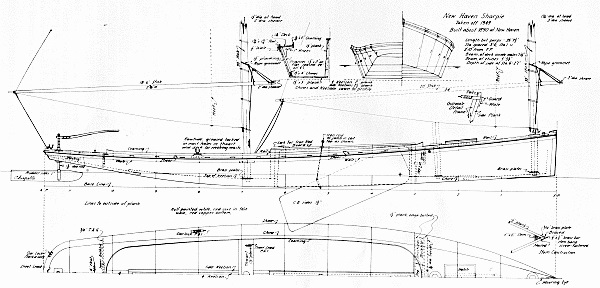
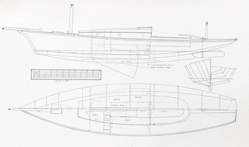
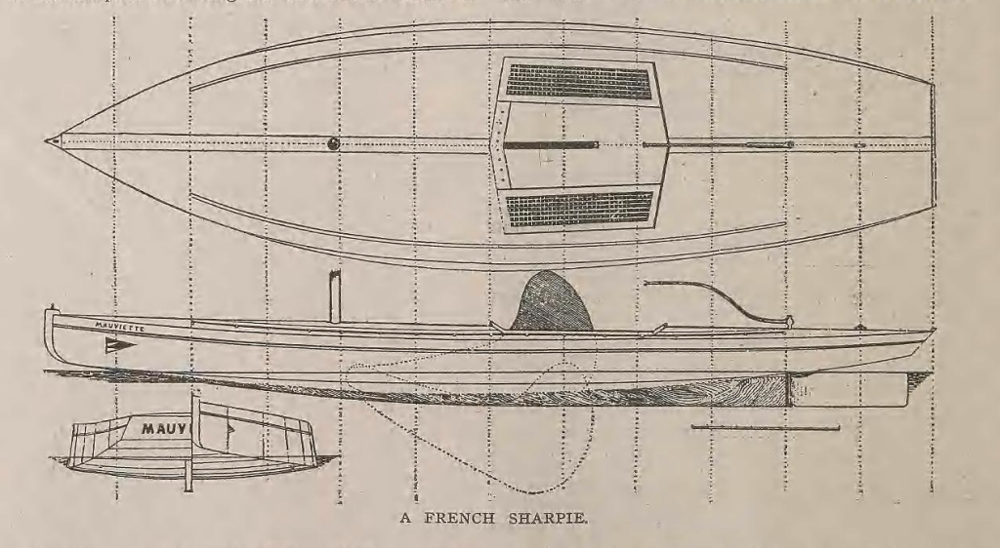
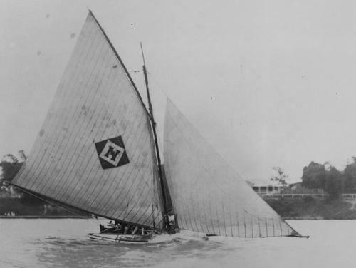
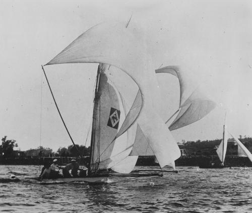
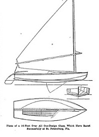

# The mysterious history of the sharpie {#sec-chapter5}

Although the sandbagger and the catboat took most of the attention that small boats received in the late 1800s, not far away another breed was developing more quietly. It was the sharpie, and while it didn’t bring the world’s attention to the potential of the centreboarder like the sandbaggers and catboat did, it may have had more direct influence on the shape of the modern dinghy.

The key word, however, is “may”. Tracing the history of the sharpie’s influence on dinghy design is a frustrating exercise on many levels. The working sharpies and their relatives have been the subject of an intimidating amount of research from people like Howard I Chapelle, Reuel Parker, and Pete Lesher, but even authorities like Chapelle admitted that some aspects of the sharpie’s history remain murky. Tracing the influence of the sharpie on racing dinghies poses an even harder problem. There was no small sharpie that played the starring role of Rob Roy, Truant or Una, and there was no racing scene like that of the sandbaggers to catch the attention of researchers and writers. Reports from some areas hint that the same economy and simplicity that attracted some racing sailors to the sharpie seem to have led others to ignore it.

There are big holes in the story of the sharpie, and they will probably always remain. Even the fact that a boat is called a sharpie may not show that it has any connection with the American craft – after all, we use the Hindi and Tamil words “dinghy” and “catamaran” for boats that have no relationship with the Indian craft that originally bore those names. Flat bottomed hard-chined boats are so obviously simple and easy to build that they have been seen in many civilisations for thousands of years. We know that flat-bottomed boats evolved from other types, such as punts, in several places across the world. Some may merely have had the “sharpie” label stuck onto them retrospectively, in the same way that some classes that have no “skiff” DNA have known become known as skiffs. Even experts on sharpie design like Chapelle and Parker believe that some of the American sharpies, like those of the Chesapeake and Great Lakes, evolved independently. If the sharpie shape and form could be developed independently in two or three places in the USA, it’s obvious that it could have evolved independently in other countries as well.

Given all these issues, in some ways it would have been easier to pass lightly over the early evolution of the sharpie and its influence on dinghy design, but that would have meant ignoring a significant step in the story of the racing dinghy. So let’s try to see how the sharpie-type dinghy may have evolved, and hope that further information and research could make the murky story a bit clearer.

The type that is normally identified as the original sharpie evolved around the fishing port of New Haven, 110km/70 miles from New York on the Connecticut shore of Long Island Sound.  As in so many other cases, the sharpie was created by the area’s local forests, industry, fisheries and oceanography. The huge area of shoals of Long Island Sound formed immense oyster fisheries that were best worked with fast shoal-draft craft. Originally, the oyster fishermen used huge dugout canoes, from 28 to 35 feet long, that were cut from the vast forests of white pine around Connecticut and upper New York. Down south on Chesapeake Bay, fishermen enjoyed similar conditions and adopted similar craft, carving canoes as long as 30ft/9m from a single log.  As the demand for larger craft grew, the watermen of the Chesapeake began building canoes from as many as five logs, each bolted together to form giant planks across the bottom.

Some time around the mid 1800s, the supply of white pine around New Haven ran out, and the local oystermen started looking for an alternative. “What more natural than that they should have applied to the nearest sawmill for plank for which to nail up a box in imitation of the more costly and complicated round-ribbed composition of the regular boat builder?” asked Forest and Stream. “The box was run to a point at one end, and a single wide plank on the bottom was rounded up aft, as the nearest approach to regular boat form three planks could be induced to assume. Simple and cheap, every man became his own builder during the sawmill era, rip and cross cut supplanting the axe and burning process of the days when big logs were common.” And so the sharpie was born.

The sharpie followed the log canoe’s long, slender shape, and was normally four or five times as long as it was wide. It also kept the canoe’s simple but heavy construction. The bottom planks ran athwartships across the hull and the bottom was heavily rockered at the stern, apparently so that the sharpie would not drag its stern when carrying a full load.

The oyster fisheries of the New York area and the Chesapeake were closely linked, with New York oystermen like the Elsworths of sandbagger and America’s Cup fame working in both areas. Not surprisingly, as the supply of big logs declined around the Chesapeake, the watermen of the Bay area developed a similar type of craft.

The long, flat, skinny hull of the sharpie was an inherently fast shape, and soon racing versions started to evolve. A 35 foot racing sharpie was lighter than a sandbagger, with a 2,000 to 2,500lb hull, and carried a much smaller rig than a sandbagger, but its ballast was even more extreme. Two 16 foot “springboard” planks were run out to windward, and 11 members of the 12 man crew would sit on them to hold the boat up. The racing sharpies kept the same unstayed ketch rig and sprit booms as the working boats, but added jibs. These big sharpies had flatter rocker lines than the working craft and were said to be extraordinary performers, capable of 15 knots and even more. As Chapelle noted “although such reports may be exaggerations, there is no doubt that sharpies of the New Haven type were among the fastest of American sailing fishing boats.”

The speed of the long, slender New Haven sharpie soon got the attention of yachtsmen, and soon sharpies were being built as yachts or converted into yachts. Fittingly, it was Bob Fish who is credited with building the first big sharpie yacht, in the shape of the 51 foot Lucky of 1855. But sharpie yachts had limitations. The slim, shallow lines of the sharpie meant that it pounded upwind and had limited stability, and the high cabin tops that were needed to provide headroom increased windage and raised the centre of gravity. At least one early sharpie builder and fan claimed that for all their virtues (“their quickness is only equalled by two well-matched Tom cats in a moonlight set-to”), they were surprisingly heavy and unless over 25 ft, poor in a seaway.[^chapter5-2]

The man who did most to promote the sharpie to yachtsmen and minimise its flaws was Thomas Clapham. A man of some wealth, Clapham was cruising on his yacht (which was probably a typical New York centreboard sloop, since she was created by sandbagger builder “Hen” Smedley) in 1863 when he met two brothers from Rhode Island on their home-made yacht. Clapham challenged them to a race, which the brothers easily won. Clapham became the first person to order a yacht from the two brothers, thereby launching the boatbuilding career of John and Nat Herreshoff.

An easy man to like, Chapham became a lifelong friend of the Herreshoff family.  When Clapham’s fortune collapsed, he moved into a smaller house on his estate and took up boatbuilding as a career. Clapham, who had owned a small sharpie as a boy, did more than anyone to develop the working New Haven sharpie into a fast pleasure yacht. At a time when science was moving into sailboat design, Clapham was a throwback to old methods.  He developed his designs by racing models on the trout pond behind his workshop and, like the old sandbagger designers, carving models and taking the lines off them. [^chapter5-1]  As WP Stephens noted, he had a simple philosophy of design; he believed that boats should sail over the water rather than carve through it, and that a boat’s fore-and-aft lines should follow segments of a circle.

Clapham’s first major contributions to design were the promotion of the yawl rig and the development of his patented “Nonpariel Sharpie” shape. The “Nonpariel” concept replaced the sharpie’s shallow, flat bottom with deep V-shaped sections. According to sharpie expert Reuel Parker, there had been other Vee-bottom hard chine boats before (such as the skipjack) but Clapham was the first to develop a significant degree of deadrise and to adapt it to the faster, safer sharpie shape.

Clapham’s sharpies demonstrated that a lightweight, lightly ballasted boat under a moderate rig was not only fast, but more importantly, safe. Clapham became prominent during the bitter flame wars between the fans of the  heavy, deep and narrow British cutter and the heavy, shallow and beamy American centreboarder. He took the controversy as an opportunity to promote his beloved sharpies (and his business building them) by criticising  both the cutter and the sloop, which he dubbed “monstrosities, built for the sole purpose of carrying enormous rigs at the expense of comfort, safety, and scientific principles.”  Clapham became an effective propagandist for the light displacement boat, claiming that the light, narrow and shallow sharpie was not only faster but safer; “give her a narrow beam not exceeding one-fourth her length, and nothing is easier (when one knows how) than to produce a yacht that shall face the roughest sea” he boasted. [^chapter5-1]  Clapham’s outspoken promotion of the sharpie went so far that he even became a character in a potboiler Victorian-era romantic novel, in the guise of “the sharpie maniac who believes that all good yachting things are to come out of his flat-bottomed broad-beamed shallow-draught favourites”, who was called “the man of many sharpies” and had “thrown his soul into sharpies and constructed the largest and fleetest and safest and roomiest that roam the seas.”[^chapter5-3]  Although most of Clapham’s effective publicity efforts went into his bigger boats, he made some sharpies as small as 15 feet long but there is no evidence that any of them raced.[^chapter5-3b]

The Nonpariel was soon followed by another variation on basic sharpie, when young boatbuilder Larry Huntington introduced a sharpie with bottom sections that followed an arc, rather than a Vee like the Nonpariel or a straight line like the New Haven types. It’s unclear when small dinghies started adopting the sharpie shape, and how much influence smaller hard-chine boats like “flatiron skiffs” or punts had on the craft that became known as sharpies. It’s said that in 1863, a M Broca of France visited New Haven while studying the oyster fisheries of the USA. He sent a sharpie (possibly a small 22 footer, although most were much longer) back home, and in the 1880s there was a belated spark of interest in the type in France.  The canoes of the USA and UK had both experimented with “sharpie” hulls before 1892, but whether were actually influenced by the New Haven type or had merely adopted the term “sharpie” to describe a hull shape that had been inspired by other slender flat-bottomed craft like the old duck punts is impossible to know.

The earliest trace that I can find of small racing sharpie dinghies in the English-speaking world is in the early 1890s, when Shelter Island, across the other side of Long Island Sound from New Haven, developed a class of 16 footers.  As if to underline the difficulty of tracing the family tree of the sharpie, the most detailed account of the Shelter Island boats notes that “in Gravesend bay, this type is called a flattie, which at Shelter Island, where they are also very popular, it is known as a sharpie.”[^chapter5-4]

The Shelter Island sharpies were “nothing more than a flat bottomed row boat, fitted with a center boat to prevent leeway, and cat rigged.The peculiar advantage of this type is that it draws but two or three inches of water and with the center-board up can be run right on short and the mast unstopped. There she can be left for the night. To get under way all that is necessary is to step the mast, the work of a minute, and shove her off”[^chapter5-5]  By the middle of the decade, the Shelter Island Sharpie Club’s 16 footers carried big rigs (300ft2 main, 150 sq ft spinnaker), capsized often, and the fleet included several women skippers.

By 1895, small sharpies were also racing across the other side of the world in Brisbane, Australia. At least one of the early boats was described as being “American style”, but no further information was included.  The Brisbane sharpie movement started with as a small group of boys racing 12 footers, but over the next decade the city developed a thriving scene with several classes of sharpies, including 10 footers for juniors, unrestricted 14 footers, 14 footers with restricted sail area, and 18 footers that could run with the “skiffs”.

Although small hard-chine training dinghies spread throughout the state, in typical sharpie style, the Brisbane boats largely kept under the radar and have been long forgotten. Perhaps the whole breed of early sharpie-type racers fell between two stools; neither quite as fast as the round bilge boats, nor cheap and simple enough to be truly popular.

There seems to be no evidence that the Shelter Island sharpies or similar boats had any direct influence on later hard-chine dinghies. But there is one enormously influential class where there is strong evidence of a link with the original New Haven sharpie – the International Star keelboat. George W Elder, the original class secretary and a man who knew the Star’s designer William Gardner, specifically states in his class history “Forty Years Among The Stars” that the former Olympic keelboat was derived from the New Haven sharpie, through Gardner’s 1896 yacht Departure and the Bug class. The Star’s arc-bottom hard shape was then followed by such classes as the Comet (designed by a former Star World Champion and originally labelled the Star Junior) and Lightning.

![Departure was an ancestor of the Star, the boat that seems to have played a significant role in spreading the sharpie and hard chine ideas. Departure was no dinghy, but she may be significant since she was a rare example of an early sharpie-style hard chine boat that raced in a restricted class against conventional round-bilge boats. She was competitive but not outstanding; perhaps an illustration that in the days before lightweight construction, chine boats were generally slightly slower than equivalent round-bilge designs.](images/chapter5/departure.jpg)

The other missing piece in the link between the New Haven Sharpie and the later American chine dinghies was a class I’d never heard of until sailing historian Rod Minchner posted a piece about it on his blog, http://earwigoagin.blogspot.com.au/. The 15 foot long Cricket evolved around Atlantic City in the 1890s, boomed in that area around 1900, and then moved south to the Miami area where it survived until the 1950s. It then vanished with so little trace that even Minchner’s research has failed to uncover its designer and details about its early history.

So why does this long-gone local class seem to be so important? It’s because the Cricket seems to show another clear link between the early sharpies and the later hard-chine Vee-bottom dinghies that formed the backbone of US dinghy sailing for decades. The Cricket definitely has strong sharpie DNA – it carried a freestanding rig with a sprit boom and “pry board” like the early New Haven racing sharpies. But the Cricket’s deep Vee single-chine hull is also very similar to that of later boats like the Snipe and California’s Snowbird, which played such major roles in dinghy sailing from the 1920s to the current day.

And so in the end, it seems clear (as we’ll get to in more detail later) that hard chine dinghies in other areas evolved completely independently from the sharpie. But it also seems clear that while the sharpie story never had a star like Una or Truant, the original New Haven sharpie did have a strong influence on the design of the hard chine dinghies of the USA. And it seems clear that one of those classes, the Cricket, went on to inspire one of the most influential boats in the history of dinghy design. But that’s for a later post...

[^chapter5-1]: *Yachting*, Dec 1938 p 53.

[^chapter5-2]: *Forest & Stream*, 1879 p 14

[^chapter5-3]: “Love and Luck, the story of a summer’s loitering on the Great South Bay” by Robert Barnwell Roosevelt, 1886.

[^chapter5-3b]:“The earliest trace that I can find of small racing sharpie dinghies”:- a letter in the American Canoeist of December 1882 mentioned a 16 foot Clapham sharpie on Lake Michigan that apparently no one, including canoe sailors, could keep upright. No further details or racing history have been found so far. Clapham later claimed that issue lay with the owner’s decision to buy the rowboat version of his boat and fit it with a sail, but he gave no information about the alternative. A 15 foot long, 54in beam sharpie built by Clapham was also advertised as an able cruiser in Forest and Stream on May 17 1888. On June 21 1888 the same paper reported that Clapham had an order for a 20 foot racing sharpie.

[^chapter5-4]: *The Brooklyn Daily Eagle*, 17 May 1896 p 15

[^chapter5-5]: Ibid

