# The raincoat boat bed and the shoe-shine missionary: The story of the early sailing canoes, the first high-performance racers. {#sec-chapter6}

The next breed of small sailboat was sparked by a very special raincoat, a mistake by a signalman in London’s Nine Elms station, and a psychological condition called “railway spine”. Almost all other popular types of sailing craft were sparked by wider factors like social forces or advances in materials; this was a type that was created by the exploits and promotion of one man. [^chapter6-1]

It all started on May 22, 1848, when John Macgregor, a descendant of the legendary Scottish hero Rob Roy, was shown an inflatable “india-rubber boat which forms a cloak, tent, boat and bed” by Archibald Smith, a scientist and yachtsman.  The inflatable boat piqued MacGregor’s interest.  “Perhaps I shall go to the Lakes next year” he mused in his diary that day.[^chapter6-2]  Instead, this remarkable man spent the next 17 years as an occasional sailor, mountain climber, barrister, world traveller, illustrator for Dr Livingstone of Africa, marksman and philanthropist, equipping the street kids of London with shoe-shine kits so they could earn a living away from begging and crime.

![Peter Halkett sailing his first invention, an inflatable boat that could be deflated and used as a raincoat. The paddle became a walking stick; the sail an umbrella. Halkett’s boat attracted widespread interest in the 1840s and was probably the craft that Archibald Smith showed to MacGregor. It was an unlikely inspiration for the type that was to become the world’s first high-performance small sailing craft. Halkett’s ingenious invention, which he sailed on the Thames and the Bay of Biscay, was highly regarded by Arctic explorers but was a commercial failure; MacGregor’s was a huge success.](images/chapter6/halkett_boat_cloak.jpg)

On May 15 1865, MacGregor was travelling home from a shooting competition when the 5:10 up train was directed onto the wrong track and into a stationary steam engine.[^chapter6-3] Macgregor was “thrown violently on my head protected by my hat” but in his typical manner, he “attended to the injured before working late on at an Exhibition.” [^chapter6-4]

Victorians were fascinated by the new threat of railway accidents and by the new science of psychiatry. MacGregor seems to have been in every way a Victorian Englishman of the very best type, and in the aftermath of the crash he succumbed to the “fashionable” Victorian English disease of the day – “railway spine”. Today we’d call it post-traumatic stress disorder, but at the time many believed it to be the result of a physical injury to the backbone.

The hangover of the train accident turned MacGregor’s sporting mind away from rifle shooting as a sport, and back to the memory of that “india-rubber boat”. “A smash in a railway carriage one day hurled me under the seat, entangled in broken telegraph wires” he later wrote. “No worse came of it than a shake of those nerves which one needs for rifle shooting; but as the bull’s-eyes at a thousand yards were thereby made too few on the target, I turned in one night back again to my life on the water in boyish glee, and dreamed a new cruise, and planned a new craft, on my pillow.”

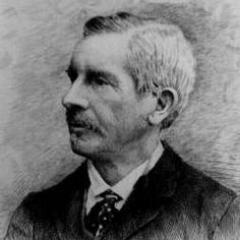

The “new craft” that MacGregor dreamed of was not as portable as Halkett’s inflatable. It had been inspired when he saw “the canoes in North America and the Kamschatka with double paddles.”[^chapter6-5]  Like many Victorians, he had been impressed by the Canadian canoe he had seen on his travels in North America. [^chapter6-6]  However, like the kayaks of Kamschatka that he may have seen at the huge trade fair of Nivni-Novgorod, Macgregor’s canoe was wider than a normal kayak, with more Vee than usual in the bottom sections. [^chapter6-7]

Macgregor’s first canoe, named Rob Roy, was more like a sea kayak than an open or “Canadian” canoe, or a modern sailing canoe. Fifteen feet long (4.57m) and 2’6”/76cm wide, drawing just 3″/76mm including the 1″/25mm deep keel, it was small enough to fit into a railway luggage wagon. Searles of the Thames built the little craft in clinker (lapstrake) planking like their lightweight rowing shells, using oak for the hull and cedar for the decks. At only 80lb/36kg, it was light enough to be easily paddled or portaged.  It had a kayak’s low-freeboard bow and stern and was decked over apart from a three foot/90cm long cockpit, with bulkheads six feet/1.8m apart to create buoyancy compartments – something almost unknown in small craft at the time. A small standing lug mainsail and jib were set on a mast just 5ft/1.5m high.  There was no centerboard or rudder; she only sailed downwind, steered by the double-ended paddle.

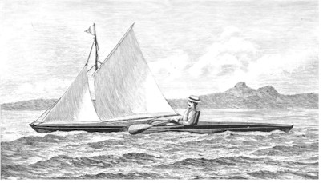

From July until October 1865, MacGregor and the first Rob Roy made their way across the English Channel by steamer and then through Europe by paddle, sail, train and cart for 1000 miles.  MacGregor was by nature a missionary, and inside the tiny hull of Rob Roy he carried bibles and other religious writings to give to those he met on his travels.  He applied the same crusading zeal to promoting canoe sailing. “A Thousand Miles in the Rob Roy Canoe on Twenty Rivers and Lakes of Europe“ was one of the best selling books of the year. He soon followed up with tours to the Baltic and the Middle East, each recorded by a best-seller.

MacGregor’s missionary experience, self confidence and crusading zeal made him an excellent public speaker, and his lectures on canoeing met an enthusiastic response among the emerging class of men with time and money on their hands.  In 1870, for example, he lectured about “Rob Roy” 56 times, sharing the stage with a Rob Roy canoe and costumes and earning 4160 pounds; about one million dollars in today’s values.  Like the proceeds from his books, it all went to charity.[^chapter6-8] Macgregor became a public figure; Charles Dickens, the most celebrated of Victorian authors, became a friend and a canoeist. Emperor Napoleon III read MacGregor’s first book and decided to organise the world’s first boat show, to encourage youth into the healthy sport. Robert Louis Stephenson, famous for books like Dr Jekyll and Mr Hyde and Treasure Island, started out as an author with a book about his own travels through Europe in a Rob Roy. [^chapter6-9] [^chapter6-10]

MacGregor’s promotion changed canoes from a curiosity to a craze. “The capabilities of the craft were practically unknown until the adventurous cruises of the Rob Roy brought before the public a type of boat at once inexpensive, safe, and sea-worthy, and gave an impetus to a movement which has since expanded beyond the dreams of its originator” gushed American writer WL Alden, the man who kick-started canoeing in the USA.  “The idea was not new; it was older than authentic history; but he gave it an overhauling and brushing up that brought it out in a form that was wonderfully attractive…The Rob Roy was so diminutive that her captain was able to transport her on horseback, but what she accomplished made her quite as famous as any ship of her Majesty’s navy. The English canoe fleet was soon numbered by hundreds.” [^chapter6-11] [^chapter6-12]

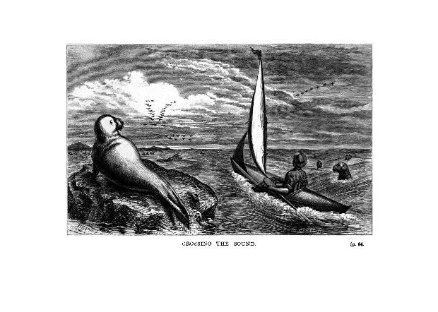

Cruising was the early canoes’ reason for existence, and it dominated their design as the sport took off. “A canoe that cannot be slept in is an insufficient hollow mockery” thundered Alden.  Even the racing champion A. Bowyer Vaux agreed; “A canoeist who cares for racing only is a sorry fellow and not likely long to remain a canoeist” was his judgement.[^chapter6-13]  Canoeists of the time waxed lyrical about the joys of sleeping under a boom tent and frying bacon on the forehatch in a canoe with all the necessities of 19th-century camping – pipe, collar and tie, laxatives, quinine and a rifle.[^chapter6-14]  There were earnest discussions about storage, and jokes that those who slept under the decks of the original “Rob Roy” type could be identified by the bruises where their foreheads smashed the deckbeams on waking.  The canoe craze made its way all the way to Australia, where canoes raced in Sydney and cruised the Tasmanian coast, and to New Zealand where “Rob Roy” canoes raced as a class.[^chapter6-15]  Canoeists paddled and sailed their way to from England to Egypt, from the US to the Caribbean, and to rivers never seen by European man.

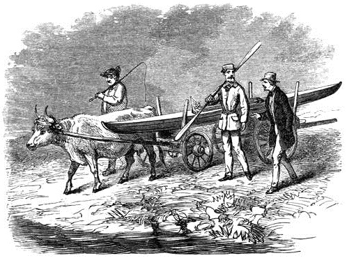

Perhaps it was this emphasis on exploration that made canoeists seem different to other sailors of the time. The Victorian age may have been an era of top hats and formality, but it was also a time of rapid technological progress, a time when the great scientists and engineers were regarded as heroes. The canoe sailors seem to have been swept up in this urge to experiment and perfect designs, far more than those who sailed other small craft. They had one advantage that allowed them to develop faster than any previous craft.  From the very first Rob Roy, their canoes had both wide decks and buoyancy (which led to the name “decked canoes” to distinguish them from open Canadian canoes) in an age when most small craft had neither.  In other small boats, a capsize was the end of the day’s sailing at best, and fatal all too often. To an experienced canoeist with a well-designed craft, a capsize was just an irritation. The fact that canoes could be quickly righted and sail on was vital in a tiny cruiser, and it seems to have given the racers a chance to push the limits of sailing and design more than any other craft of their time.

For many years, the canoe craze centred around sailing rather than paddling.  “The great desire of nearly all who have any interest at all in canoe racing is to get a canoe that will sail fast” noted Vaux. “Probably more time has been spent by canoeists studying how to improve the sailing qualities of the canoe than on any other branch of the sport.”[^chapter6-16]  They soon discovered that the Rob Roy type was a poor sailer.[^chapter6-17]  It was too low, especially in the bow, too unstable, too wet and too hard to steer. Worst of all, without a centreboard or false keel it could only sail downwind.

The early canoeists, led by Warrington Baden-Powell (brother of the creator of the Boy Scouts) and E.B. Tredwen improved the sailing performance of their canoes by increasing the freeboard, especially at the bow, to stop nosediving. They introduced extra beam and flatter sections amidships, to provide more stability to carry sail and when getting sails up and down or boarding passing steamers. The bow and stern were made deeper, to increase lateral resistance.  They introduced rudders and sailed and paddled lounging back in their cockpits, steering with foot pedals like the skippers of today’s 2.4m Paralympic racers. They favoured cat-ketch rigs because moving the masts to each end created a cockpit big enough to sleep in.  Despite their small size, canoes like Baden-Powell’s series of Nautilus (Nautilii?) were excellent sea boats.[^chapter6-18]

Until 1871, canoes could not sail upwind effectively. Sailing races consisted only of downwind legs. In that year, Baden-Powell introduced the art of sailing to windward in a decked canoe by fitting a deeper keel to the third of his Nautilus series of canoes, and sailing upwind to the start line. “When Nautilus completed the first leg and came about successfully, a great cheer rent the air” wrote Vaux. “This feat had been considered impossible up to that time…..his Nautilus No. 3 is the starting-point for sailing-canoes.” [^chapter6-22]   In the same year, Baden-Powell beat an 16 foot drop keel dinghy in two well-publicised races in the open waters off Southsea, in a convincing demonstration of the performance of the canoes.

Exactly when centreboards arrived is unclear.  William Forwood, of Truant and Mersey sandbagger fame, claimed to have introduced the centerboard into canoes; since he was an innovative person with years of experience with the Mersey centreboarders, his is a believable claim.  Centreboards in canoes were apparently still a novelty in Scotland in 1875. [^chapter6-23] The American decked sailing canoes (as distinct from open Canadian canoes, which were well known but had little influence on mainstream canoe sailing) were relying on keels with 15cm/6” of rocker instead of centerboards as late as 1879, for leeboards “did not seem to work for some unknown reason”[^chapter6-24] Americans were using centerboards by 1881.[^chapter6-25]

![The Nautilus of 1881 was a very different craft to her older sister.  She had much firmer bilges, a wider stern and 5″/127mm extra beam to provide more sail-carrying power. The keel line was straighter and when cruising she had a 83lb/37kg centreboard and 100lb/45kg of ballast in lead shot. Both keel and mainmast were placed well forward, to keep the cockpit clear for sleeping. The long straight keel gave her more lateral resistance. By this time, there was huge variation in canoe sail areas.  Dixon Kemp’s 1895 edition said that in the 1881 version of Nautilus the sail area had leapt up to 95sq ft in the main and 25sq ft in the mizzen, but the 1884 edition of Kemp said that the 1880 cruising version of Nautilus had just 52 sq ft of sail. In contrast, it seems that the 1884 racing version of Nautilus had a 100ft2 main, 50ft2 mizzen, and 60ft2 spinnaker hanging from an 11ft pole. This scan from Kyarchy.](images/chapter6/nautilus-1881.png)

The rig posed a difficult challenge for the early canoeists.  Since cruising was one of their main aims, they had to be able to reef and drop their sails from the security of the cockpit so they could handle squalls or use the paddle effectively.  Their canoes were too small to use the heavy fittings meant for boats and too tippy for them to stand up and handle the sails in the conventional fashion, so they were forced to create ingenious rigs and lightweight gear that allowed them to reef and stow their sails by remote control from the cockpit.

As American canoe pioneer C. Bowyer Vaux recalled, “a canoe’s rig was made up of brass window-shade blocks, fish-line halliards and sheets, curtain-rings on mast, clothes-line painters, bent-wire hooks, wooden cleats, home-made sails of unbleached sheeting in one width, and all sorts of makeshifts. No boat hardware was small enough or light enough for a canoe. Battens in sails were unknown. A canoe three years of age presented the appearance of a junk-shop, so varied was the assortment of odds and ends that went to make up the rig.” [^chapter6-19]  In the words of one British writer, “the fathers of the sport are remembered as having spent half the season on the lawn of the Royal Canoe Club, devising new combinations of strings, and the remaining half in chanting the virtues of arrangements which were marvellous until the moment came when they had to work.”[^chapter6-20]  [^chapter6-21]

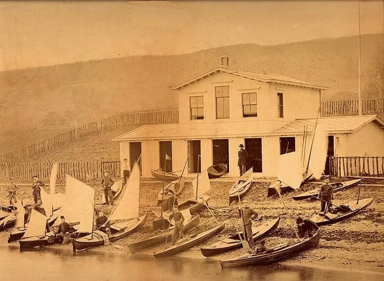

By the late 1870s, the British had developed a sophisticated mini yacht, carrying up to 180lb/82kg in ballast to keep her upright under a rig that consisted of mainsail, mizzen and sometimes a spinnaker. A canoe of this style was much faster than a Rob Roy under sail, but her bulky hull and ballast meant that she was harder to paddle, and almost impossible to carry (or portage) easily ashore.  As Baden-Powell said, “though she was successful in racing, she was simply abominable for hauling about or housing.”[^chapter6-26]

Canoes like Nautilus of 1881 were an early example of a problem that sailing still struggles with; perhaps today more than ever before. The increase in performance had come at the cost of simplicity and versatility, and the sport was losing its appeal. “In England canoeing has suffered in popular favor by reason of a few men building special racing canoes with most perfect gear and quietly sweeping the field at every opportunity” warned Vaux. “Many have been discouraged from it by the idea of its being a most complicated and intricate science to master, as it is when looked at through a modern Pearl or Nautilus canoe.” [^chapter6-27]

![“A most complicated and intricate science to master”.  E.B. Tredwen, Baden-Powell’s great rival in early British canoe racing, and the complicated rigging of one of his string of canoes that went by the name of Pearl. Note the hinged sidedeck flap at Tredwen’s elbow.  The rigging of these early canoes was complicated by the fact that they were expected to be reefed and unreefed to sail quickly and safely through the changeable British weather, without the sailor leaving his seat. For 16 years, Tredwen and his series of Pearls and Baden-Powell and his series of Nautilus canoes were first and second in almost every British canoe race. Pic from the International Canoe class site.](images/chapter6/trewden.jpg)

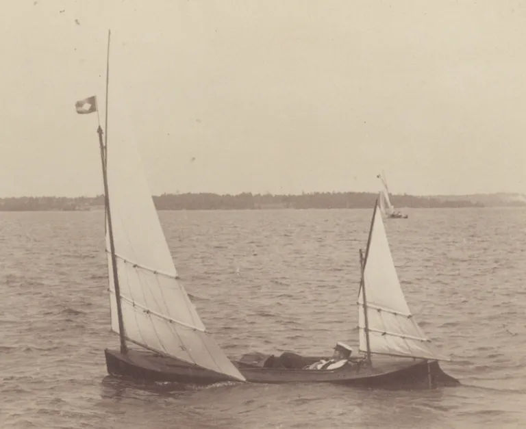

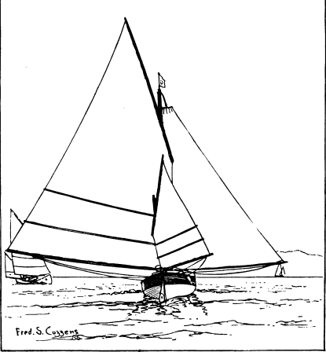

The sailing canoe arrived in North America in 1870, with copies of the Baden-Powell design known as Nautilus No. 3.  From the outset, the promoters of the new sport made sure that the decked sailing canoe was seen “not a (Canadian) canoe at all, but a cheap and portable yacht.”  New York’s first canoeists were experienced publicists but inexperienced sailors, and at the first regatta at New York in 1872, three of the four sailing entries capsized into the cold October waters. “It was then considered a very dangerous thing to upset, and fatal results were expected as a consequence”.  “The unpremeditated upsets were so frequent as to evoke much mirth from the spectators, and bring the sport of canoeing into great ridicule” claimed a writer years later.

The disastrous regatta put the Canoe Club off organising any other regattas for years, but nothing could stop canoe sailors from cruising. In 1874 Nathaniel Bishop cruised his 14’ Nautilus canoe 2,500 miles from Quebec to the west coast of Florida.  The canoe Bishop used for this extraordinary voyage was made of sheets of paper, built up to 1/8”/3mm thick and varnished for waterproofing, and weighed just 58lb/26kg.  It was an example of the lightweight path that American canoes were to take. Like many canoe pioneers, Bishop spread the canoe gospel in the successful book “The Voyage of the Paper Canoe”.

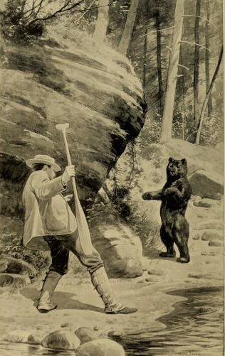

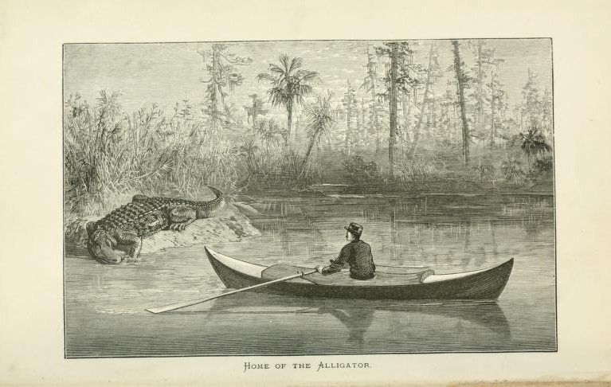

While they may not have been much good at sailing at first, the early American canoeists were good learners and even better innovators. When they finally organised another regatta seven years later to celebrate the opening of their new clubhouse, it attracted many spectators who “looked forward to the pleasure of seeing many capsizes.” [^chapter6-28]  They must have been disappointed – despite the strong winds, only one canoe capsized.  Instead, the spectators saw C Bowyer Vaux himself doing something unique – sitting on the deck of his canoe Dot instead of sitting inside, and clearly sailing faster than the rest of the fleet. It was the start of a new era that was to change the shape and speed of the sailing canoe – and, perhaps, to kill it as a popular craft.

Once New York’s canoe sailors had a clubhouse to gather around, they quickly improved their technique and their craft. “Sailing scrub races was indulged in every Saturday during the season; rigs were modified, keels reduced in depth, to avoid the drag noticed on regatta day in June, and a very good racing fleet was the result. The deck position for crew was adopted for racing, and the members all followed the Dot’s lead in getting deck tillers to steer with….These improvements very soon were noted by visiting canoeists, and a general movement towards good rigs was inaugurated.” [^chapter6-29]  [^chapter6-30]

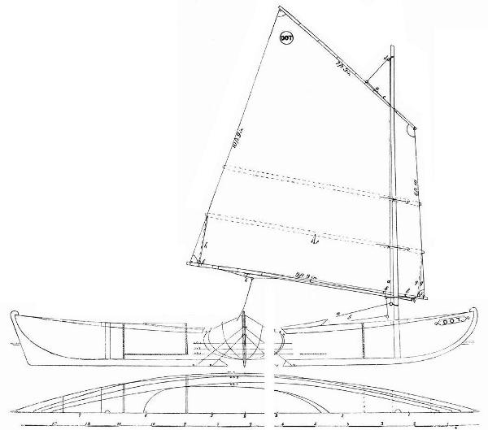

By 1880 capsizing, once so feared, had become so routine that “upset races” were common.[^chapter6-31]  A few years later, two British canoeists amazed big-boat sailors  when they “calmly and solemnly” capsized their canoe on purpose “to turn her right over till her mast and sails were in the water, and then stood on her centre-board and equally calmly and solemnly righted her, and sailed away.” [^chapter6-32]   As American yacht design legend L. Francis Herreshoff was to write many years later, “when one has become used to handling a decked sailing canoe he is far safer than in the dinghies, which can be swamped and which cannot be righted and freed of water instantly after a capsize.”

Like their British contemporaries, the American canoes of the era were “as fully fitted and able cruisers as any could be under the knowledge of the time.”[^chapter6-33]  They still followed the ideal that “the general spirit of those interested in racing has always been to condemn any appliance that was a purely racing device. The building of sailing machines is tabooed”.[^chapter6-34] [^chapter6-35]

![The “Radix” centreboard, which opened its brass leaves out like a fan, was used in some American canoes because it did not require a centreboard case, leaving the cockpit clear for sleeping. Each blade slid inside a slot in the next blade up when retracted. Some great photos of an original Radix board can be found at here at the Dragonfly Canoe Works site. Vaux noted that they were “somewhat prone to get out of order and check the speed considerably when lowered and are, consequently, not popular.” Illustration from Dixon Kemp.](images/chapter6/radix-centreboard-from-1884-kemp.png)

At a time when other small sailboats were designed for local sailing, the canoe was designed to travel, and travel they did. By the 1880s, the American and Canadian canoeists had formed the American Canoe Association and were arranging regular canoe meetings on remote islands, where up to 300 canoe sailors would camp, dress in drag for amateur theatricals under a circus big top, run firework displays from their craft, wear silly hats, play Swiss horns, race under paddle and sail, and talk canoe sailing, paddling and design. [^chapter6-36]  The appeal of the cruiser-racer sailing canoe caused 100 clubs to grow in America, and the American Canoe Association itself grew to 700 members.  North America became the centre of canoeing, whether cruising or racing and under sail or paddle.

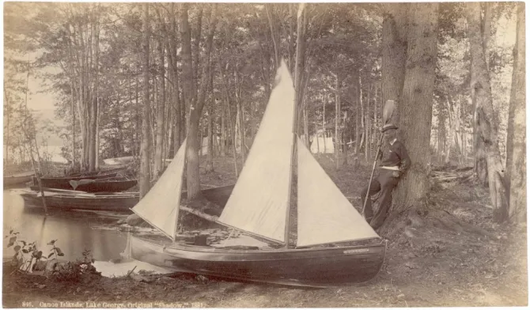

The big fleets that gathered at the national and regional camps allowed the American fleets to quickly develop the art of canoe design and sailing; as Vaux noted, “each year at the meets new ideas are tested practically, and every meet is characterized by some special racing device brought prominently forward.” [^chapter6-37]  One “new idea” came from Dr A.E. Heighway of Cincinatti Canoe Club, a tall athlete sailing a slender and tippy 26″/66cm wide Rob Roy canoe, who stuck his toes under the lee deck, his calves on the windward coaming and leaned back until his head touched the water.[^chapter6-38]  It seems to have been the first documented example of a modern hiking style, and it allowed him to carry two huge lateen sails that the Rob Roy was never designed for. It also lead to the development of the tiller extension.[^chapter6-39]  Generations of sailors have been straining bone and sinew copying the doctor ever since.

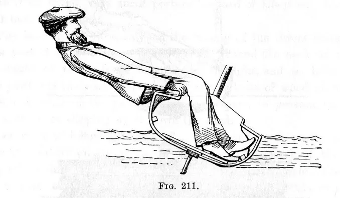

By 1882, the “deck position” was almost universal among American sailing canoe racers.[^chapter6-40]  The switch to using body weight instead of ballast for sail carrying power soon changed the whole design of their craft. “Almost immediately the need for big-bodied heavy canoes, with heavy centerboards and inside ballast, almost disappeared…. The canoe could be built lighter, with finer lines, and it was easier to handle both afloat and ashore” wrote canoe sailor Maurice D Wilt.[^chapter6-41]  By 1884, the newspapers who had once mocked canoes were admitting that they were “manifesting a speed of which we had not thought them capable.”[^chapter6-42]

While many of the Americans still cruised to races under rigs that could be reefed, menm like Paul Butler and W.P. Stephens, who built Butler’s canoes, and a hard core of racing fanatics turned the canoe into a lightweight, big-rigged racing machine. Hull dimensions settled down to a length of 16ft and a beam of 30in (4.88m x 76cm).  The cat-ketch sailplan was maintained but the balance lug rig, with its heavy battens and reefing gear, was dumped in favour of an improved gunter rig, or “batswing” rigs with huge roaches held out by full battens. Some sailors preferred a return to the lightweight “leg of mutton” or Bermuda rig.  By 1881 W.P. Stephens and Charles J. Stevens had developed a 65ft2/6m$^2$ “leg of mutton” with a hollow mast, batten-less sail and imported English cloth and cordage that weighed just 9lb/4.5kg – lighter than a Laser rig.  [^chapter6-61] Such developments were possible because reefing and lowering sails, so important for the cruising that canoes had traditionally done, was no longer considered.  Sails were lashed to the spars, and instead of reefing the top sailors kept up to five difference rigs, each tailored to a different wind strength.[^chapter6-62]   Butler, a wealthy man whose father gave him the schooner America (yep, the schooner America) had a servant to stand by with spare rigs.  Hulls were as light as 45 kg / 100 lb (stripped) or about 125kg/275 lb rigged and sailing.

As racing canoes became more complicated their cost rose, until a typical canoe cost \$150; half as much again as an early American Nautilus.[^chapter6-43]  Although the canoe was sometimes called the poor man’s yacht, most of the prominent canoe sailors seem to have been affluent members of the middle-class.  Unlike those who sailed big yachts, catboats, sandbaggers, catamarans and hikers, the canoe sailors did not give cash prizes or valuable trophies and restricted people from sailing other’s boats, for they specifically wanted to avoid professionals and “their twin companions, betting and gambling.”  Today we may see this as class consciousness, but the reality is that betting, gambling and the related race-fixing and corruption were definitely major problems for sport in the 1880s, as they are today.  Canoeing’s amateurs-only policy had its own victims in England, where the Royal Canoe Club was happy to operate from the premises of the Turk family, boatbuilders along the Thames since 1195 but refused to allow one of the family to become a member because he was “in trade.”  In America the policy seemed fairer.  A man who became a canoeist only so he could do a canoe trip as a paid advertising stunt was deemed a professional and barred, but the Association decided “the fact that a man depends on canoeing for his livelihood, that he builds or deals in canoes, does not bar him from membership so long as he is a gentleman and a canoeist”.[^chapter6-44]  [^chapter6-45]

Perhaps it was this combination of professional boatbuilders and amateur sailors who had nothing to win or lose financially that made the canoeists the most innovative of sailors.[^chapter6-46]  “Experimentation ran wild” wrote Stephens, one of the leaders “and each gathering, local or national, saw new ideas, most of them impracticable.”[^chapter6-47] The ideas included every sort of rig; spritsail ketches, junk rigs, gunters, and lugsails.  The simple and light “leg of mutton’ or Bermuda rig had been effective and popular in its small sizes; the whole rig could simply be lifted and dropped to shorten sail or de-rig, which was faster and easier than reefing or unlacing a normal sail.[^chapter6-48]  But when sail size increased under the pressure of racing, the “leg of mutton” proved so hard to reef and had such a tall mast for the area (14’ to 15 high for a 65ft sail) that many Americans adopted the reefable British balance lug. [^chapter6-49]  Others favoured the “Mohican”, which could be reefed by pulling a single line.

Perhaps the most telling illustration of the innovative attitude of the era was the tests by the famous American canoe builder J.H. Rushton. As well as tank-testing, in 1886 Rushton conducted extensive full-size tow tests to determine the drag of half a dozen canoes. He took about 3,000 readings, accurate down to about half a pound, in what must have been one of the most intensive small-craft design studies ever conducted.

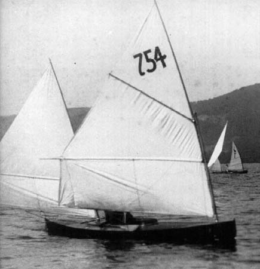

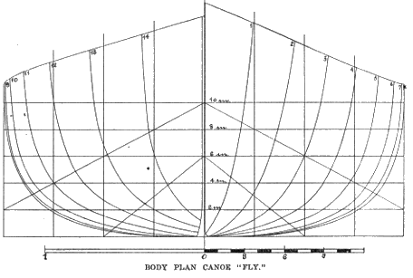

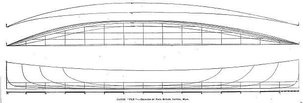

The passion for development and the easy transport of canoes lead to the world’s first international small-boat contests; the race for the American Canoe Association and New York Canoe Club International Challenges in 1886. From England came Warrington Baden-Powell with the sixth of his series Nautilus canoes– a classic heavily-ballasted British type, with a 56lb/ centreboard and 100lb/45kg of lead shot movable ballast.  She was normally sailed by a helmsman sitting inside the cockpit, British-style, but Baden-Powell was aware of the US developments and like some other British sailors he had already fitted a tiller so that he could steer from on deck.  Pearl, owned by Baden-Powell’s arch rival Tredwen but sailed by Walter Stewart, was another classic British canoe, carrying the same amount of ballast but so lightly built that she fell apart at the ACA meet and a replacement had to be shipped out before the Challenge Cup event.  Like Nautilus, she was fearsomely complicated; the skilled but inexperienced Stewart had no less than 21 lines to adjust on the rig as well as deal with the fact that both the original and the replacement canoes had major structural issues.[^chapter6-50]

![Contrast in canoe rigs, as seen in a Fred Cozzens sketch illustrating Vaux’s article “Canoe Meet at the Thousand Islands” in Outing of August 1886. The English rig (centre) was complicated but allowed the sailor to reef deeply down for the variable English conditions. Pecowsic’s “standing sail” sailplan (to the right) required the whole rig to be lifted out when wind increased. A typical American rig (to the left) had one reef.  The photograph of the regatta site below, with canoes stretching to the distance, comes from the same article.](images/chapter6/outing14-canoe-rigs.png)
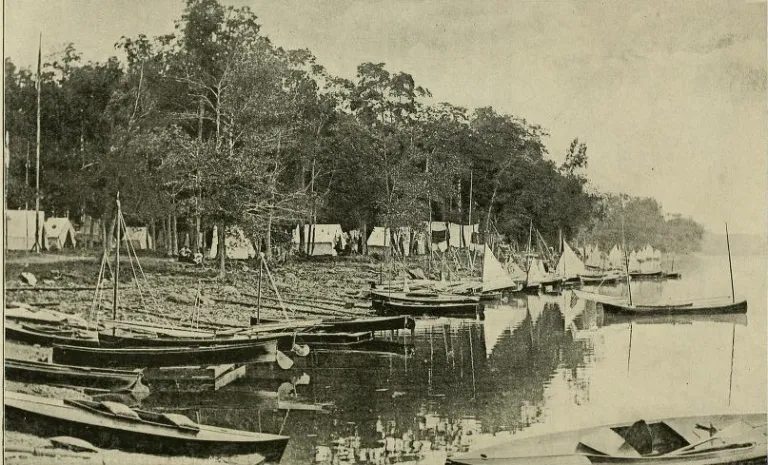

When the heavyweight British canoes arrived at the ACA camp in the Thousand Islands before the International Challenge Cup they met the latest development in American thought; the Pecowsic and the Vesper. “The Pecowsic had fine lines, was a narrow and long canoe, and was fitted with modified mutton sails laced to the mast” wrote Vaux. “The canoe was first sailed with three masts and sails, but did not prove successful. Afterward two sails were used with wonderful result. The canoe had five sails of different sizes, all interchangable, only two being used at one time – which two depended on the power of the wind.” [^chapter6-51]  With her biggest rigs set, Pecowsic’s  100lb/45kg hull could be driven by no less than 122ft^2   of sail, although it seems that she normally carried much smaller sails. Where other canoes had complex reefing gear, Pescowic’s skipper changed sail area simply by lifting out the entire rig.

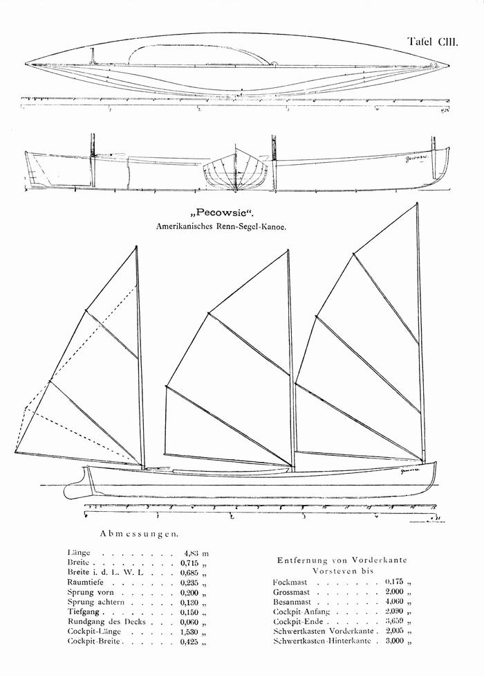
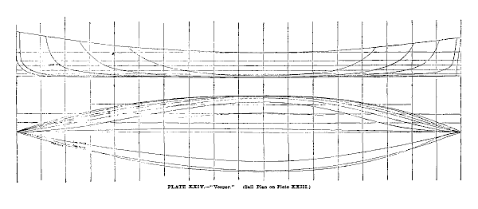

The Vesper carried a much smaller rig and unlike Pescowic (which carried some ballast) she was completely unballasted.  The lightweight American canoes, lead by Vesper and Pecowsic, came through later in the race and to leave the British boats six minutes behind in the first International challenge, at the American Canoe Association meet.

The later series for the New York Canoe Club’s International Challenge Cup in New York was much closer. It was a four-boat teams event sailed in variable breezes, often strong enough breeze for the canoes to be reefed. To windward in strong winds it was apparent that Baden-Powell, lounging back inside Nautilus’ cockpit on the beats “had an advantage in thrashing to windward, owing to greater quickness in stays, (tacking) although it did not seem that it had any advantage in pointing.”  Baden-Powell had got to know and prepare his boat better, got better starts and “illustrated his advantage in going against the wind, but the American team’s Vaux, demonstrated with much greater emphasis his superiority in reaching, by sitting out far to windward, and thus keeping the boat on a more even keel, and maintaining a press of canvas greater in proportion to continued the size of his boat”.  [^chapter6-52]  Each team had a win in the first two races. In race three, Baden-Powell was well ahead in light airs when the time limit had expired. In the resail, Vaux passed Baden-Powell on the last reach to keep the Cup for the USA.

It was a much closer series than history remembers. In the usual fashion, today the victory margin is exaggerated and the series is seen as an American whitewash. But the lessons were clear. As the victorious Vaux wrote, “both Englishmen and Americans learned something. The Americans discovered that the set of the British sails, the rig, cordage and fitting of the foreign canoes far outdid anything the Americans could show. They learned also the advantages of a smooth skin canoe perfectly polished…..The Englishmen found out that their bulky canoes with heavy ballast and heavy centerboards carrying large sails and crew inside were no match in point of speed for the light and slim canoes of the Americans, carrying little or no ballast, having very light plate centerboards, comparatively small spread of muslin and crew on deck to windward.”[^chapter6-53] [^chapter6-54]

The British immediately started hiking and “at once discarded their 56 pound centerboard and 300 pounds of shotbags and cut down the displacement of their models to the American standard.”[^chapter6-55]  But while the British were adopting the “deck position”, the US fleet was taking another step. Paul Butler, a lightweight sailor who had been disabled by polio, had turned up to the 1886 ACA meeting with the innovation that was to make the sailing canoe the fastest of all singlehanded monohulls for over a century. Butler had got WP Stephens to build him “a very ingenious deck seat, two boards as wide as the boat, the lower fixed to the coaming, the upper sliding in grooves on top of the lower and locked by a spring catch. The upper piece is slid far out to windward and locked there, making an outrigged seat on which the canoeist sits. By means of the spring catch it may be quickly shifted and locked in going about.”

Butler’s first “sliding seat” extended less than 76cm/30in. It doesn’t seem to have given Butler a major boost in performance at first.  He wasn’t a winner in the 1886 championship races, and his brilliant innovation went almost unreported in articles of the time, which concentrated on the international challenges. But within a few seasons, Butler had developed the sliding seat until it extended a full 5ft/1.52m. Instead of just hiking from the gunwale, the canoe sailor could now sit outside his craft, with his feet on the gunwale, exerting as much leverage as a modern trapeze hand.

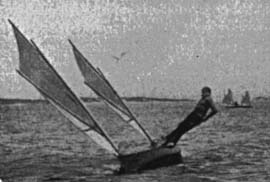

Butler wasn’t the first sailor to get extra stability by slinging a board out to windward and sitting on it. The big racing sharpies and the Chesapeake Log Canoes were throwing up to a dozen crewmen to windward on their huge “spring boards” in the same era. But Pete Lesher, curator of the Chesapeake Bay Maritime Museum, notes that the Chesapeake was quite isolated from the sailboat racing heartland. The “spring board”, he feels, was a separate development to the canoe’s sliding seat. Ben Fuller agrees that the “spring board” was such an obvious development that it sprang up independently in several areas – but as a canoe sailor himself, he believes that the sliding seat, a much more complicated piece of engineering, was created by Butler alone. Contemporary histories all seem to give Butler the credit for introducing the sliding seat, which was a step ahead of the spring board in sophistication and ease of use. And it was the canoe’s sliding seat, rather than the “pries” or “spring boards” of other classes, that made an impact on yachtsmen and inspired further developments.

To steer from the seat, Butler created the “cross head tiller”; basically a wooden pole that slid from side to side in a steel frame which was connected by linkages to the rudder.  The links allowed the rudder to be operated by moving the cross-head tiller fore and aft, rather than side to side like a modern tiller extension.  Others tried modern-type tiller extensions, but the primitive materials of the day made them too hard to handle and too fragile.  The cross-head could be strong enough to actually be used as a handhold, whereas the extension tiller was all too likely to snap.[^chapter6-56]

Butler also invented the predecessor of the modern cam cleat, so that he could hike off the plank and dump sheet when necessary by hitting a lever on the cleat with a toe.  Along with others, he reduced the side of the cockpit until it was little more than an easily-drained footwell. [^chapter6-58] For a while, some top American canoe sailors would cleat both sheets and stay hiked out on the sliding seat, “with nothing to do but steer and balance till he comes to the turning mark of the course.  Here he quickly snatches a fresh trim of sheets for the new leg of the course, and off he goes again.  If she gets an extra heavy knockdown puff and capsizes, all the agile acrobat has to do is to jump out on to the centre plane, which is now lying horizontal on the top of the water, and to prise the canoe up, using the slide-seat plank as a lever.”[^chapter6-57]

Butler became known as ‘the father of modern canoe sailing.”  As Maurice D Wilt noted, “he developed by his inventive genius the fastest sailing craft for its displacement that the world has ever seen, a seaworthy, unsinkable boat capable of a speed of fifteen miles an hour… The long deck seat, the thwartship tiller, and the tight self-draining cockpit made it possible to increase sail area to an enormous extent and in complete safety” said Wilt. [^chapter6-59]  “every man who has sailed on a sliding seat and experienced the thrill of the speed owes a debt of gratitude for the invention and development of the finest of all water sports to the memory of Paul Butler.”[^chapter6-60]

These construction of these canoes was a miracle of lightweight strength given the technology of the times. The planking was just 2.3mm or 3/32 in thick, “strengthened by strong, light cloth, cemented to the inside…specially braced by sticks of the diameter of a pencil, each located with respect to some special strain or stress” and with masts that were “built up of three layers of thin veneer, wound spirally in opposite directions and glued together.”[^chapter6-62]

The lightweight sliding seat canoe took small-craft sailing to new heights of performance.  “Canoe sailing has now reached a point where it can give long odds to any other kind of smallboat sailing” wrote the old champion Vaux. “The canoes have been made to attain a degree of speed and windward qualities not shared in by much larger boats, and now it is far from an unusual thing to see a sixteen foot canoe with a hundred feet of sail beat a good-sized catboat, and at times when the weather is favorable actually outfoot sloops and schooners of twice her length and twenty times her power.”[^chapter6-63]

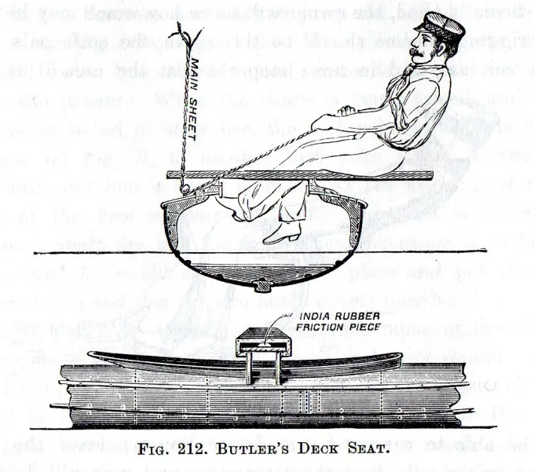

By 1890 it was noted that “the contempt expressed by catboat sailors for canoe sailing was turned to unqualified admiration one day in July, on New York Bay, when four canoes covered the four-mile course in less time than the fastest catboat present, The fastest seventeen-foot catboat about New York, Bon Ton, was in the race. To add to the credit of the canoes it must be added that the water was rough and wind strong, so that the cats had to sail with reefed sails, and made bad weather of it at that.”[^chapter6-64]

But speed came at a price.  As Stephens noted, structurally the new-style canoe was “a beautiful specimen.of engineering” that could handle racing loads but was “in every way unfit for the ordinary uses of a canoe.”  The cockpits that had once been a comfortable bed became nothing but a footwell for lines.  Hulls that had been wide enough for cruising were now so unstable that racing canoes would capsize under bare poles.  The “racing machines” were so hard to sail that only those who spent all their time training could get them around the course.

The sliding seat “racing machine” and its athletic skipper drove those who were short on training time or interested in cruising as well as racing out of the sport.   “The true canoe, fitted to be useful and comfortable, otherwise than for mere “pot-hunting”, has no chance in racing against this machine type of canoe and man” wrote Warrington Baden-Powell. The sliding-seat canoe, he growled, “has engrafted the athlete and the acrobat upon the sport of canoeing.  Neither of them was wanted….the infinite harm done to sailing and racing by these machines since about 1889 is now beginning to be universally admitted…”[^chapter6-65]  The same year that Vaux exulted about canoes beating catboats was the peak of canoe racing in the USA.[^chapter6-66]

“These extreme canoes in a few years developed themselves out of existence” wrote Wilt  “The huge batswing sails got to be so hard to hold up, in the extreme sizes, and the hulls of the boats had to be so strongly built, and consequently heavy to stand the various strains imposed upon them, that they became useless for anything but match sailing.  They were too heavy for easy transportation, and they were entirely too expensive to build and maintain.”  Even the American Canoe Association admitted that the sharp drop in the number of racing canoes was “probably due to the increasing development of the scientific racing canoe now in vogue.”[^chapter6-67]

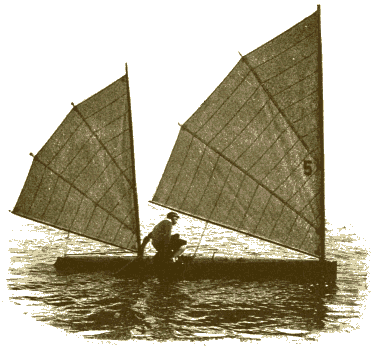
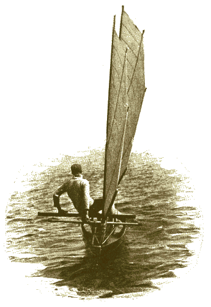

In response, the ACA introduced sail area limits; bringing the sail area first down to 130, then 110 and finally 90 sq ft (12, 10.2 and 8.4m$^2$)[^chapter6-68]  The new rules created lightweight boats like the 1897 champion Mab, which was built of 1/8”/3mm thick white cedar and had hollow spars and varnished rawhide leather fittings instead heavier brass gear.[^chapter6-69] The masts were limited to 16’/4.88m height and carried two light, short-battened Bermudan mains in a cat-ketch rig.  The bow and stern were thin and fine-lined, with heavily Veed bottom sections.[^chapter6-70] This was a boat designed for low wetted surface and low wave-making drag, rather than generating planing lift. While at least one modern expert who has sailed a reproduction of a Stephens 16 x 30 of 1910 vintage is convinced that it did plane, the general consensus is that the deeply Veed sections and narrow stern made it a high-speed displacement hull -a boat that would “cut through the water in the manner of a modern catamaran hull…..with the power provided by the sliding seat they did go a great deal faster than their theoretical hull speed”, as canoe and dinghy designer Gordon “Sandy” Douglass wrote in his autobiography, “Fifty Years Before the Mast”.

The “16 x 30” class lasted for four decades, but it could not stop the death of canoe sailing as a popular sport.  “The perfection of the racing-machine and the extreme acrobatic skill required in attaining perfection in its handling, has driven busy men for the most part from the sailing courses” ran a report of the American Canoe Association annual meeting.[^chapter6-71]  “There is no prettier work afloat than canoe handling; but, as it is now, it requires the mental skill of the boat sailor with the physical skill of the gymnast, and unfortunately there are few possessing the ability who are willing to devote themselves to so absorbing a sport” reported *Outing*.[^chapter6-72]  The fans of the general purpose canoe had dropped out of racing.  There were so few keen racers that canoe racing almost died. [^chapter6-73]   The improvement in other types of small craft, like the oar-and-sail dinghy, canoe yawls and Raters, also played a part.[^chapter6-74]

Gordon “Sandy” Douglass, a canoe champion who went on to show his understanding of the American market by designing some of the country’s most popular racing dinghies, later wrote that the arrival of the hard-core racing canoe was the end of the sailing canoe as a popular class; “when the canoe became a racing machine instead of a utility boat for camping, cruising and paddling, as well as for racing, it lost most of the very qualities which had been the reason for its existence.  By 1900, gone were most of the nearly two hundred canoe clubs, gone were the hundreds of campers and competitors who, in the 1880, had made canoe sailing a popular sport.  There still were enthusiasts... but now they numbered only  few dozen.”[^chapter6-75]  It was a story that was to echoed time and again in other classes, at other times and other places.

There were, as usual, other factors at play too. While canoeists had been developing craft that were ever harder to sail, bicycle manufacturers had been developing bikes that were easier and safer to ride. Many of the pioneering canoe sailors took to the roads and played the same leading role in organising cycling as they had done for canoeing.  As The Rudder noted later, “the bicycle dealt canoe-sailing its mortal blow... (canoeing’s) novelty attracted thousands of men, who followed the pastime until something fresh came on board. Then they flew to this and the sailing canoes were left to rot in the houses”.  Like the windsurfers of a century later, the canoe sailors learned that early adopters are also early abandoners once the next new invention arrives.

The canoe lasted longer as a cruising boat. Although we think that the desire to escape from technology is a modern emotion, it was present even in the 1800s, when canoe cruising was seen as “a revolt against the artificiality of the age. We have grown tired of pulling a lever when we want heat and pushing a button when we want food; we long to grapple fundamentals.” And so the canoeists turned further from racing and towards cruising the inland rivers and lakes, where other craft could not go – but more and more of them did it under paddle power.[^chapter6-76]

But while the canoeists of North America turned their backs on sailing, a small group of sailors from the river where the first Rob Roy was built started to develop a new type of sailing canoe and a new type of sailing.  Read on for the next part in the history of the sailing canoe – the arrival of the planing hull.

[^chapter6-1]: The windsurfer may be the only other type that was created by individuals rather than wider social and technological forces. Like the canoe, it used some leading-edge materials, but neither windsurfer or canoe were created by the possibilities of those materials, and neither of them were developed by a wider group.

[^chapter6-2]: “John Macgregor” p 277

[^chapter6-3]: http://www.railwaysarchive.co.uk/documents/BoT_NineElms1865.pdf, retrieved 9/12/15.

[^chapter6-4]: “John Macgregor” p 275

[^chapter6-5]: “John Macgregor” p 278.

[^chapter6-6]: The recent writers who have assumed that the Victorians would have looked down upon “native” canoes and kayaks are falling for a stereotype themselves.  In reality, many (although not all) Victorian era-canoeists were very impressed by the older craft; the Canadian canoe, for example, was seen as “incapable of improvement” for its use; “The County Gentleman: Sporting Gazette, Agricultural Journal, and The Man about Town of London”, July 30, 1892 pg. 1026.   As Folkard noted (The Sailing Boat page 534) “it would be difficult, if not impossible, for the most ingenious and scientific of European boat-builders, with twenty years or more experience in their art, to make a boat so admirably adapted to the purpose as the native kaiak.” Supporters of rowing boats did attack the canoe in the wake of Macgregor’s publicity, denouncing it as “the invention of savages….an imperfect, unscientific, uncomfortable imitation of the true boat”; see “John MacGregor” p 291.

[^chapter6-7]:

[^chapter6-8]: “John Macgregor” p 350

[^chapter6-9]: John Macgregor p 297

[^chapter6-10]: “John Macgregor” p 356 and

[^chapter6-11]: The County Gentleman: Sporting Gazette, Agricultural Journal, and “The Man about Town” (London, England), Saturday, July 30, 1892; pg. 1026

[^chapter6-12]: *New York Times*, August 1 1880

[^chapter6-13]: C Bower Vaux   , courtesy Dragonfly

[^chapter6-14]: See for example “Modern Canoeing” *Outing* Vol 4 p 217

[^chapter6-15]: “John MacGregor” notes at p 359 that a Reverend C.R. Fairey copied Macgregor by canoeing around Australia with religious tracts for watermen. See also NZ -Australian Town and Country Journal 26 Feb 1887 p 39

[^chapter6-15b]: Re capsizing – Dixon Kemp’s 1884 edition says that as early as 1879, a canoe that capsized and filled recovered quickly enough to finish third in a field of 11 racers.

[^chapter6-16]:  "Canoe meet at the Thousand Islands" - C. Bowyer Vaux. “  *Outing*, Vol 14, P 354.  As late as 1897 the Encyclopedia of Sport still referred to sailing as “the leading feature of present day canoeing” (p 171) and in 1892 it was stated that ‘the most remarkable feature in modern canoeing is the extent to which the paddle has been superseded by the sail”;( The County Gentleman: Sporting Gazette, Agricultural Journal, and “The Man about Town” London, England), Saturday, July 30, 1892; pg. 1026

[^chapter6-17]: Macgregor’s second major cruise, for example, was one third under sail; John Macgregor p 289.

[^chapter6-18]: WP Stephens, “Single-Hand cruising and single-hand craft”, *Outing* vol 36 p 384

[^chapter6-19]: History of American Canoeing Pt 1, C. Bowyer Vaux, *Outing* Volume X issue 3 June 1887, p266.

[^chapter6-20]: “The Dry-Fly of sailing” by “Uncle”, The Yachting Monthly, August 1924, p 287

[^chapter6-21]: Still, there were occasional tragedies and some had near misses.  The Rector of Cheadle, Commodore of the Mersey Canoe Club, “narrowly escaped losing his life while boating with no other companion than one of his monkeys, who stood on his head until finally washed away by the waves.”  The Rector later became one of the world’s leading experts on show dogs, which was probably safer for him and for his monkeys.

[^chapter6-22a]:  Account from The Field,  Oct 7 1871, quoted in *Forest and Stream*, June 3 1896.

[^chapter6-22]: p 216; “History of American Canoeing Pt 1", C. Bowyer Vaux, *Outing* Volume X issue 3 June 1887 p 260, and letter to the editor by Vaux, *Outing* Vol 6 p 237. Leeboards had been used in open Canadian canoes in 1860 and centerboards by 1865, but the open decks, high ends and hull shape of such types meant that they could not perform as well under sail as the decked canoe.  Quite why the centerboard and leeboard apparently took so long to be adopted into decked canoes is a mystery.

[^chapter6-23]: See for example the report of Clyde Canoe Club racing in Glasgow Herald of 15 Sept 1875.

[^chapter6-24]: “History of American Canoeing Pt 1, C. Bowyer Vaux, *Outing* Volume X issue 3 June 1887 p269.

[^chapter6-25]: *Outing* vol 10 p 364

[^chapter6-26]: *Forest and Stream* Nov 27 1890 p 386. Some canoes carried even more ballast, with an article in The American Canoeist for June 1886 (p 100) saying that a couple of years earlier, 300 to 350lb of ballast was “not an uncommon amount”.

[^chapter6-27]: “Canoe Handling”, second edition 1885, Forest and Stream Publishing Co, C Bowyer Vaux,  re Nautilus and Pear winning -*Forest and Stream*, April 29 1886

[^chapter6-27b]: “The Canoe – How to build and manage it” by   Alden, Scribner’s Magazine, August 1872.

[^chapter6-28]: “History of American Canoeing” *Outing* Vol X, Issue 3 June 1887 p268

[^chapter6-29]: History of American Canoeing” *Outing* Vol X, Issue 3 June 1887 p269

[^chapter6-30]: History of American Canoeing Pt II, C Bowyer Vaux, *Outing*

[^chapter6-31]: *Outing* vol 10 p 361.  In “upset races” each canoe had to be capsized and recovered in the middle of a race.

[^chapter6-32]: The County Gentleman: Sporting Gazette, Agricultural Journal, and “The Man about Town” (London, England), Saturday, August 22, 1891; pg. 1145

[^chapter6-33]: Encyclopedia of Sport, Canoeing, p172

[^chapter6-34]: *Outing* Vol 14 p 354.

[^chapter6-35]: *Outing* August 1887, History of American Canoeing Pt III by C Bowyer Vaux p 407. CHECK CHECK CHECK

[^chapter6-36]: "The Canoeing of To-day", by C. Bowyer Vaux. *Outing* Vol 16 p 214 and THE AMERICAN CANOE ASSOCIATION, AND ITS BIRTHPLACE, by C. Bowyer Vaux. *Outing* Vol 12  p 419; *Outing* vol o4 p 108 “They are somewhat prone to get out of order” , Canoes and Canoeing, Vaux, 1894

[^chapter6-37]: The Canoeing of Today, C Bowyer Vaux, *Outing* Volume XVI, 2 May 1890 p 135

[^chapter6-38]: Trads and memos MBing oct 42 p 84.

[^chapter6-39]: F & S Jan 8 1891 p 506   and ors – planks strained retrofitted and early  canoes  AND tiller extension?  Short fore and aft tiller and deck yoke applied by Vaux in Dot. “As men learned to sit further out some means of reaching the tiller was necessary, and a second handle, jointed to the first, was added. This same gear has been used on the majority of canoes.  The tiller extension can also be seen in some contemporary canoe plans.

[^chapter6-40]: History of American Canoeing Part III, *Outing* August    p 403

[^chapter6-41]: Canoeing Under Sail,      Sailing Craft, ed by SChoettle, p 118

[^chapter6-42]: NY Spirit of the Times 1884 p 773

[^chapter6-43]: “Modern Canoeing”, *Outing* Vol 3 p220

[^chapter6-44]: “The only requisites for membership are that the applicant must be a canoeist and a gentleman.” THE AMERICAN CANOE ASSOCIATION, AND ITS BIRTHPLACE, by c. bowyer vaux. *Outing* Vol 12  p 418

“their twin companions, betting and gambling”:- The American Canoeist, June 1882 p 72

[^chapter6-45]: F & S Jan 15 1891 p 525   (also referred to pros as “the men who sail sloops an catboats off Coney Island with advertisements of soap and patent medicines pained on the sails”.

[^chapter6-46]: History of American Canoeing Vol II, C Bowyer Vaux, *Outing* Vol 10 p 369

[^chapter6-47]: Trad and Mem MotorBoating October 1941 p 84

[^chapter6-48]: See for example EB Tredwen quote on p 86 of “Amateur Canoe Building”.

[^chapter6-49]: Trad and Mem MotorBoating October 1941 p 84

[^chapter6-49a]: *Forest and Stream*, April 29 1886

[^chapter6-49b]: These figures from “Rushton and His Times in American Canoeing”, by Atwood Manley - “like some other British sailors he had already fitted a tiller so that he could steer from on deck”:- See The American Canoeist, June 1886 p 100

[^chapter6-50]: CANOE MEET AT THE THOUSAND ISLANDS. BY C. BOWYER VAUX. *Outing* vol 14 p356

[^chapter6-51]: C Bowyer Vaux, appendix.  Pescowic SELECTED FOR ICC   but as Vaux noted, ““Her performance at the ’86 A. C. A. meet were the talk of the canoeing world for over two years in England, Germany and America. This arrangement did not and cannot prove popular for obvious reasons. It is a racing expedient, and perfectly allowable as such.”[51]

[^chapter6-51b]: Progress in canoeing

[^chapter6-52]: “The International Canoe Race”, *Outing* Vol 9 p 169

[^chapter6-53]: Bower Vaux, appendix to          ,

[^chapter6-54]: One of the British sailors was already aware of the American position and had fitted his boat with a tiller that could be used while sitting on deck, although he still sat in the boat downwind. Stevens says that it was Baden-Powell (Trad and Memoro,s MotorB Oct 41 p 84) but Vaux, who probably knew better as the winner, says (in  Note *Outing* vol 9 p 167) that it was the less experienced Stewart, who finished third in the regatta.  Only the first finisher in each nation’s two-man team counted.

[^chapter6-55]: Stephens Tad and Me Oct 41 *MotorBoating* p 84

[^chapter6-56]: In *Forest & Stream* Jan 8 1891 p 506 it was noted that the modern type of tiller extension that had been used in some canoes was “defective in two points.  It is so weak in construction as to be very easily broken, and also from its weakness and the fact that it swings freely it is of no aid to the main in regaining his position after hiking out…the mishaps to the old tiller in the races at the meet probably settled its fate, and the new (thwartships) one will supplant it entirely wherever the sliding seat is used.”

[^chapter6-57]: Encyclopedia of Sport, Canoeing, p 172

[^chapter6-58]: Wilt says that the canoes developed by Butler could recover from a capsize easily, but Vaux noted in “THE AMERICAN CANOE ASSOCIATION, AND ITS BIRTHPLACE, by c. bowyer vaux. *Outing* Vol 12  p 420” that the big rigs of the later canoes made it harder to bring them upright than with earlier craft.

[^chapter6-59]: Canoeing Under Sail,    Sailing Craft p 120.

[^chapter6-60]: Canoeing Under Sail,     , Sailing Craft p 118-119.

[^chapter6-61]: Information on rig from T and M, *MotorBoating* Nov 41 p 54.  See “The modern single-hand cruiser” by C Bowyer Vaux, *Outing* Vol 22

[^chapter6-62]: *Outing* vol 14 p 354 saoid that this ‘standing rig” was first used in the famous canoe Pescowid in 1886.

[^chapter6-62b]: “Scantling regulation in yachting”, W P Stephens, http://www.sname.org/HigherLogic/System/DownloadDocumentFile.ashx?DocumentFileKey=bc8bb07c-337b-43c8-a201-e3e686b6f09f

[^chapter6-63]: CB Vaux, Editor’s open Window, *Outing* Vol 14 p 313

[^chapter6-64]: “Editor’s Open Window, Canoeing”, *Outing* vol 16 p 495

[^chapter6-65]: “Canoes and Canoeing” Warrington Baden-Powell in “the Encyclopedia of Sport”, F.G. Aflolo et al (eds) London, 1897 p 172

[^chapter6-66]: *Forest and Stream*, p 412 May 12 1894

[^chapter6-67]: *Forest and Stream*, Jan 26 1893 p 83

[^chapter6-68]: For every inch the beam was increased over 30”, sail area could be increased by 3 ft2, while for every inch under 16’ the sail area had to be increased by ¼ ft2.  Beam had to be between 1/3 and 5/32 of overall length.  There were also minimum depth, waterline beam and weight limits. “Canoeing Under Sail”, Wilt in “Sailing Craft”, p 120 and 130.

Wilt’s complaint about the weight of the “racing machines” is something I still have to follow up. Some of the later big-rig US canoes reverted to ballast, perhaps because the power of the sliding seat allowed them to carry such large sails that they needed (and could afford) some ballast to keep them upright when tacking or gybing.

[^chapter6-69]: Champion canoes of To-day, R.B. Burchard, Outing vol 30 p 226

[^chapter6-70]: Later it was reported that there was a swing back to ballast.  “Canoeing”, Bowyer Vaux, p 20 he says that Toltec, which won the International Challenge Cup for 1891 against a Canadian challenger, had 100lb of ballast.  Her skipper “belayed both sheets in a strong, puffy breeze, and slid in and out on his long sliding seat as required, sometimes having both feet against the outside of his canoe, and directing his course by occasionally touching the tiller with his aftermost foot.”

[^chapter6-71]: *Outing*, Vol 29, p. 143

[^chapter6-72]: *Outing* vol 30, The champion Mab, reported in the same article, had a 5’3” sliding seat, 16 x 30, silk sails of 136 sq ft, storm sails of 90-, hollow masts, 1/8” wjite cedar planks, toe operated cam cleats but varnished rawhide fittings instead of brass, cockpit draining through CB case.

[^chapter6-73]: See also “THE CANOEING OF TO-DAY By LEONIDAS HUBBARD, Jr.” Outring Vol 40 p 700; BROOKLYN EAGLE 17 May 1896 p16  http://bklyn.newspapers.com/image/50432305/.

[^chapter6-74]: *Forest and Stream*, p 412 May 12 1894.  By “rater types” one means boats lilke the Scarecrow, wich were nbot designed as Raters but followed the same style. The typical “canoe yawl” was a small double-ended yawl-rigged centreboard cruising yacht about 18-   long, which developed in north England from about     .

[^chapter6-75]: Gordon K (Sandy) Douglass, “Sixty Years behind the mast – the fox on the water” p

[^chapter6-75b]: The Rudder, May 1915, p 253. See also the London Times, quoted in American Canoeist, November 1882 p 155.

[^chapter6-76]: “THE CANOEING OF TO-DAY By LEONIDAS HUBBARD, Jr.” Outring Vol 40 p 705

