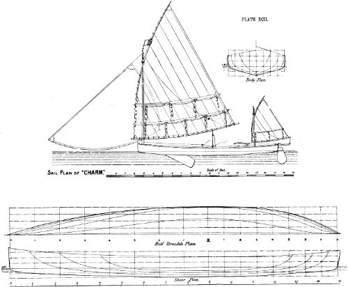
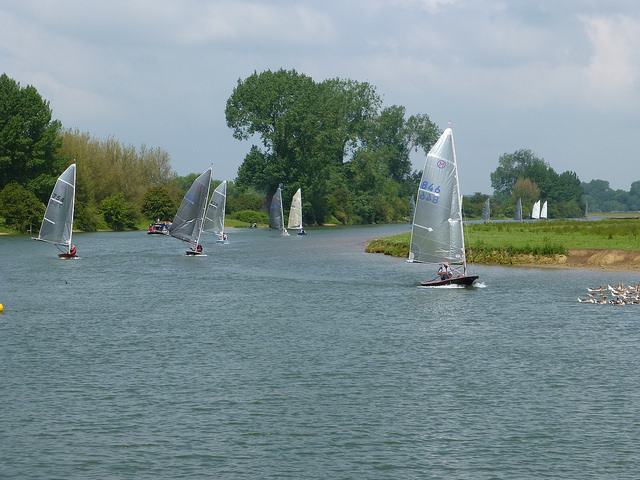
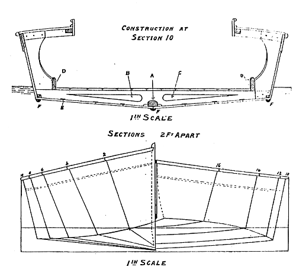
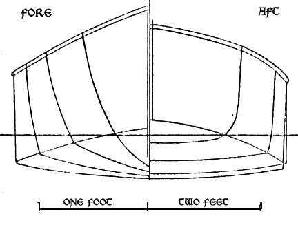
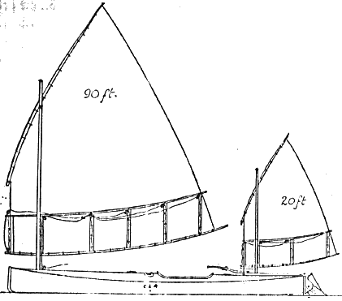

# "Skidding over the water" – Enter the planing hull {#sec-chapter7}

After their defeat by the slim American canoes in 1886, the British quickly followed the Americans in dumping their heavy centreboards and ballast, moving out of the cockpit, and starting to hike. Although at least one modern writer has claimed that the British resisted the change to the “deck position”, that was probably just one more example of someone falling for the myth of the conservative sailor. There is no real evidence of any such factor.  Once they got over the inevitable teething issues, the British canoe racers found that sailing from on deck was a revelation in performance and, more importantly, enjoyment and immersion in sailing. “For genuine exhilaration….there is no sailing in the world to equal the deck position of a 30-inch canoe” enthused one English sailor. “Every pulsation of the craft, every flutter of the sail, every streak of wind simply means that the body must act in response and unison; it means, in short, that the hand, the eye, and every pound of the body shall work with the wind in propelling the boat….in this position a man cannot help feeling that he is a part of the machine which moves at his will, but by the force of the wind…..We can carry more sail, therefore, go faster, and enjoy sailing more on deck than before…out of fifteen or sixteen canoes we have recently been sailing with at Hendon, at least fourteen have adopted the deck position, and the unanimous opinion is much in accord with what we have expressed here.”[^chapter7-1]

In 1887, Stewart underlined the change in style by winning the Royal Canoe Club’s premiser prize, the Challenge Cup, in what was called a “Pescowic style” canoe, Charm.  [^chapter7-2] [^chapter7-3]  Although they were happy to use the deck position, the British did institute class rules to maintain the portability that had always been central to the canoe’s appeal;  “our American cousins taught us the power gainable by sitting out to windward, we saw the danger that that position would invoke huge sails and deep wedge bodies and lead or heavy plates” wrote Baden Powell “so we limited sail area….with sail area limited and length limited, beam, centerplate and keel limits are of very minor importance, and could with advantage be simplified in the rules so as to give greater freedom of model.”[^chapter7-4]

While the Brits took up the deck position with relish, it was a different story when they tried to take the next step and adopt the sliding seat. The first British canoe to adopt a sliding seat had an easy win in a race in 1892 [^chapter7-5a]. But the sliding seat was (and still is) almost impossible to use in the gusts and lulls of the Royal Canoe Club’s home waters at Teddington, where the River Thames is only about 75m/yards wide and lined by trees.  The changeable English winds meant that the other American innovation of the day, the un-reefable “standing rig”, was also unsuited to the British racing courses. Dixon Kemp felt that even on “Hendon Lake” (now known as Welsh Harp reservoir) nearby it would only be “a peculiar day” when the wind was steady enough for the “unreefable” American standing rig.[^chapter7-5]  Reports of the early canoe races are full of mentions of calms interspersed by squalls strong enough to lay boats flat. The evidence indicates that the sliding seat canoe was not widely adopted because it was simply impractical in the places the British were sailing at the time, not because the British were opposed to development.

The Royal Canoe Club responded by taking a different path. The club created the “A” and “B” classes, also known as the “cruising canoes”, which banned the sliding seat and instead relied on heavy centerboards and the skipper hiking from a 3’6” wide hull to balance 150ft2 of sail.[^chapter7-6]  “The sliding seat canoes, after nearly killing canoe sailing owing to the tricky acrobatic nature of their sailing, have been replaced by the RCC’s A and B class canoes” wrote the designer Linton Hope, a man who was no stranger to pushing the limits but also recognised where they lay.[^chapter7-7] “The Royal Canoe Club cruising canoe is very tightly restricted as to type and dimensions, so that it is impossible to degenerate into a useless eggshell type of a racing machine, such as those which have killed canoe sailing in America, and nearly killed it here before the advent of the present type.”[^chapter7-8]  The cruisers, wrote Linton Hope, revived the sport “when it was almost killed by the sliding-seat racing machine….A few of the racing-machine type of canoe are still in existence, but they have a very poor chance against the more modern cruiser when racing, whilst there is no comparison when it comes to pleasure sailing.”[^chapter7-9]

The creation of the “cruising canoes” and the RCC’s ban on the sliding seat may have led the way to one of the biggest leaps in small sailboat racing.  Because they could not rely on the sliding seat for sail-carrying power, the British canoe designers could not follow the Americans down the path of the ultra-slender hull that sliced through the water.  Instead they went down a different path, creating what may have been the first ancestors of the modern planing boat.

Tracing the development of the planing sailboat is a complicated business.  The concept is simple; a boat is “planing” when the movement of the hull pushes water down and in an opposite and equal reaction the hull is lifted up (a phenomenon known as “dynamic lift”) and effectively lifts the boat out of much of the drag created by its own bow and stern wave.  It gets harder to tie it down more closely.  The classic definition by the guru of planing hull dynamics, Dr Daniel Savitsky, is centred around powerboats and doesn’t seem to allow for any round-bilge hull to plane at all. Perhaps the first planing hull to be demonstrated (at least in model form) dates to the early 1870s, but the rocket-powered model was clearly not a useful inspiration for a sailing boat.

Some naval architects classify a “planing hull” as one in which dynamic lift causes the hull’s centre of gravity to rise above its static point, but that’s impossible to measure in the real world.[^chapter7-10]  Many of the rules of thumb that sailors use, such as whether the boat is exceeding hull speed, are misleading – very narrow hulls like those of naval destroyers and classic catamarans, which dance to a different set of physical laws, can exceed hull speed without planing.  Whether the wake runs “cleanly” off the transom is also not a reliable measure; some heavy powerboats have a messy wake even at speed, and some craft have a clean wake even when moving slowly.

Even if we could arrive at a definition of “planing” that we could easily measure while sailing, the exact definition of “planing boat” remains murky. How often does any particular craft have to plane before we label it a “planing boat”?  If a boat can only plane in expert hands when running dead downwind before a gale under full sail, is it really a “planing boat”?  A boat that may routinely plane in a famously windy city like Wellington in New Zealand may not plane for months on a light-wind lake.  Even among planing craft there is a wide difference in feel and performance – long windsurfers, short windsurfers, 18 Foot Skiffs, Flying Dutchmen and International Canoes each have very different styles of planing. Before the Moths grew hydrofoils, even amongst the top designers and sailors there was a difference of opinion about whether they planed at all.

The proverbial mists of time and tyranny of distance make the search harder. Adding to the confusion is the language barrier.  We can search English language records, but maybe some long-lost Scandinavian or Arab designer created the planing boat centuries ago.  Certainly there are one or two detailed accounts of what seem to have been planing hulls in action in Asia and Australasia as early as the 1870s.  But neither of these types left their mark on history.  One certainly planed and the other may have, but both vanished without leaving a trace, and without influencing later generations.  As far as their effect on the development of the dinghy goes, they may as well never have existed.

But around the early 1890s, a small group near the the upper reaches of the Thames started to specifically design boats that were not just intended to plane, but also played a part in bringing the concept to the attention of the sailing world.  In the Victorian era the waters that run through the ancient university town of Oxford were home to a small community of sailors, apparently rather isolated from the hotbed of dinghy sailing that was developing further downstream near London.  In the 1880s “sailing-boats, whose wild career used to be a terror in former days to the throngs of rowers” had been banned around the rowing boathouse area near the centre of the ancient town and its famed spires, because of the risk of collisions with punts and rowing boats.[^chapter7-11]  The sailors of Oxford moved even further upstream where the river, traditionally known in this area as the Isis, flows past the ancient riverfront common of Port Meadow.  In this stretch the river is just 70m or yards wide, but the flat surrounding land and scanty tree cover would allow a fair breeze. It was here where Oxford don Charles Dodgson, a.k.a. Lewis Carrol, dreamed up the tale of Alice in Wonderland on a rowboat, and where “any day during term-time small centre-board boats may be seen making their way up past Godshow and on to Eynsham, while an occasional variation is afforded by a sail over Port Meadow when the floods are out.” [^chapter7-12]

![The home of the planing sailboat? Above, “Oxford, Port Meadow from Medley Fields” by James Aumonier, 1880. Below, British Moths (a 1930s one design that fits into the International Moth rules) racing in 2012 at Port Meadow. With its tall rig, short hull and even shorter waterline, the British Moth is an exceptionally nimble boat that out-performs many bigger boats in the shifty and light winds of small inland waterways. From an outsider’s perspective, the fact that the British sail so enthusiastically on tiny waterways like this, and design boats that work in such narrow waters, seems like a combination of cause and effect. The fact that they love the sport so much causes them to sail anywhere; the fact that they design boats that they can sail anywhere (like the British Moth) means that sailing is so convenient that it’s easy to love. Lower pic from the Medley SC website.](images/chapter7/oxford.png)

The Oxford University Sailing Club was an unusual outfit for its time.  Unlike the other clubs of its day, it raced over winter and even through snow, sailing a course that had  a Z shape so that it could be squeezed into the river’s confines.  It was an unlikely club and location for a breakthrough in boat design, but from 1888 a family of boatbuilders started developing “sharpie-style” flat-bottomed hard chine canoes.  By 1890, reports in the sailing press made it clear that they were creating something new.  The report claimed that the sailing canoe Snake possessed “the extraordinary power of rushing over the water at ten or twelve miles an hour, probably more, without any wave-making apparently; only a wide smooth wake is seen astern. Yet at five or six miles an hour she makes waves like any other boat.”[^chapter7-13] Here is a description of a small planing hull in action, in a race, and a time that proves she was no one-way flyer. Another account of contemporary British canoes describes how water passing under a canoe’s fore sections “at high speed acts on them like a wedge, tending to lift the bows”. These passages leave little doubt that as early as 1890, the British had developed a boat that would plane.

![Above, the Theo Smith “canoe yawl” Snake. Along with Shadow (below) she may the first planing sailboat in the Western hemisphere. Her deep Vee bow fades into very rounded mid and stern sections, which would have allowed her to develop planing lift even when heeled. These sections look like those of a 1960s Moth; in fact I had to edit this chapter because I mistook Snake’s sections for a Duflos or Mistral Moth!  John Hayward, writing in his book  Canoeing with Sail and Paddle (downloaded from the wonderful [Dragonfly canoe site](http://dragonflycanoe.com/)), noted that Snake had “flaring sides and broad side-decks, which makes her initial stability considerable, especially with two or three men sitting on the side-deck”.  He also noted that the Smith canoe yawls used only their mainsails when racing, probably to keep their sail area under the rating limits. NOTE – Forest and Stream labels the same plan and pics as “Snake II” in its September 28 1895 issue, although the information in the text indicates that Snake II had a transom stern. It is likely that they show the first Snake. ](images/chapter7/snake-plan.jpg)

[IMAGE HERE - snake-sections]

The man who created Snake was Theo Smith, one of four boatbuilding brothers.  Unlike many other boatbuilders along the Thames, who relied on hand shaping their boats and left little trace, Theo and his brother Harry designed on paper and left some record of their creations, including a piece in Field and Stream magazines that recorded the development of the type that became known as the “Oxford Canoe Yawl” and the lines of another of his canoes, the hard-chine Shadow.[^chapter7-14]

Theo Smith’s words show that the development of the planing canoe was the product of specific development, rather than being a random accident.  “The Shadow is not, as some may suppose, the result of a “happy hit” in the way of design, but is rather the result of careful; original thought, based upon close observation of the performance of various types of boats of light displacement that have appeared on the river at Oxford” he wrote. “Although the first of the Oxford canoe-yawls she was preceded by several boats of the sharpie type, which were purely experimental, the first of these being the Yankee, followed by the catamaran Domino, the sloops Merlin and Skipjack, and the canoe Iris, boats which have in turn under favorable circumstances shown a remarkable pace. For instance, the Domino might have been seen careering over Port Meadows with about 12in. of water under her at a pace that could not be short of 10 to 15 miles an hour…. instances have been noted when the sharpies have gone apparently three times the pace of other boats in competition. By a peculiar adjustment of the surplus buoyancy and the displacement of the Oxford yawls have the faculty to a greater or less degree of “skidding” over the water, and not “wallowing” in it as most boats do. The same faculty has been attained even in the round-bodied boats, such as Wisp and Torpedo.”[^chapter7-14b]

The lines of Snake and Shadow leave little doubt that they could have planed. Their rocker is flat over most of her length , with maximum rocker just 20% aft from the bow, and a long straight run aft – similar to the rocker line that a young designer from Cowes was to make into a trademark decades later. The round bilges of Snake develop a drooping chine at the stern – a feature that could encourage the water to break cleanly away at the stern instead of wrapping around the hull.  This detail appears to have been dropped from canoes for many years, returning only in the mid 20th century.

The Smith canoe yawls had an overhang aft, an extremely unusual feature in canoes, but as John Hayward noted it allowed them to “go about marvellously quickly”, which was a major advantage on the short courses the British canoes often inhabited, and also reduced their rating under the measurement rules of the era.

At around 18ft (5.5m) LOA these were very long canoes for their day, but they weighed a mere 100 to 150lb (45 to 68kg) without fittings and had big rigs and the capacity to take two or three crew to to hike the boat flat. [^chapter7-21] These are the sections and dimensions of a craft that can plane.

![Snake’s contemporary, Shadow, image digitized by dragonflycanoe.com. The term “canoe yawl” is confusing, because these boats are much smaller than the canoe yawls developed soon afterwards and commonly known by that term. Like Snake, Shadow had the deepest point of her rocker well forward, with a flat run aft towards a stern that was extremely flat for its day. These are perhaps the earliest examples of what has become the classic planing hull rocker line. Notice the overhang at the stern. This reduced their measured waterline and therefore their rating, and also allowed the Oxford canoe yawls to turn very quickly compared to the contemporaries with deep sterns and skegs – a major advantage on the Royal Canoe Club’s confined home waters.](images/chapter7/shadow.png)

The Oxford canoe yawls proved that they were not just flat-water downwind fliers when Snake went to a British Canoe Association regatta and showed that she was “the fastest boat present” and at her best upwind.   The wide sidedecks and narrow cockpit of the Smith boats meant that they could heel right over and even capsize without taking on water, although (as Hayward notes) they did struggle a bit in breaking waves. [^chapter7-15] [^chapter7-16] [^chapter7-17] [^chapter7-18] Shadow, Spruce and Torpedo, “a thing shaped more like a cigar than anything” even took on the light-displacement Rater class yachts (around 8 to 9m/25 to 30ft LOA) on the Solent and South Coast. The little Torpedo “literally sailed around them (and over them and under them for the matter of that” it was said at the time.

The Smiths continued to develop the Oxford canoe yawl style with boats like Battledore, designed and built by Harry Smith as an “improved Sharpie type” with a “Sharpie middle and after body, and canoe bowed; that is, the angular bilge as it goes forward is rounded so that the angle rounds into a U, which again flattens into a V forward”.  The speed of development was shown when Battledore, sailed by R H Hinckley, won the 1892 Royal Canoe Challenge Cup in “a strong steady breeze”[^chapter7-19] by a full 16 minutes from Vanessa, which had been launched as Nautilus in 1883. [^chapter7-20]

::: {#fig-battledore layout-ncol="2"}

Battledore's body and sail plans.
:::

Another test came in 1894, when American canoest W.W. Howard came to race in England. Howard won only one race in his tour of the UK. His slender, flat-rockered canoe Yankee was too hard to keep upright and too slow to tack to be competitive on the Thames, and he withdrew from the RCC’s Challenge Cup on the Thames just 30 minutes before the start, stating that “the conditions were not fit for an international race”[^chapter7-23]  In 1895 the modified Yankee returned to the fray and was notably fast downwind, but still unable to regularly vanquish the beamier British canoes on their home waters.  Although the Brits admitted that on flat and open waters the slim Yankee, with her bigger rig and sliding seat, would probably beat their own craft, she was just not competitive on the UK courses, which tended to be either narrow and fluky or windy and choppy. [^chapter7-24]

But just like the fine-lined American canoes, the Oxford canoe yawl was to fade away. Oxford was too far from the downstream and coastal areas where sailing was growing.  Harry Smith moved to Burnham on the East Coast, where his Burnham Yacht Building Company was noted for “continuous striving for improvement in performance and construction techniques” and he designed yachts like the Royal Corinthian One Design, which is still racing as a class 81 years later.[^chapter7-25] Theo Smith moved to the south coast and then to the Isle of Wight.  He continued to design and build boats and today his living heritage is his redesign of the West Wight Scow; not a flat scow like the American breed, but basically a modified pram yacht tender with a sail.  He never created another breakthrough boat, but his ideas lived on – none other than Uffa Fox described him as “that great master of the canoe yawl”.  Uffa used Smith’s idea of using rollers along the top of the centreboard case to support heavy centreboards instead of a normal pivot pin, and this idea was picked up by Sandy Douglass when he designed the Thistle and Flying Scot. So while Theo Smith’s writings and plans were destroyed after his death, one small part of his design skill survives in two of America’s most popular racing dinghies – and the fact that Uffa knew of his work and drew similar rocker lines makes one wonder how much of the Smith brothers’ pioneering work on planing hulls influenced Uffa’s hull shapes.

Others, such as the brilliant Linton Hope, kept on developing “cruising canoes” after the Smiths left Oxford. They seem to have developed a rather more conservative shape than the Smith’s boats, but one which was at least as fast.  In 1900 Linton Hope wrote that “the modern cruising-class canoe can not only sail as well as the regular up-river racing boats of more than twice her size, but is far more suitable for confined waters, and can go equally well in the open waters of the Solent – where the up-river rater would not live five minutes – and even hold her own in fine weather with the small raters there.  She is also easy to carry on a yacht or to send by rail, as her small size enables two men to lift her, and her sea-going qualities make her suitable for harbor or estuary sailing, as well as for inland waters, and she has room for her owners to sleep aboard, and to carry his kit and stores, if he likes that form of amusement.”[^chapter7-26]

But the number of people who like that form of amusement was dropping.  As early as 1891, “The Yachtsman” magazine had noted that “the popularity of the canoe seems to be on the wane in this country and the reason is not far to seek.  The canoe has departed from the state of beautiful simplicity in which it existed before the introduction of such ingenious, but complicated contrivances as drop rudders, sails with patent reefing gear, and heavy centre-plates; there is now but little to choose between the complexity of gear found in a 1 rater and that in what is called a first-class sailing canoe.”[^chapter7-27]  “Canoe racing is indeed nowadays confined to a small class of experts, who can afford to build mere racing machines, which are of little value for anything else” lamented one paper. Just as in America, only a tiny number of enthusiasts remained faithful to the racing canoe.[^chapter7-28] Cruising canoeists had caught the complication bug too….a cruising canoe competition went to a sailor who crammed a bedstead, wash stand, and tea tray into his canoe. Many ageing British canoe sailors moved into the little fully-decked double-enders that took over the name of “canoe yawl” from the lighter, smaller Smith type. To many sailors they were an ideal miniature yacht. To an old-time canoe sailor like Baden-Powell, they were “heavy, bungling, deep-drafted chungbungoes” [^chapter7-29] that had no more right to the “canoe” label than a battleship, which also had a canoe stern. But even as the British and American racing canoe faded, many of its leading lights moved on to the next type of boat that was to become a pattern for today’s sailing – the Rater.

[^chapter7-1]: Quoted in “History of American Canoeing Vol III”, *Outing* for August, 1887, p 413. Even Baden-Powell, the established leader of British canoe racing, thought that the change to lighter boats, ballasted with crew weight rather than a heavy centreboard and lead shot, would make canoe sailing more popular “if extreme types be guarded against”; *Forest and Stream* Jan 27 1887.

[^chapter7-2]: To quote Vaux in “The American Canoe Association, and its Birthplace”, Outing Vol 12 p 420, “a boat built in England on the American plan, and sailed in American fashion, won the Royal Canoe Club Cup in the spring of 1887—a great triumph for American ideas.”

[^chapter7-3]: *Outing* Vol 10 p 486 Editors OpenWindo

[^chapter7-4]: *Forest and Stream* Nov 27 1890 p 386.  RATING AT THIS TIME L x Sa/6000 =0.5

[^chapter7-5a]: Sliding seat – *Forest and Stream* March 24 1892 p 284

[^chapter7-5]: *Yacht and Boat Sailing* p 519

[^chapter7-6]: In 1890, the sail area was 112 sq ft; *Forest and Stream* p 386 Nov 27 1890

[^chapter7-7]: The Yachting Monthly, p 245

[^chapter7-8]: CANOE SAILING ON THE THAMES. LINTON HOPE. *Country Life Illustrated* (London, England), Saturday, October 27, 1900; pg. 538;

[^chapter7-9]: CANOE SAILING ON THE THAMES. LINTON HOPE. *Country Life Illustrated* (London, England), Saturday, October 27, 1900; pg. 538; “Perhaps the first planing hull to be demonstrated”: This was the Polyspheric Boat, created by a British . See for example The Pacific School and Home Journal for 1879, page 235 ... “at high speed acts on them like a wedge, tending to lift the bows”. The Yachtsman, May 16 1891

[^chapter7-10]: Reference needed here! 

[^chapter7-11]: AJ Church in “Isis and Thamesis”, quoted in “The golden age of the Thames", Patricia Burstall, London 1981

[^chapter7-12]: *Outing* vol 12 p 400

[^chapter7-13]: Cite.  Snake and her near sisters were called “Canoe Yawls”, which is a term normally used for much larger and heavier cabin boats designed for sailors looking for more comfort than a standard canoe.

[^chapter7-14]: Thanks to John M Watkins for bringing this passage to my attention in the course of a thread he started about the history of the planing dinghy on the Wooden Boat magazine forum.

[^chapter7-14b]: Pcge 278-8 Sept 28 1895

[^chapter7-15]: *The Yachtsman*, June 6 1891 p 139

[^chapter7-16]: Hayward., *Canoeing*, p 15

[^chapter7-17]: *Forest and Stream*

[^chapter7-18]: The County Gentleman: Sporting Gazette, Agricultural Journal, and “The Man about Town” (London, England), Saturday, August 22, 1891; pg. 1145; Issue 1528.

[^chapter7-19]: Hayward, *Canoeing* p 17 and *Southampton Herald* , June 25, 1892, Issue 4804, p.8, quoting *The Field*.

[^chapter7-20]: *Southampton Herald* , June 25, 1892, Issue 4804, p.8, quoting *The Field*, and *Canoeing* p 17

[^chapter7-21]: Hayward, *Canoeing* p 20

<!--[^chapter7-22]: Hayward, *Canoeing* p 22 -->

[^chapter7-23]: *Morning Post*, June 20, 1894, Issue 38073, p.3.  *The Rudder* Oct 1904 Vol15.   p544 mentions that two US canoes also failed to win the RCC Challenge Cup in 1904.

[^chapter7-24]: *Forest and Stream* Aug 31 1895 p 192, and April 6 1895 p 280. Detailed accounts of the one race that Yankee won indicate that none of the top British boats turned up.

[^chapter7-25]: Information on Harry Smith from “The Elegant Thames Skiff” by John Leather, *Wooden Boat Magazine* April 1990 p 34.

[^chapter7-26]: CANOE SAILING ON THE THAMES. LINTON HOPE. *Country Life Illustrated* (London, England), Saturday, October 27, 1900; pg. 538;

[^chapter7-27]: *The Yachtsman*, Sept 3 1893 p 458

[^chapter7-28]: The County Gentleman: Sporting Gazette, Agricultural Journal, and “The Man about Town” (London, England), Saturday, July 22, 1893 p 921

[^chapter7-29]: *The Encyclopaedia of Sport*. Nope, I don’t know what a chunbungoe is either.

