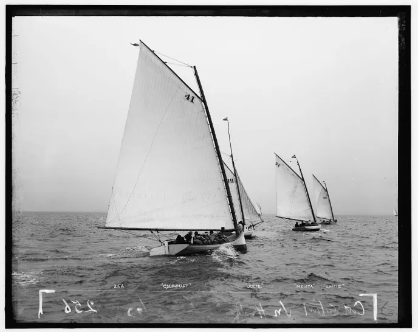
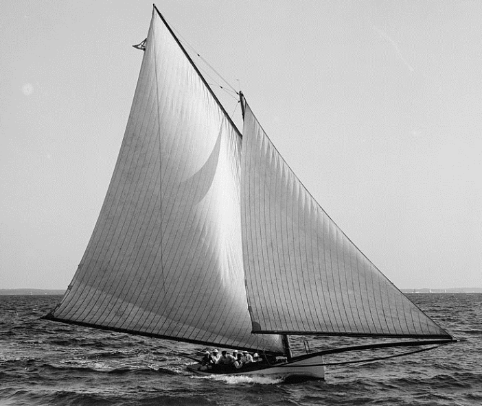
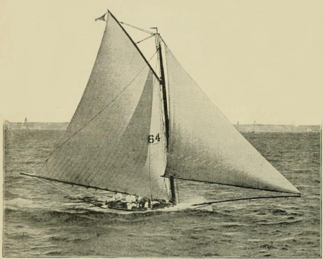
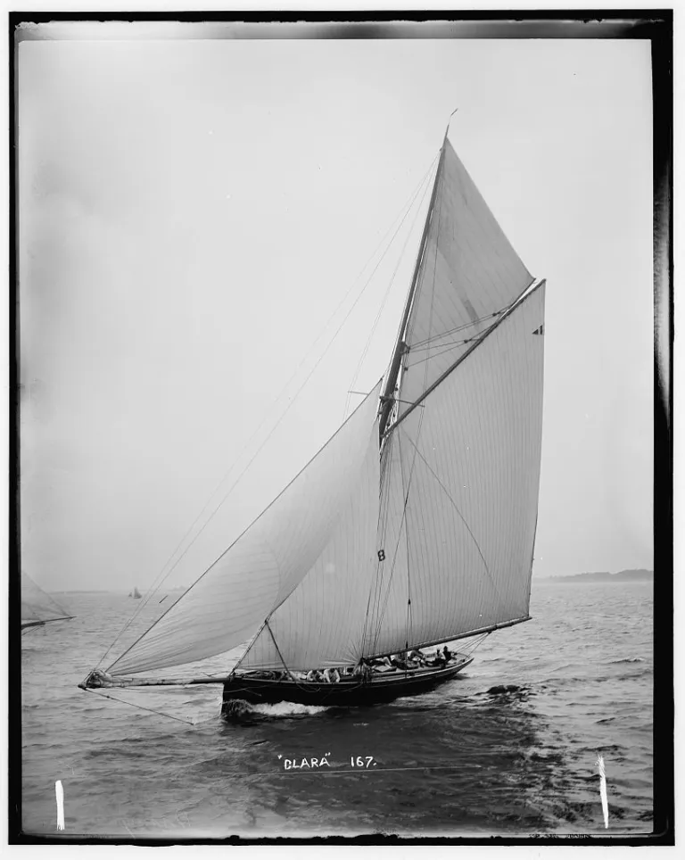
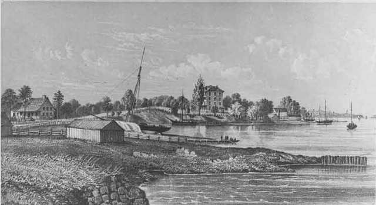
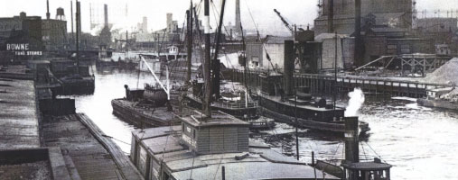
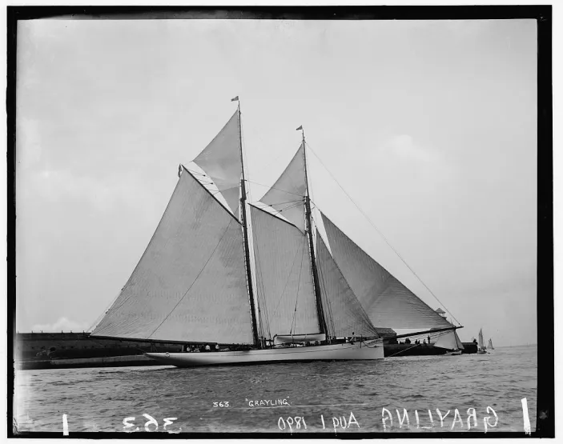
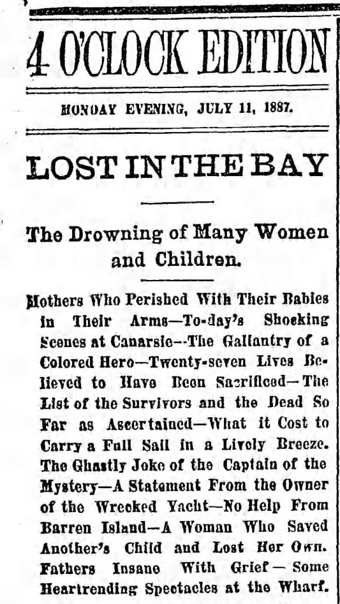
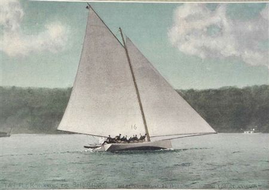

# “We have written too many obituaries of their victims” – the end of the sandbaggers {#sec-chapter8}

While the sharpie and canoes were developing, the sandbaggers were dying. Despite all their speed, influence and fame, they fell victim to social changes, safety concerns, developing technology, and the changing face of the waterfronts.

![The cropped and enlarged version of the previous photo shows the huge stack of ballast on the windward rail. This pic seems important for three reasons. For one, it’s the clearest pic of sandbags in use I know of. Secondly, looking at that vast stack of gravel brings home what an ordeal it must have been to lump all that weight from side to side each tack and gybe. Thirdly, despite carrying all this ballast and sail area, results show that Gold Dust was left trailing miles behind the new breed of lightweight scow types.](images/chapter8/sandbagger-goldust-cropped.png)

As with so many tales, the end of the sandbagger is normally seen as a simple tale of the conservative villains of the “establishment” killing off a fast, innovative type of boat. As is so often the case, the truth is more complex and shows the protagonists in a much better light.

One of the first blows to the sandbaggers came when booming economy of the late 19th century allowed the emerging middle classes to stop watching other people race and to start sailing themselves. Around the same era, there was a new emphasis on amateur or “Corinthian” sport – participant sports done for the love and adventure, rather than professional sports done for spectators, gamblers and cash. The ideal that the Corinthians pushed was for sailing in the modern style, rather than the old model of pros sailing for the rich. [^chapter8-1]

To people like the first commodore of the Seawanhaka Corinthian Yacht Club, one of the clubs leading the new wave, Corinthian sailing was “the only true and enjoyable kind of yachting.” [^chapter8-1b] Unlike the old model where paid hands did the work while owners looked on, a Corinthian or amateur race was “a test rather of the pluck and skill of our amateur sailors than of the length of their purses.” It was better for an amateur to “sail one own’s boat to victory, enjoying all the triumph and suffering all the inconvenience, than to watch one’s hired substitute at the helm taking all the credit, and deserving it.” [^chapter8-2]

The fans of Corinthian sailing knew that the amateur who took over the helm and sheet would not be able to sail as well as the pros who spent their life on the water. The Corinthian sailor would “instantly discover that between knowing how things are done and doing them there is an extraordinary difference, and he will find himself curiously awkward in doing what he has seen his men do a hundred times.”[^chapter8-3]   The amateurs would “not display the same sagacity in taking advantage of the technical points of seamanship as do their employees”, but they would find that racing “develops the seamanship of our amateurs, and makes capable sailors of them.” [^chapter8-4]

Progressive thinkers such as Thomas Clapham (creator of cheap and radical boats) and Thomas Day (a promoter of amateur boatbuilding and the true creator of amateur ocean racing) saw amateurism as a way to open the sport up to those who were not expert watermen or tycoons. [^chapter8-7] Others saw it as a wider issue – to get an active, adventurous and fit population one had to encourage them to participate in sports rather than sitting by and throwing money away by gambling as they watched pros.[^chapter8-5]   In some ways, the Corinthians were addressing the same sort of issues that sailing is facing today. They were trying to stop people from sitting and gambling while watching pro sport; we are trying to stop people from sitting and playing on their devices while watching pro sport.

The irony is that the much-criticised Corinthians were more successful in their aims than the sailors of today are. They realised that sailing had to change and become more accessible if more amateurs were to become involved.  The early members of the Seawanhaka Corinthians were sandbagger owners and sailors (and some of them, like C Oliver Iselin and A Cary Smith, had been very competitive against the pros) but they realised that the extreme sandbaggers were not suitable for the typical middle-class amateur. The weekend warrior was not skilled or experienced enough to keep the over-rigged “gravel wagons” upright, and they lacked the cash to run the big rigs and to pay for the big human-ballast crews.  [^chapter8-9]  They realised that if sailing was to attract more participants the boats had to become cheaper, easier to sail, and require fewer crew. It’s a lesson we could re-learn today.

To promote amateur sailing, the Seawanhaka ruled that only half of each crew could be professionals.  As the yachting reporter Captain Coffin noted, such restrictions on pros “enabled many sailors to own a yacht that could not afford an expensive crew.” They banned the shifting of ballast, which (as other sailors showed before and after) was something that few amateurs wanted to do. And finally, and (to designers) most importantly, they adopted a rating rule that measured sail area.

![Skipper Ed Willis (left) and the crew of the sandbagger Nola look like a bunch of the waterfront workers that the Corinthians were allegedly trying to drive out of the sport. The truth appears to be quite different. A pro sailor, Willis was part of the afterguard of America’s Cup defence candidates, a prominent member of the Port Washington YC, a champion skipper in his own Star class yacht and initiator of the short-lived “Fish” class,  which were 28ft versions of the Star. Willis then moved to crewing for his friend Adrian Iselin, one of New York’s richest men. Together they won the Star Worlds and prestigious Bacardi Cup three times. If the aim of the Corinthians was to drive pros like Willis out of sailing it seems unlikely that he would have had such a career. Port Washington Public Library pic.](images/chapter8/ed-willis-and-nola.jpg)

The new “Seawanhaka Rule” simply multiplied the measured waterline length by the sail area.[^chapter8-10]  It put the emphasis on efficiency and penalised the big-rig brute-power style of the sandbaggers. Over the next few years, the other major clubs adopted similar rules.  The Seawanhaka also lead the way in opening up their regattas to members of other clubs, advocated the use of spinnakers, and took a less formal approach to dress.

There were of course some elements of snobbery in the class-conscious New York of the time. Some owners clearly thought that working-class professional sailors were their inferiors. Day, the editor of The Rudder magazine, was against professionalism on moral grounds. “As soon as a pastime is performed by hirelings it is no longer a sport, it is a business” he proclaimed, and with typical flair and hyperbole he went on to associate professionalism with the fall of Rome and general moral degradation.  [^chapter8-8]

Overall, though, there is no evidence that the move to amateur sailing was a simple morality tale of upper-class snobs  treating the enlightened lower classes unfairly. Some felt that snobbery went both ways, and noted that some working watermen felt contempt towards amateurs.[^chapter8-6]  Although the owners held the wallets, contemporary records indicate that their pro crews were far from powerless; sailors of boats as big as the 130′ cutter Ailsa were known to go on strike when they didn’t agree with the way the skipper was handling the boat.

The fact that many clubs followed Seawanhaka into restricting pro sailors is often seen as the end of sailing as a working class sport in America, but there were other clubs that kept organising sandbagger racing for money.  As late as 1889 a new association, the New York Yacht Racing Association, was formed with rules that did not measure sail area or ban pros, and specifically provided that shifting ballast was to be allowed in open boats. Many clubs joined it, and it was said to have held the largest regattas ever run in New York. There seems to have been nothing to stop the sandbagger sailors from racing with the NYYRA clubs or even forming their own clubs, as other sailors (even ones too young and poor to own their own boats) did before and after them.[^chapter8-11]  The private matches that had been such a feature of sandbag racing did not need a club at all. The available evidence seems to indicate that the “establishment” and their ratings and rules would not have been enough to drive the working waterman out of racing.  Even up to the edge of World War 2, boats like the America’s Cup defenders carried professional crews; pros were a fully accepted part of the sport.

The Corinthians and other clubs do not seem to have killed the sandbagger. Wider social and technological forces were involved. One of the technological issues was the arrival of faster types of boat, like the catamaran. Nat Herreshoff’s Amaryllis cleaned up the sandbagger fleet in the Centennial Regatta in 1876.  [Although there is a popular myth claims that catamarans were banned from racing](https://cthom249.wordpress.com/2016/05/16/the-real-story-of-amaryllis-and-the-first-racing-catamarans/), the truth is that they were welcomed to race as a class in many regattas, and one race report after another tells of the cat fleets leaving the fastest of the sandbaggers miles astern.[^chapter8-12]

Just three years after Amaryllis beat the elite of the sandbagger fleet, the image of the archetypcal American centreboarder suffered another hit when the slim and deep 46′ British cutter Madge came across the Atlantic and beat everything of her size. The victory of Madge was a spur to the “cutter cranks”, a vocal and well-placed group who campaigned against the centreboard sloop.[^chapter8-13]  In 1885, the centreboarder Priscilla, designed by former sandbagger designer/skipper A Cary Smith, was beaten for the honour of defending the America’s Cup by Puritan, a “compromise sloop” that combined the best points of the deep and narrow British cutter and the beamy American centreboard sloop.[^chapter8-13b] “The building of Puritan…marked the end of the old centreboard sloop” wrote WP Stephens, who is sometimes seen as a “cutter crank” himself. By the middle of the 1890s, the arrival of the light-displacement fin keel Raters and their scow relatives drove another nail in the proverbial coffin for the sandbagger’s reputation.

Once the new types proved to be as fast or faster than the beamy big-riggedcentreboarders, many sailors turned away from the chore of throwing ballast around on every tack with relief.  “The crew difficulty was in a measure simplified” one sailor recalled.  “Going about” became a pleasure instead of a chore.”[^chapter8-14]   Sailors spoke of the “relief from the exhausting physical labour” of sandbagger racing that new rules and designs brought. [^chapter8-15]

Another factor that seems to have hurt some of the sandbaggers and their working catboat relatives was that their very popularity attracted rich men who could outspend the men who had to work for a living.  The races for working sandbagger catboats in Beach Haven, New Jersey, attracted more than 40 boats until the arrival of the expensive Herreshoff-built Merry Thought, which “so outclassed all of (the working boats) that in one or two seasons the oldtime rivalry and contests were a thing of the past.” [^chapter8-16]

Big money may also have tempted sandbagger sailors away. Some of the best may have learned a lesson that still applies today – if you want to race for cash you’re better off sailing big boats than small ones.  Bob Fish moved on to become the professional skipper of  vast schooners like Sappho and Enchantress.  Sandbagger builders David Kirby and A Cary Smith designed the America’s Cup defenders Madeline and Mischief respectively, as well as some unsuccessful defence candidates. The Ellsworth clan also ended up in the America’s Cup; indeed it was said that the family could provide the entire crew for a big schooner. “Cap’n Joe” Ellsworth skippered the 1876 challenger in one race and made tactical calls for the defender in 1885, while his brother “Cap’n Phil” designed the defence candidate Atlantic.

Changes in wider society also played a part.  The growth of New York was matched by a growth in pollution.  By the end of the century, the city was called “an island in a sea of sewerage” that affected the oyster fisheries, killing off the weekday work for the sandbaggers and many of their sailors. Factories, oil tanks and transportation facilities took over the waterfront, sweeping away the old havens like Gowanus Bay. Club after club had to move away from their convenient stations near the city.

Perhaps the greatest blow came when the traditional American centreboarder earned a reputation as an unsafe type. For years, the pages of the New York papers had run stories of death after death when small centreboarders capsized.  “The capsizing of small open boats and yachts, even when attended with fatal results, was too common to attract much notice” wrote Stephens.[^chapter8-18]

For the racing crews sandbagger capsizes were rarely (if ever) fatal, but for inexperienced sailors, women encumbered with dresses, and big boat sailors, a capsize could be lethal. Reports spoke of 60 deaths per year in small catboats in the USA.  From the mid 1870s, a series of disasters and victories proved that the cutter cranks had a fair point when they criticised the beamy centreboarder.  In 1876 the enormous centreboard schooner Mohawk (measuring 235 ft from the end of the flying jib boom to the end of the main boom and carrying 32,000 sq ft of sail on a hull only 6’6” deep [^chapter8-19]) capsized at anchor, killing her owner, his wife and three others.  In the same year four lives were lost when the 40 foot sloop Rambler capsized on the confines of Cayuga Lake, killing interest in sailing on the central NY lakes for years.[^chapter8-20]  In 1883 the 81 ft centreboard schooner Grayling, designed by sandbagger sailor Philip Ellsworth, capsized on her first trial, some of her crew being rescued by a small keel cutter that had handled the squall with ease.[^chapter8-21] Around the same time two other big boats capsized in good conditions, killing several crewmen and one owner and his family.[^chapter8-22]

Four years later an even worse tragedy occurred when the 37ft centreboard sloop Mystery capsized when racing another boat back from a picnic. Over 20 people died, mostly children, babies and women and including the entire family of the absent owner, many of them trapped down below. At a time when the improving economy was allowing the rich to move to larger boats, more suitable for long-range cruising, such disasters turned the tide further against the beamy centreboarder. [^chapter8-23]

“As the result of a lengthy agitation there came about, between 1880 and 1885, a marked change of sentiment among American yachtsmen in favor of yachts with less breadth and greater depth of body and with all ballast fixed in the keel or below the floor” wrote Stephens.  “Though this applied mainly to the larger cabin yachts, the same ideas finally prevailed in the smaller classes, producing a new type of sailing boat. Year by year the new rules, prohibiting sand-bags and the shifting of ballast, and limiting the number of crew, were more generally adopted; the number of sand-bag boats constantly decreasing.”[^chapter8-24]  The clubs that still ran races open to shifting-ballast boats found few entries.[^chapter8-17]  Some of the sandbaggers were fitted with ultra-light cabin tops and went to race with the real cruiser/racers.  [^chapter8-18]

By the end of the century, the sandbagger’s reign as a popular type was over.  Some mourned the loss of the hard-driving old boats; years later Rudder magazine claimed that “real crew work went with the sandbagger, as did the true art of the helmsman.” [^chapter8-25]  Even those who welcomed the end of the sandbagger respected the lessons they had taught. “Those who survived to graduate from its severe curriculum have been a credit to it as a teacher of sailormen” went Stephens’ account of the 1896 interclub meeting that finally killed sandbagger racing on Long Island Sound.  “But among the number present, probably every one of whom had learned his yachting on the weather rail with his lap full of sandbags, not one raised his voice in behalf of his old ally.  We do not propose to write the obituary of the sandbagger; we have in the past written too many obituaries of its victims.”  Even the few classes that did not join in with the ban, like the 20 foot Sneakboxes of Barnegat Bay, later abandoned sandbags with relief when lighter and newer boats with fixed ballast arrived.[^chapter8-26]

In those distant days, the northeastern USA set the pattern for much of North America, so the death of the workboat classes and their working-class crews spread across the continent. Steve Clark (former world International Canoe champion and owner of the country’s largest dinghy manufacturer) says, with the end of the sandbaggers and their working-man crews, sailing in the USA became the preserve of the upper and middle classes. To this day, sailing – even dinghy sailing – is widely seen in the USA as a sport for the affluent. It’s a perception that still affects US dinghy sailors and the designs they sail.

But while the sandbaggers and other American workboats may have died, they can be seen as one of the ancestors of the modern racing dinghy because they woke the world up to the potential of centreboards, shoal draft and movable ballast. And as the sandbaggers faded from the New York area, they moved inland to the virgin sailing waters of the US Midwest.  “It so happened that this change was almost coincident with the growth of inland yachting, and many of the fastest and most famous of the Sound fleet, of open sloops and catboats, like Phyllis and Rival, were sold to Lake Geneva, Lake Minnetonka and other small lakes in Wisconsin and Minnesota” wrote Stephens. “The fastest of these were purchased in the East and new and faster ones were ordered from the few builders who still continued to model them. The boats were raced keenly and steadily and many skilful sailors were developed from practically raw material.” [^chapter8-28]  Although the sandbaggers were to be superceded by the scows, they were the basis of the midwestern sailing scene. [And even as the sandbagger died in the late 1800s, the Australian boats that they had influenced were developing into the ancestors of the modern racing skiff.](https://sailcraftblog.wordpress.com/2016/07/20/__trashed-5/)

[^chapter8-1]: A bit later, in 1890, the first edition of *The Rudder* (Vol 1 No 1 May 1890 p 6) reported unprecedented demand for “rowing and sailing boats”, canoes, cruisers, and canoe yawls.

[^chapter8-1b]: The Seawanhaka did not create the concept; the early races of the NYYC had included “Corinthian” events, as had many British clubs.

[^chapter8-2]: Brooklyn Daily Eagle. 11 June 1877 p 2.

[^chapter8-3]: Yacht’s Sailing Boats, the Earl of Pembroke and Montgomery, Yachting Vol 1, Badminton Library

[^chapter8-4]: Brooklyn Daily Eagle. 11 June 1877 p 2.

[^chapter8-5]: See for example Thomas Day’s editorial in The Rudder, vol 20 Oct 1908 p 230.

[^chapter8-6]: American Catboats, Sailing Craft, p.88

[^chapter8-7]: Of course, there was snobbery in yachting; people like William Cooper had to note that owners who got involved in handling their boats would not meet “undue familiarity” from their paid crew (Traditions and Memories of American Yachting, MotorBoating Jan 45 p 91).  Claims that the big-boat men were jealous of the publicity the sandbaggers appear to be baseless – the America’s Cup attracted many more spectators with up to 200 steamers and many smaller yachts following the races; see Outing Vol 10, Editor’s open Window p 485.  General interest magazines gave enormous publicity to the America’s Cup and big boat events; Harpers Weekly included a ten page feature on the AC, a detailed article on rating rule development, and regular updates on the selection trials. Day was also against professionalism on moral grounds; as he wrote (The Rudder Vol that “as soon as a pastime is performed by hirelings it is no longer a sport, it is a business” and he went to associate professionalism with the fall of Rome and general degradation. 1908 p 230

[^chapter8-8]: The Rudder, Dec 1904 p 677. The fact that Day, the influential and opinionated editor of The Rudder magazine, was against women being allowed into yacht clubs demonstrates that the sailors of the time were not simply divided into backward-looking snobs and forward-looking progressives.

[^chapter8-9]: The Rudder May 1890 Vol 1 p 2

[^chapter8-10]: The Seawanhaka Rule followed the model that Dixon Kemp had been advocating since 1880.  For some years afterward, there was variation in the rules followed by the major New York and Boston clubs, but some all followed the “sail area times length” them. See Traditions and Memories of American yachting, MotorBoating April 1941 p 42 amd May 1941 p 26.

<!--[^chapter8-10a]:“A new association, the New York Yacht Racing Association, was formed which specifically stated that shifting ballast was to be allowed in open boats.”  See [Rule VIII](https://babel.hathitrust.org/cgi/pt?id=loc.ark:/13960/t0vq3sp1w;view=1up;seq=55;size=75). “It was said to have held the largest regattas ever run in New York”:- *Forest and Stream*, Feb 16 1895 --> 

[^chapter8-11]: While there may have been good reasons for the “watermen” not forming new clubs, around this time several small clubs like the Stuyvesant YC (which started when a group of young men bought a rowboat, rigged it with a sail and carried it to the water on a milk wagon) formed their own racing association.  Why did any die-hard supporters of the professional sandbaggers did not do the same?

[^chapter8-12]: The races for catamarans are covered in numerous articles in the New York Times and other papers and Nat and Francis Herreshoff’s letters in the Mystic Seaport museum indicates that Nat did not feel that cats were unfairly treated.  The catamaran owners included powerful figures such as commodores of several established clubs, and the catamarans were treated just like other types of boats.  At the time, races were normally divided into separate classes according to length and design; jib-and-main boats were given a separate class to catboats of the same length, and schooners and sloops of the same length raced in separate classes. There were few if any events open to all types.  The catamarans were allocated a separate class in the same way.

[^chapter8-13]: One of the leaders of the “cutter cranks” was expatriate Englishman John Hyslop, the NYYC measurer and one of the original members of the Birkenhead Model Yacht Club. The influential journalist and author CP Kumhardt was another influential member, while Stephens himself was often thought of as a cutter fan.

[^chapter8-13b]: Puritan and her designer Edward Burgess came from Boston, where deeper water and stronger winds than New York had bred a long tradition of moderate designs, and where shifting ballast had long been banned even in small boats.

[^chapter8-14]: “Barnegat Bay Sneak Boxes” by Edwin B Schoettle, “Sailing Craft” p 607.

[^chapter8-15]: “Bilgeboard scows” Edwin M and T.M. Chance, in Schoettle’s Sailing Craft  p 487

[^chapter8-16]: “American Catboats” by Edwin J Schoettle in Sailing Craft p 98.  Merry Thought has been said to have cost $5000 instead of the $1000 to $1500 of earlier boats.  See also Gaff Rig, John LWeather, 1974 edition p 97

[^chapter8-17]: For example, Riverside YC still had a class for 25ft open catboats with shifting ballast in 1895; Forest and Stream 1895 July 13 1895 p 36

[^chapter8-18]: American Yachting p 126 (F&S Jan 14 1892)

[^chapter8-19]: Traditions and Memories, MotorBoating August 1944 p 121.

[^chapter8-20]: The Rudder, Sept 1903 p 509

[^chapter8-21]: Yacht types in Australia, Southern Cross, Dec 12 1898 and Traditions and Memories, MotorBoating Sep 44 p 46

[^chapter8-22]: Stephens Sept 44 MB p 46

<!--[^chapter8-22b]: F&S July 14 1887 p -->

[^chapter8-23]: Yachting In America.
The Times (London, England), Tuesday, Dec 04, 1883; pg. 8

[^chapter8-24]: WP Stephens, Inland Yachting – its growth and its future, Outing Vol 38, p 522.  Stephens was no fan of the extremes of the centreboard sloop, but he also recognised the advantages of the type; see for example his paper reprinted at        p 432 of Forest and Stream 1895.

[^chapter8-25]: The Rudder, v 13 Oct 1902 p 379

[^chapter8-26]: See

<!-- [^chapter8-27]: See chapter -->

[^chapter8-28]: WP Stephens “Inland yachting – its growth and its future” Outing Vol 38 p 522
