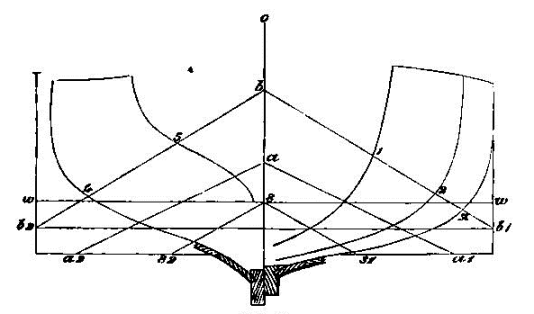
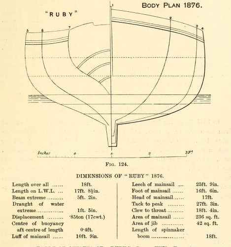

# “These little clippers” – from rowing boat to racing dinghy {#sec-chapter9}

While the canoes, sandbaggers and other types were all pushing design to the extremes, a different style of small boat was quietly evolving.  The most significant mark of this breed was that it developed from the boats used both oar and sail power to carry passengers and light freight around the waterfront and out to ships and yachts.  When this breed started to develop into a racing type in the late 1800s it had a confusion of names, including gig, sailing boat, rowing and sail boat, tender, yacht’s cutter, and skiff. But perhaps it’s easiest to use a term that was reserved for some of the smaller examples – the dinghy. It’s appropriate because many of the smallest oar-and-sail boats were actually yacht’s dinghies, and also because in many ways they were the most influential of all of the ancestors of the modern dinghy.

Unlike the other breeds of centreboard racer, the early sail-and-oar racing boats did not develop in a particular time or place, or because of a specific person or rule.  Different types evolved quietly into racing classes in local ports around the world, with little evidence of communication or competition between each emerging type.  But although they came from many different places, most of them evolved a similar shape that was dictated by their ancestry and use. It’s not surprising that perhaps the most important feature of the design of the sail-and-oar boats was that they descended from craft that were regularly rowed, as well as sailed.  In many of the these craft oars were the main power source; sails were just a useful addition when the wind was right. The rowing heritage meant that the emphasis was on a hull shape that could easily be driven at moderate speed by the limited power a rower could generate. The effects of the low-drag hull shape then seem to have flowed on to the rig, crew and further development of the type.

The rowing heritage meant that the oar-and-sail boats were narrower than workboat-style craft like the sandbaggers or catboats, which were designed with the beam to carry a more sail and often a heavier load.  The longer oar-and-sail craft, 22 to 16 feet, were generally narrow on the waterline, with sections that took the shape of a rounded Vee in the centre sections, and flared on the topsides.  The shorter types that were often used as yacht tenders normally had less flare and a relatively wider waterline beam for stability and to allow them to carry their load within their restricted length.

Whatever the length, the bow and stern were normally fine-lined and narrow (or in the case of the smaller dinghies, as fine lined as possible within their restricted size and duties) and the stern normally swept up high to a small wineglass-shaped transom that lay well above the waterline. Where the stern lines or buttocks lifted to the transom, the hull developed a keel-like “deadwood” – a deep but narrow section along the centreline under the stern – to keep the boat straight while rowing and towing.

![The famous Whitehall style of waterman’s shows the lines of a classic example of the type of craft used under oar power and sometimes sail power around the harbours and rivers of ports in the 19th century. The hollow lines fore and aft, the high wineglass-shape transom, the narrow beam and the deadwood aft were all details that made such craft move well under oar power and probably fast in light winds, considering their small rigs. “Speed, under oars or the simple spritsail which could be shipped or unshipped in a moment, was prized alike by the rival ferrymen, the boarding-house runners, and the thieves of the waterfront, as well as by their pursuers; and there were many close races in which no starts were timed and no money prize awarded” wrote WP Stephens in ‘American Yachting’.](images/chapter9/whitehall-lines.png)

The slender lines shape of the oar-and-sail types meant that their hull lacked the form stability of the beamy workboat-style craft. The shallow hull and lack of keel meant that they had nowhere to place large amounts of ballast low down like a keelboat did.  As Dixon Kemp declared, “no plan of lead or iron ballasting will make a shallow boat such as the centre-board gig stiff, in the ordinary meaning of the word.” [1] The lack of stability meant that very few of the oar-and-sail types carried the vast rigs of the contemporary ballasted yachts or the beamy craft like sandbaggers and catboats.  A sketch by Howard I Chapelle shows a 16′ Whitehall with a little spritsail of about 70ft2, and an equally smaller rudder and centreboard to match – roughly a third as much as the catboat Una, which was the same length.

To keep the weight low for easy rowing and carrying aboard larger craft and to create more room for passengers and luggage, most sail and oar boats were undecked.  The combination of limited stability and lack of decking meant that they were generally inshore boats, considered suitable only for rivers and sheltered harbours unless in the most experienced hands; to quote Kemp again, “a light centre-board gig, easy to row, and not an indifferent performer under canvas in smooth water, is not fit for open water where there might be a real sea.” [2]

Perhaps because they were not as fast as the bigger-rigged yachts and workboats, perhaps because they tended to sail in waters too confined for bigger boats, races for most of the sail-and-oar types had a low profile. Classes were small and localised.  Half a dozen boats was a strong fleet.  The fame of the individual oar-and-sail types was generally as limited as their geographical spread, and perhaps for similar reasons they seem to have not attracted the same prizemoney or professionals as the sandbagger-style workboats or large yachts. Although sail-and-oar craft like ship’s boats had been racing in regattas before the sandbaggers, catboats and yacht had existed, in racing terms they were largely a shadow on the sidelines. Not until the 1880s did they slowly start to become a bit more prominent.

The rise of the oar-and-sail boats and the racing types that developed from them seems to mirror, and perhaps partly cause, the boom from the late 1800s in amateur sailing among the middle classes and among the working class who were not professional watermen. With their small rigs, the sail-and-oar type were cheaper to own and easier to sail than the big-rigged workboat types or the complex and tippy canoes, and they seem to have suited the amateurs who were enjoying more cash and leisure than ever before. “Centreboard sailing dinghies have of late years become very popular, and it is hardly possible on a summer day to visit any of our coast towns without seeing a few of these handy, able little boats” wrote the Scottish designer D F Maclachlan. “The designing and building of these little clippers have now reached a state of perfection, and their popularity is easily seen by the number of races which are held, for it is surprising the speed that can be got from a boat twelve feet in length.”  The new passion for centreboarders ran from one end of England to the other; “small sailing boats of various sizes, from 10 to 15 or 20 feet, are numerous on and about the beach at various places on the South Coast” noted the writer Folkard in his book ‘Sailing Boats’ “and some of the boats of members of the local Sailing Clubs are of excellent type and construction” . [1]

One of the first clubs to specialise in open boats was the New Brighton Sailing Club on the Mersey, formed in 1869. This long-gone club was said to have been the first club to use the term “sailing” instead of “yacht” in its title and to use a girth (or beam) restriction. It may been a way to ensure that the club’s boats resembled the working boats of the Mersey watermen, and perhaps a reaction to the bigger and beamier sandbagger-style boats of the vanished Birkenhead Model Yacht Club. By the late 1880s the boats of the NBSC had developed into a restricted class of 18 footers, with a moderate beam of 6ft or a bit less, displacement of around 570 to 670kg, 80kg of ballast, 200 sq ft of sail in a lug sloop rig, and an 80sq ft spinnaker. They were a typical example of the bigger oar-and-sail type, similar to the “yachts cutters” (tenders to the big cruising and racing yachts and the 500 ton steamers) that were often cruised and sometimes raced at regattas. [3]

![Zinnia, designed by the boatbuilder G.H. Willmer, from the pages of Dixon Kemp’s Manual. In his commentary on Dixon Kemp, the gaff rig expert John Leather noted that Zinnia’s sections were similar to the sandbaggers and catboats, and wondered whether Willmer had been influenced by them, perhaps by the catboat plans in earlier editions of Dixon Kemp. Given that Truant and the boats she inspired had sailed on the same river a couple of decades earlier, it seems likely that Willmer had direct experience of the American type.  However, the class restrictions meant that Zinnia was much narrower and had a much smaller rig than a sandbagger. The NBSC sometimes started over a dozen boats, a large fleet for the time. Zinna was highly competitive for years but was also involved in a tragic capsize that claimed the lives of several crew.](images/chapter9/zinnia.jpg)

But perhaps the most influential fleets of early dinghies were on the Thames River near London. Above London the river was not suffering from the shipping congestion, industry and pollution that was driving leisure sailors away from the lower Thames and to the East Coast villages and Cowes in the late 19th century. [1]  As London and its railway network expanded along the Thames, boatmen switched from running freight to offering hire boats to the whole spectrum of society, from the nobility to the “‘Arry and Arriet” of the working classes. It was a scene beautifully captured by Jerome K Jerome in “Three Men in a Boat (to say nothing of the dog)”, the greatest comic novel of the time, which was set on a camping trip down the Thames by oar and sail.

By the late 1800s there were hundreds of private and hire boats on the Thames, and it was said that “nearly every craft carries a sail of some size of kind, for the predominant desire of most frequenters of the Thames is to take things as easy as possible. Every favoring breeze is therefore promptly utilized, and every rowboat is equipped with a sail. Such boats, however, cannot use a wind unless it be almost directly astern, and are totally unable to “tack” and so do not impede the passage of other crafts going in the opposite direction”. [2]  [3]

The reason for the inability to “tack” upwind was the reluctance of the Thames boatbuilders of the time to fit keels or centreboards to their craft.   The typical Thames gig or skiff of the late 1800s was a low slender craft even by oar-and-sail standards, often 22’ long but only 4’ in beam, and probably even less able to carry a big rig than other oar-and-sail boats of the era.  One later photograph shows a Thames gig driving fast and hard downwind under its small ketch rig, a bow wave cresting under the foremast, but with so little stability it cannot have been a great upwind performer.

It’s said that it was Alfred Burgoyne, one of the greatest of the Thames boatbuilders, who introduced the centreboard to the upper Thames around 1868.  As Ingrid Holroyd reported later, “the river enthusiasts, who till then had been supplementing sail power with oar power for any journey to windward, saw the prospect of a whole new sport opening up before them. With centreboards in small boats they could race on shallow, inland water, and could exercise the same skills as their so-called superiors on the sea.” [1] By 1871, no less than 57 one-sailed ‘gigs’ competed in the regatta of the newly-formed Thames Sailing Club. The winner had a centreboard, but such devices were barred from the main event of the autumn regatta that year, a race which was downwind only to avoid exposing the boats to the “ordeal” of going to windward.[2]

The Thames sailors soon developed a more stable, powerful design with much more freeboard than the slender early skiffs and gigs. Dixon Kemp claimed that it had been found that the most convenient size for racing on the upper Thames was a 14 footer, with “as much as 5ft. 3in. beam to enable them to carry large sails”.  Kemp’s book included his own plans for some oar-and-sail boat, including one (below) where the same sections could be used at different spacings to create boats of different lengths. At 14 feet long, the boat would weigh 165kg fully rigged and would require about as much ballast.

The career of the enormously successful Ruby, an 18 footer built by Burgoyne in 1876, is another classic example of the development in the era. In her initial design Ruby was described by Dixon Kemp as “in all respects...representative of the popular boat for ‘rowing and sailing’”. Although she has much higher freeboard and a more stable hull shape than the earlier style of Thames skiff described above, in some ways Ruby’s shape at her launch showed how little the oar-and-sail boat had changed since the day of Peggy almost a century before. Eighteen feet long and weighing 860kg, including 177kg of internal ballast, 150kg on the shallow iron keel and a 38kg iron centreboard, she carried a 14 sq m/150sq ft of sail in the balanced lug rig that Burgoine had popularised. Although a medium sized rig for its day, it was a fraction of the size of the rigs carried by similar-sized racing catboats and sandbagger types, and even smaller than some canoes of the era.  Ruby was to be radically modified over her long career, as we’ll see later.

Boats like Ruby played a part in a boom in sailing that saw the number of clubs in England, for example, increase from 120 to 200 between 1894 and 1904. “So popular is the pastime of boat-sailing, and so numerous the sailing-boats and small yachts, that boat-sailing clubs bid fair to outnumber the yacht clubs” noted the author Folkard. Although many of those who sailed the emerging breed of dinghies were “men of modest means” (to use the term of the era) there were also many who could afford big boats but found that there was more fun to be found on small ones. “Enrolled among the members of the boat-sailing clubs are, however, some of the keenest and most prominent yachtsmen of the day ; members of some of the principal yacht clubs in the kingdom, but who nevertheless join a boat-sailing club because of the encouragement they give to, and interest they take in, the humbler pastime, in which the competition is every whit as keen, and the pleasure and excitement nowise less, than in the matches between yachts of the larger type” he noted.  And on the other side of the Atlantic in the mid 1880s, two such men seem to have been creating one of the first examples of a concept that did not change boat design, but did change the way the world went sailboat racing.

