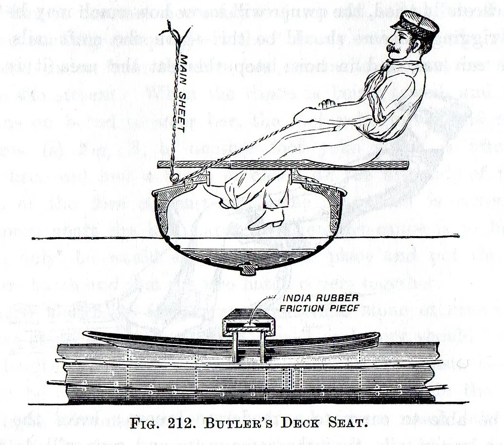
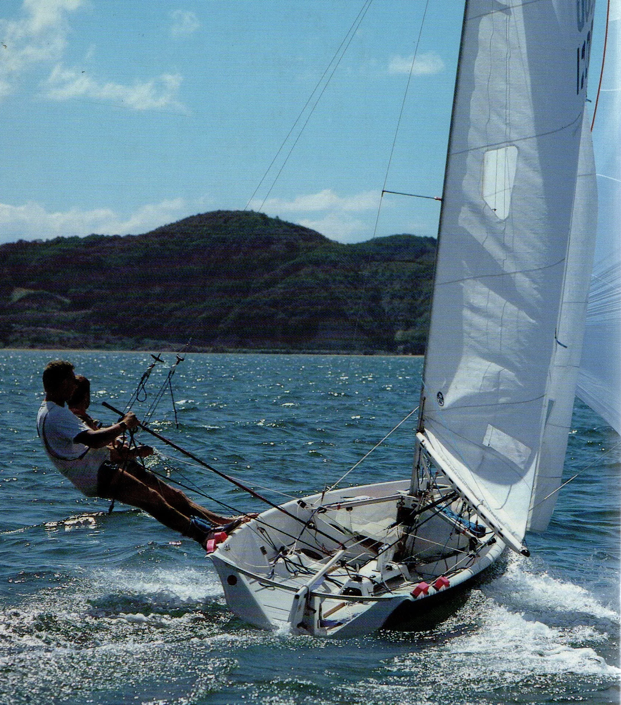
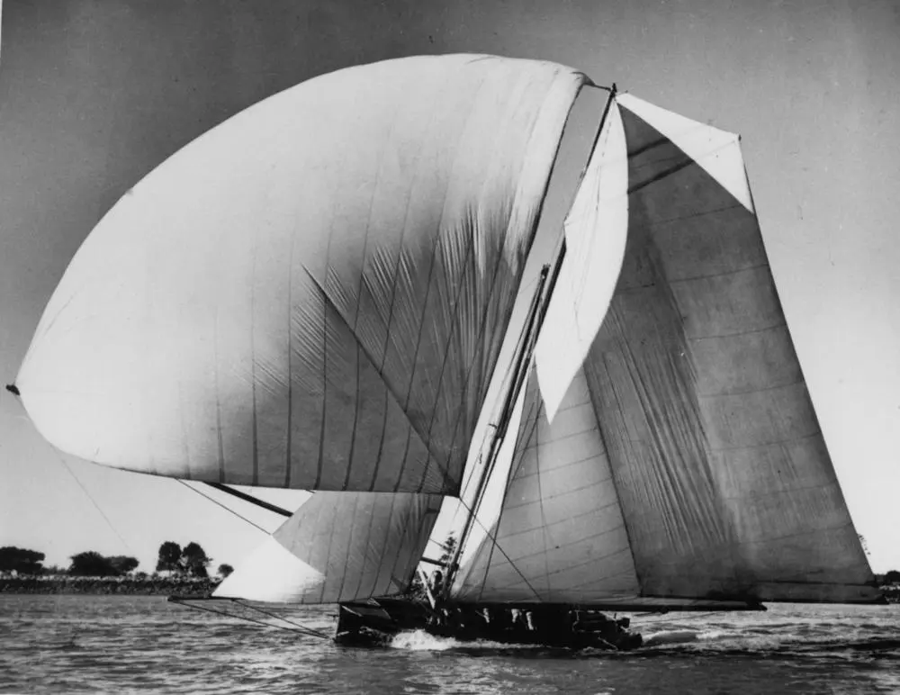

# Introduction {.unnumbered}

The SailCraft blog was really born years ago, when I realised that no one had tried to tell the story of the racing dinghy and the forces that shaped it.   It’s a complex tale; a web of interaction between factors such as emerging technologies, differences in geography and economies, the physics of wind and water, real estate and liquor laws, the width of an Austin A40 sedan and an English seaside laneway, and changing gender roles. It’s a tale that has spawned many myths, often ones about conservatives stifling development, but where the reality has few such villains and many heroes. [^1]

This is an ideal time to tell this story. The arrival of online archives allows us to find information that has been hidden away in ancient newspapers and rare mouldering books. It’s a time when even the shyest dinghy designer can be coaxed into giving priceless nuggets of information over email. Many of the world’s top dinghy creators, including Paul Bieker, Frank and Julian Bethwaite, Ian Bruce, Rob Brown, Steve Clark, Stu Friezer, Mike Jackson, Bruce Kirby, Andrew McDougal, Phil Morrison, Andy Paterson and many more, have been happy to be interviewed for this project.

The same changes in technology have also delayed SailCraft by years. I’ve been waiting for digital publishing to develop to the stage where it can provide images of boat designs and photographs well enough to show intricate details like the hull lines of a Bieker 14, or the workmanship of an Uffa Fox classic. Such technology still isn’t here, and sadly my ability to write well still hasn’t returned, so I have turned to this blog to pass on the information that so many people have helped me to gather.  Many thanks to them and the many other people who have given their time and knowledge in the past, and my apologies for the long delay.

SailCraft comes in three parts. Part 1 is a history of the development of the racing dinghy (and the bigger boats that influenced them) from the 18th century to the present day. Part 2 is an examination of the design principles and philosophies that dinghy designers follow. Part 3 is an examination of individual classes and types and their design and development.

This blog is concentrating on Part 1 at first, starting from the 1700s, when the first racing centreboarders arrived. Part 1 is generally being posted in chronological order, but some out-of-sequence posts will be put up at times. Some sections from Parts 2 and 3 will also be posted out of order at times.

There are still many gaps in the story of the racing dinghy and its design. I would love to hear from anyone who wants to provide any information, comment or corrections.

Chris Thompson

[^1]: and a few heroines, but, sadly, not too many.